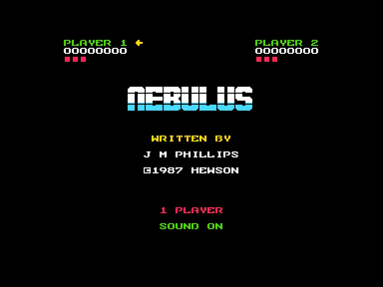
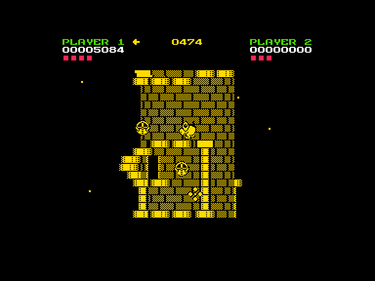
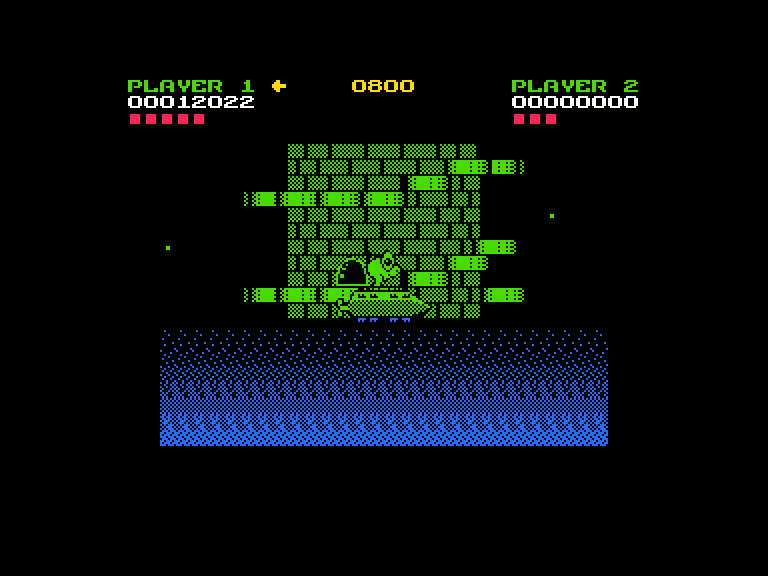
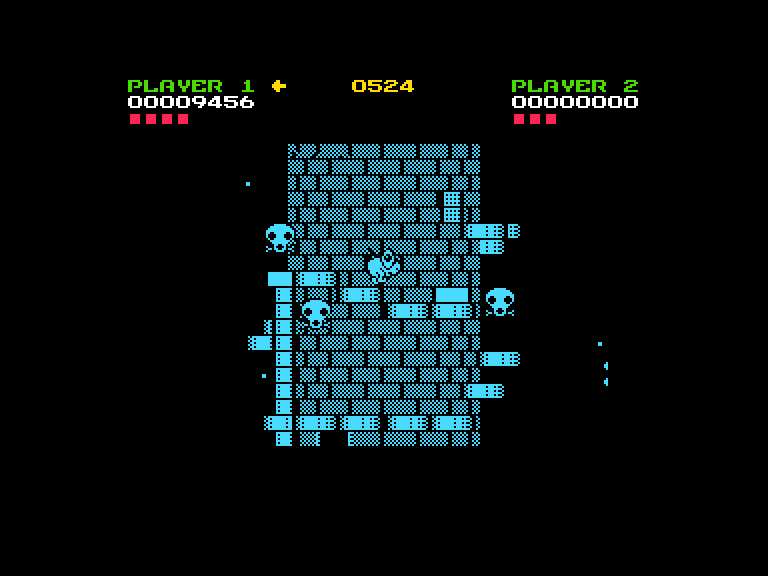

[0-9](../0/games-0.md) - [A](../a/games-a.md) - [B](../b/games-b.md) - [C](../c/games-c.md) - [D](../d/games-d.md) - [E](../e/games-e.md) - [F](../f/games-f.md) - [G](../g/games-g.md) - [H](../h/games-h.md) - [I](../i/games-i.md) - [J](../j/games-j.md) - [K](../k/games-k.md) - [L](../l/games-l.md) - [M](../m/games-m.md) - [N](../n/games-n.md) - [O](../o/games-o.md) - [P](../p/games-p.md) - [Q](../q/games-q.md) - [R](../r/games-r.md) - [S](../s/games-s.md) - [T](../t/games-t.md) - [U](../u/games-u.md) - [V](../v/games-v.md) - [W](../w/games-w.md) - [X](../x/games-x.md) - [Y](../y/games-y.md) - [Z](../z/games-z.md)

Ігри для [Enterprise 64k](../games-ep64.md) - [Enterprise 128k+RAMexp](../games-epramexp.md) - [2dfx](games-2dfx.md)

Ігри для систем [IS-DOS](../games-is-dos.md) - [SymbOS](../games-symbos.md) - [EDC Windows](../games-edcw.md)

Ігри для емуляторів [ZX Spectrum 48k/128k](../zxemu/games-zxemu.md) - [Amstrad CPC](../cpcemu/games-cpc.md) - [Sinclair ZX81](../zx81emu/games-zx81.md) - [Videoton TVC](../tvcemu/games-tvc.md) - [Commodore VIC-20](../vic20emu/games-vic20.md)

----------

# Nebulus

**Альтернативні назви:**
 - Tower Toppler

**ID:** nebulus-zx

**Жанри:** Аркада, Екшн

## Примітка

ℹ Стара неофіційна конверсія з платформи ZX Spectrum.

## Скріншоти

## Опис

На поверхні планети Nebulus виникло кілька високих веж, населених ворожими формами життя. Граючи за симпатичне створіння, нам необхідно забратися на самісіньку верхівку кожної вежі, використовуючи сходинки й ліфти, що розташовані на зовнішній стороні споруд, та активувати механізм самознищення.

## Основна інформація
- **Мови:** Англійська
- **Оригінальна платформа:** ZX Spectrum
### Загальні системні вимоги
- **Апаратні:** EP128
### Геймплей
- **Керування:** Keyboard, Internal Joy, External Joy 1
- **Кількість гравців:** 1 player
- **Додаткові теги:** Attribute mode
### Розробка
- **Рік випуску:** 1987
- **Автор:** John M. Phillips

## Посилання
- [Опис на ep128.hu (угорською)](http://www.ep128.hu/Games/Nebulus.htm)
- [Інформація про оригінальну версію](https://spectrumcomputing.co.uk/entry/3377/ZX-Spectrum/Nebulus)
- [Завантажити](http://www.ep128.hu/Ep_Games/Prg/Nebulus.rar)
- [Easy Load&Play](https://t.me/EP128k_Load_n_Play/33) *(Telegram-канал Vibrant Waves)*

## [Керування](../controllers.md)

`Internal Joystick` (натисніть `Space` для початку гри)  
`External Joystick 1` (натисніть `Fire` для початку гри)  
`Keyboard`: `Q`, `S`, `I`, `O`, `N` (натисніть `N` для початку гри)  

`Fire`: Стріляти (для знищення білих бульбашок та мигаючих блоків)  
`Fire`+`⬅️`: стрибати ліворуч  
`Fire`+`➡️`: стрибати праворуч  

`;`: Пауза (натисніть `Fire` для продовження)

## Детальна інформація

### Системні вимоги  

#### Мінімальні системні вимоги  

Оперативна пам'ять: **128 КБ (або більше)**  

### Геймплей  

У нашому розпорядженні є лише підводний човен, тому, починаючи з найнижчого поверху, нам доведеться підніматися на самий верх пішки. Але дорога нагору легкою не буде: по дорозі вам зустрінеться безліч різноманітних мешканців вежі, які хоч і не можуть вас вбити, але з радістю скинуть із платформи на поверх або два вниз. Деякі перешкоди та кулі, що підстрибують, можливо знищити за допомогою кульок, якими стріляє персонаж, але іншим супротивникам вони не завдадуть жодної шкоди. Загинути герой може лише від води, оскільки він зовсім не вміє плавати: при потраплянні у воду тоне, безпорадно пускаючи бульбашки. Платформи теж недостатньо надійні: деякі провалюються під ногами, з інших можливо зісковзнути. Обмежений час, за який необхідно здійснити підйом, теж може вважатися ускладненням, але якщо проходити гру акуратно й не поспішаючи, то його вистачить із великим запасом.  

### Історія розробки  

Свого часу ця гра вважалася досить красивою не лише через чудово анімованих персонажів, а й завдяки оригінальному псевдотривимірному ефекту обертання вежі, а нескладний і зрозумілий ґеймплей захопив безліч гравців по всьому світу. Tower Toppler удостоїлася бути портованою на безліч 8- та 16-бітних ігрових платформ і у 1988 році отримала нагороду Golden Joystick Award за найоригінальніший ігровий процес. Навіть сам Джон Ромеро якось зізнався, що він займався портуванням гри на Apple IIe, але їхній замовник, корпорація Epyx, скасувала всі роботи з переносу ігор на інші платформи через величезні інвестиції в Atari Lynx.  

### Чіти  

**Вбудовані оригінальні чіти:**  
`LeftShift`+`N`+`E`+`B`: нескінченні життя  
`LeftShift`+`1`..`8`: Вибрати рівень 1..8 (після активації попереднього чіта)