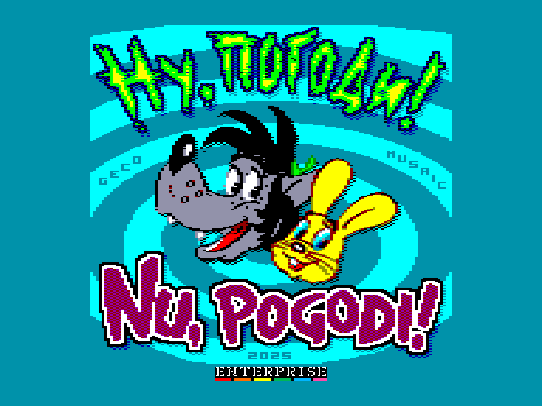
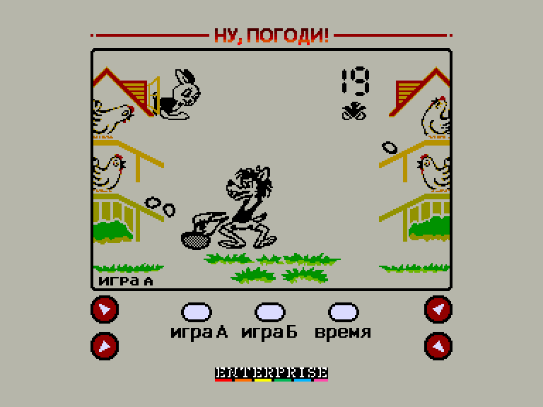
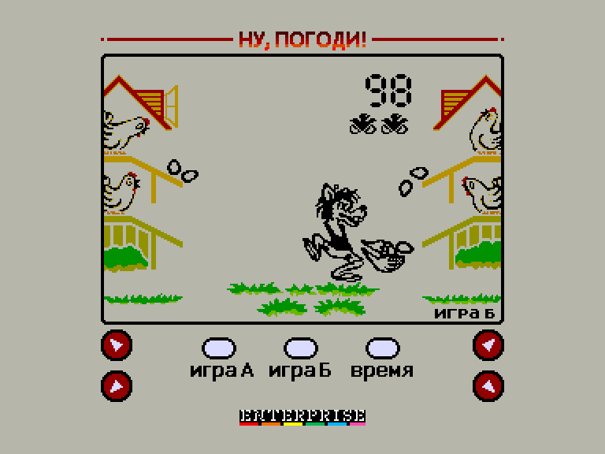
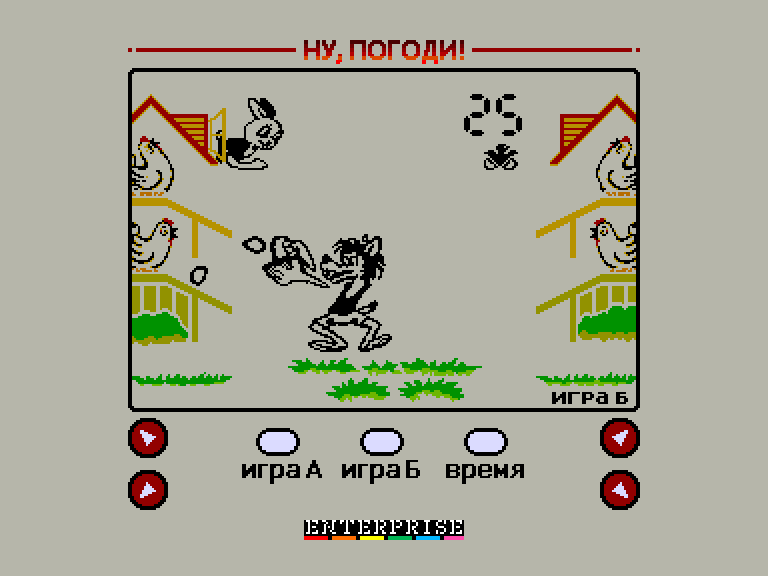

[0-9](../0/games-0.md) - [A](../a/games-a.md) - [B](../b/games-b.md) - [C](../c/games-c.md) - [D](../d/games-d.md) - [E](../e/games-e.md) - [F](../f/games-f.md) - [G](../g/games-g.md) - [H](../h/games-h.md) - [I](../i/games-i.md) - [J](../j/games-j.md) - [K](../k/games-k.md) - [L](../l/games-l.md) - [M](../m/games-m.md) - [N](../n/games-n.md) - [O](../o/games-o.md) - [P](../p/games-p.md) - [Q](../q/games-q.md) - [R](../r/games-r.md) - [S](../s/games-s.md) - [T](../t/games-t.md) - [U](../u/games-u.md) - [V](../v/games-v.md) - [W](../w/games-w.md) - [X](../x/games-x.md) - [Y](../y/games-y.md) - [Z](../z/games-z.md)

Ігри для [Enterprise 64k](../games-ep64.md) - [Enterprise 128k+RAMexp](../games-epramexp.md)

Ігри для систем [IS-DOS](../games-is-dos.md) - [SymbOS](../games-symbos.md) - [EDC Windows](../games-edcw.md)

Ігри для емуляторів [ZX Spectrum 48k/128k](../zxemu/games-zxemu.md) - [Amstrad CPC](../cpcemu/games-cpc.md) - [Sinclair ZX81](../zx81emu/games-zx81.md) - [Videoton TVC](../tvcemu/games-tvc.md) - [Commodore VIC-20](../vic20emu/games-vic20.md)

----------

# Nu, Pogodi!

**Альтернативні назви:**
 - Ну, погоди!

**ID:** nu-pogodi

**Жанри:** Аркада, LCD-ігри (Game&Watch)

## Примітка

ℹ Гра створена на базі портативної LCD-гри "Ну, погоди!" (клоном гри Game&Watch EGG від Nintendo).

## Скріншоти

## Опис

Чотири курки несуть яйця, що скочуються вниз чотирма лотками. Керуючи Вовком (з мультфільму «Ну, постривай!») потрібно наловити якомога більше яєць у кошик.

## Основна інформація
- **Мови:** Російська
- **Оригінальна платформа:** Enterprise
### Загальні системні вимоги
- **Апаратні:** EP64, EP128
### Геймплей
- **Керування:** Keyboard
- **Кількість гравців:** 1 Player
- **Додаткові теги:** 4-color mode
### Розробка
- **Рік випуску:** 2025
- **Автор:** Geco

## Посилання
- [Опис гри на ep128.hu (угорською)](http://www.ep128.hu/Ep_Games/Leiras/Nu_Pogodi.htm)
- [Тема на форумі enterpriseforever](https://enterpriseforever.com/jatekok/nu-pogodi!/)
- [Завантажити гру](http://www.ep128.hu/Ep_Games/Prg/Nu_Pogodi.rar)
- [Easy Load&Play](https://t.me/EP128k_Load_n_Play/773) *(Telegram-канал Vibrant Waves)*

## Відео

<iframe src="https://www.youtube.com/embed/xQI7g0ZFbuw"  
style="width:75%; aspect-ratio:16/9;" allowfullscreen></iframe>

- [Відео](https://youtu.be/dX78u3IqiKM)

## [Керування](../controllers.md)

`Keyboard`: `Q`, `A`, `O`, `K`  

### Елементи керування меню  

`1`: Почати гру А  
`2`: Почати гру Б  
`3`: При натисканні показує налаштований час будильника  
`4`: Режим налаштування часу *(натисніть `3` для виходу)*  
`5`: Режим налаштування будильника *(натисніть `5` для активації/деактивації будильника і `3` для виходу)*  
`Q`/`A`: Зміна годин у режимі налаштувань  
`O`/`K`: Зміна хвилин у режимі налаштувань

## Детальна інформація

### Системні вимоги  

#### Мінімальні системні вимоги  

Оперативна пам'ять: **64 КБ**  

### Рекомендовані системні вимоги  

Оперативна пам'ять: **128 КБ (або більше)**  

### Геймплей  

За кожне спіймане яйце гравцеві додається по одному очку. Спочатку яйця котяться повільно, але поступово темп гри прискорюється. Після набору кожної цілої сотні очок темп гри трохи сповільнюється.  

У разі падіння яйця на землю гравцеві нараховується штрафне очко, яке позначається зображенням курчати, що вилуплюється. Якщо падіння сталося в присутності Зайця, що висунувся з вікна будиночка в лівому кутку, то з розбитого яйця, що впало, вибігає курча (за відсутності зайця яйце просто розбивається і нараховується ціле штрафне очко), а гравцеві нараховується половина штрафного очка, зображення штрафного курчати при цьому блимає. При наборі в кошик 200 і 500 яєць штрафні очки анулюються. Після отримання трьох штрафних очок (від трьох до шести падінь яєць) гра припиняється.