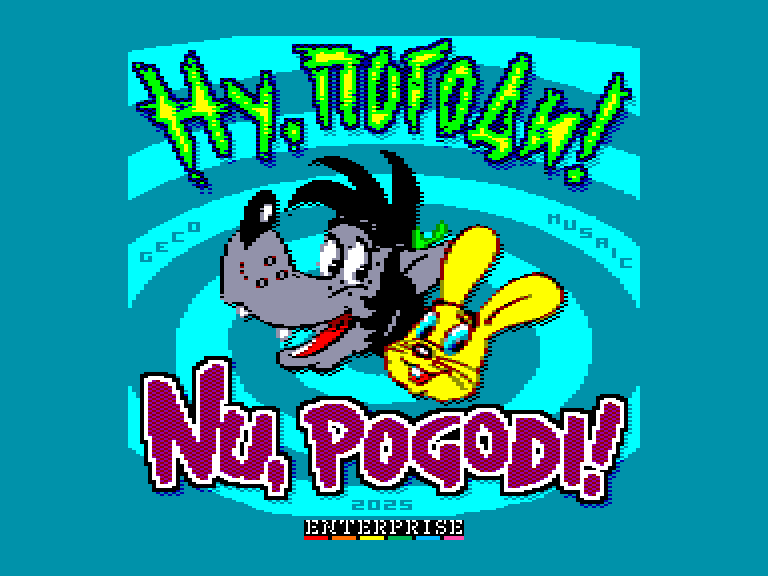
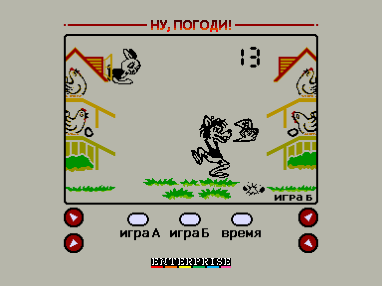
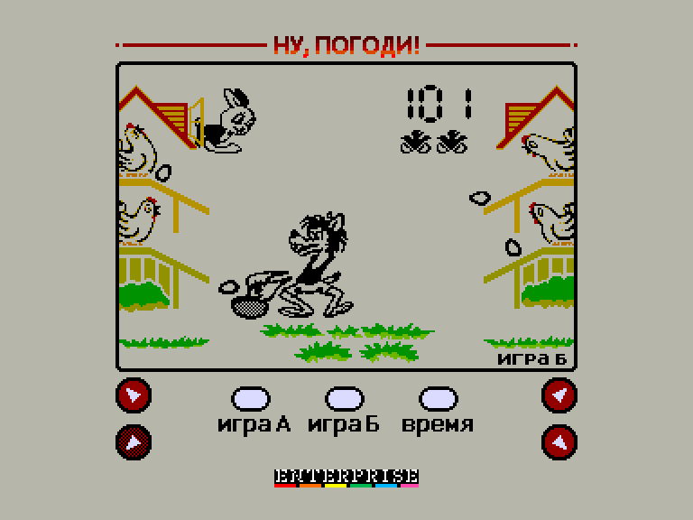

# Nu, Pogodi! / Ну, постривай!

 
 
 

Жанр: аркада  
Кількість гравців: 1  
Мова гри: російська  

## Опис

Чотири курки несуть яйця, що скочуються вниз чотирма лотками. Керуючи Вовком (з мультфільму «Ну, постривай!»), який може займати чотири положення (навпроти кожного лотка), потрібно наловити якомога більше яєць у кошик. За кожне спіймане яйце гравцеві додається по одному очку. Спочатку яйця котяться повільно, але поступово темп гри прискорюється. Після набору кожної цілої сотні очок темп гри трохи сповільнюється.

У разі падіння яйця на землю гравцеві нараховується штрафне очко, яке позначається зображенням курчати, що вилуплюється. Якщо падіння сталося в присутності Зайця, що висунувся з вікна будиночка в лівому кутку, то з розбитого яйця, що впало, вибігає курча (за відсутності зайця яйце просто розбивається і нараховується ціле штрафне очко), а гравцеві нараховується половина штрафного очка, зображення штрафного курчати при цьому блимає. При наборі в кошик 200 і 500 яєць штрафні очки анулюються. Після отримання трьох штрафних очок (від трьох до шести падінь яєць) гра припиняється.

### Режими гри

Гра має два ступені складності, що викликаються відповідно кнопками «Гра А» і «Гра Б». Гра А означає, що яйця починають котитися тільки трьома лотками одночасно, у Грі Б - усіма чотирма. Невикористаний лоток у Грі А залежить від кількості штрафних очок: за 0 очок не використовується нижній лівий лоток, за 0,5 і 1 штрафного очка - нижній правий лоток, за 1,5 і 2 штрафних очка - верхній лівий лоток, а за 2,5 штрафних очка - верхній правий лоток. Під час анулювання штрафних очок незадіяний лоток змінюється на нижній лівий.

<iframe width="560" height="315" src="https://www.youtube.com/embed/xQI7g0ZFbuw" title="YouTube video player" frameborder="0" allowfullscreen></iframe>

## Системні вимоги
### Мінімальні системні вимоги
Оперативна пам'ять: **64 КБ**  
### Рекомендовані системні вимоги
Оперативна пам'ять: **128 КБ (або більше)**  

## Керування та тонкощі запуску
### Елементи керування меню:

`1`: Почати гру А  
`2`: Почати гру Б  
`3`: При натисканні показує налаштований час будильника  
`4`: Режим налаштування часу *(натисніть `3` для виходу)*  
`5`: Режим налаштування будильника *(натисніть `5` для активації/деактивації будильника і `3` для виходу)*  
`Q`/`A`: Зміна годин у режимі налаштувань  
`O`/`K`: Зміна хвилин у режимі налаштувань  

### Основні [елементи керування](../controllers.md):
⌨ Клавіатура (`Q`, `A`, `O`, `K`)  

## Посилання

▶ [Easy Load&Play](https://t.me/EP128k_Load_n_Play/773) *(Telegram-канал Vibrant Waves)*  
💾 [Завантажити гру](http://www.ep128.hu/Ep_Games/Prg/Nu_Pogodi.rar)  
📃 [Опис гри](http://www.ep128.hu/Ep_Games/Leiras/Nu_Pogodi.htm) (угорська)  
🗨 [Тема на форумі enterpriseforever.com](https://enterpriseforever.com/jatekok/nu-pogodi!/)  

## Автори
### Версія гри для Enterprise
👨‍💻 Код: [Geco](../../community/geco.md)  
👨‍💻 Графіка: Musaic  
📅 Рік релізу: [2025](../release_years/2025.md)