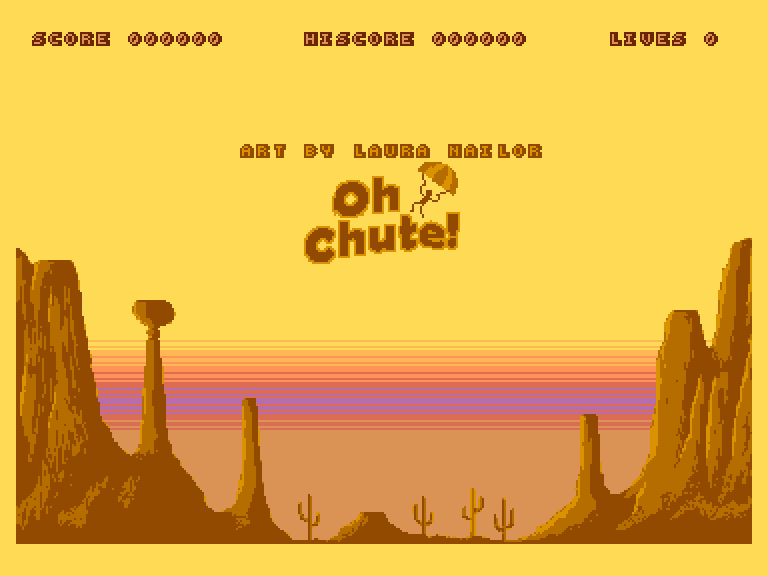
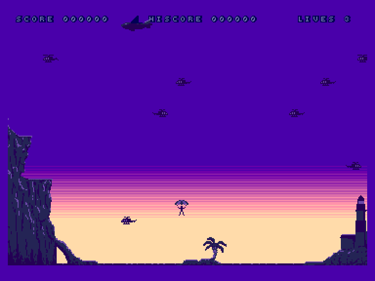
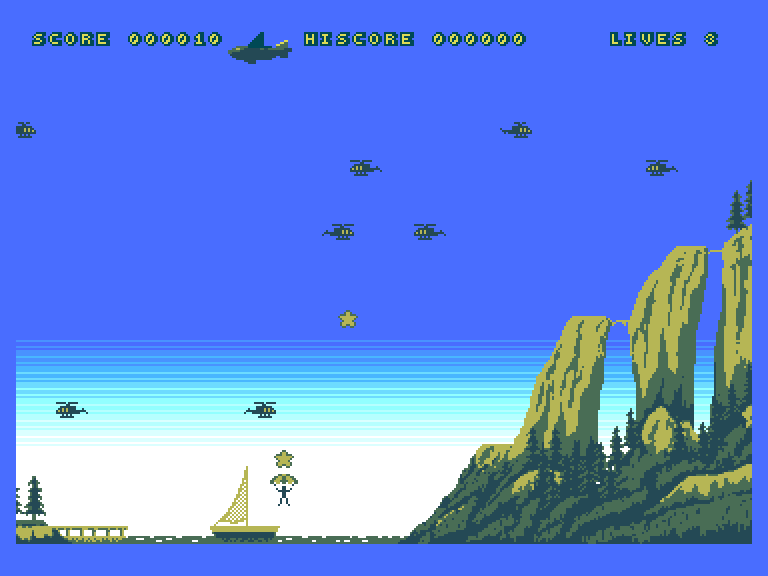
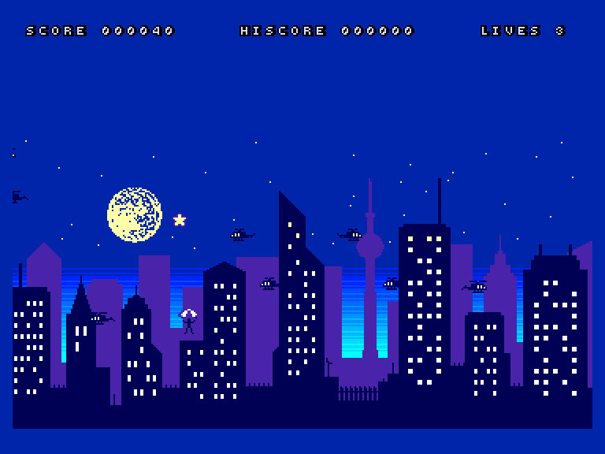

[0-9](../0/games-0.md) - [A](../a/games-a.md) - [B](../b/games-b.md) - [C](../c/games-c.md) - [D](../d/games-d.md) - [E](../e/games-e.md) - [F](../f/games-f.md) - [G](../g/games-g.md) - [H](../h/games-h.md) - [I](../i/games-i.md) - [J](../j/games-j.md) - [K](../k/games-k.md) - [L](../l/games-l.md) - [M](../m/games-m.md) - [N](../n/games-n.md) - [O](../o/games-o.md) - [P](../p/games-p.md) - [Q](../q/games-q.md) - [R](../r/games-r.md) - [S](../s/games-s.md) - [T](../t/games-t.md) - [U](../u/games-u.md) - [V](../v/games-v.md) - [W](../w/games-w.md) - [X](../x/games-x.md) - [Y](../y/games-y.md) - [Z](../z/games-z.md)

Ігри для [Enterprise 64k](../games-ep64.md) - [Enterprise 128k+RAMexp](../games-epramexp.md)

Ігри для систем [IS-DOS](../games-is-dos.md) - [SymbOS](../games-symbos.md) - [EDC Windows](../games-edcw.md)

Ігри для емуляторів [ZX Spectrum 48k/128k](../zxemu/games-zxemu.md) - [Amstrad CPC](../cpcemu/games-cpc.md) - [Sinclair ZX81](../zx81emu/games-zx81.md) - [Videoton TVC](../tvcemu/games-tvc.md) - [Commodore VIC-20](../vic20emu/games-vic20.md)

----------

# Oh Chute!

**ID:** oh-chute-cpcp

**Жанри:** Аркада

## Примітка

ℹ Сучасна неофіційна конверсія з платформи Amstrad CPC+.

## Скріншоти

## Опис

Ви – Рон Денджер, каскадер і любитель екстремальних видів спорту. Ви просто не можете насититися стрибками з парашутом, але місцевим пілотам вертольотів набридли ваші витівки, і вони полюють на вас... Саме ви маєте показати їм, хто тут головний!

## Основна інформація
- **Мови:** Англійська
- **Оригінальна платформа:** Amstrad CPC+
Amstrad GX4000
### Загальні системні вимоги
- **Апаратні:** EP128
### Геймплей
- **Керування:** Keyboard, Internal Joy, External Joy 1, External Joy 2
- **Кількість гравців:** 1 player, 2 players (alternate)
- **Додаткові теги:** 4-color mode
### Розробка
- **Рік випуску:** 2024
- **Автор:** Chris Lord, Laura Nailor
- **Компанія:** Team Giraffe

## Посилання
- [Домашня сторінка гри](https://cwiiis.itch.io/oh-chute)
- [Опис гри на ep128.hu (угорською)](http://www.ep128.hu/Ep_Games/Leiras/OhChute.htm)
- [Тема на форумі enterpriseforever](https://enterpriseforever.com/cpc-rl/oh-chute!/)
- [Інформація про оригінальну версію](https://www.cpc-power.com//index.php?page=detail&num=19279)
- [Завантажити гру](http://www.ep128.hu/Ep_Games/Prg/Oh_Chute.rar)
- [Easy Load&Play](https://t.me/EP128k_Load_n_Play/678) *(Telegram-канал Vibrant Waves)*

## Відео

<iframe src="https://www.youtube.com/embed/y9KALur0TNE"  
style="width:75%; aspect-ratio:16/9;" allowfullscreen></iframe>

- [Відео](https://youtu.be/gxAM5KKV4tM)

## [Керування](../controllers.md)

`Keyboard`: `O`, `P`, `Space`  
`Internal Joystick`  
`External Joystick 1`  
`External Joystick 2`  

`↔️`: Керування під час спуску (тільки коли розкритий парашут)  
`Fire`, `Space`: Вистрибнути / Розкрити парашут  
`Hold`/`Pause`: Пауза  
`Right Shift`: Soft Reset  

### Елементи керування меню  

`↔️`: Вибір рівня  
`Fire`, `Space`: Почати гру для одного гравця  
`Fire2`, `Enter`: Почати гру для двох гравців

## Детальна інформація

### Системні вимоги  

#### Мінімальні системні вимоги  

Оперативна пам'ять: **128 КБ**  

### Геймплей  

Додаткові бали (і зірки) нараховуються за особливо небезпечні трюки, такі як пізнє відкриття парашута або небезпечне наближення до вертольота.