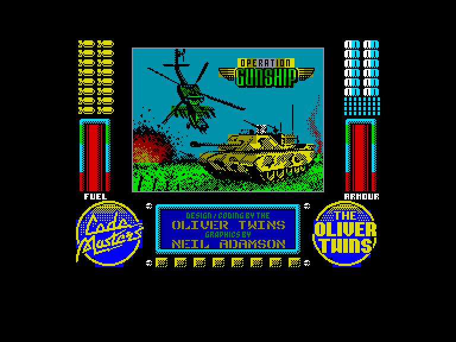
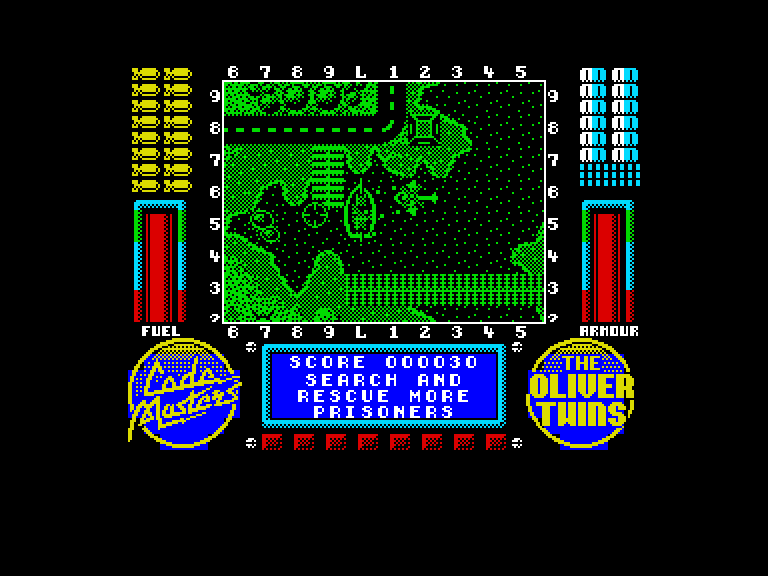
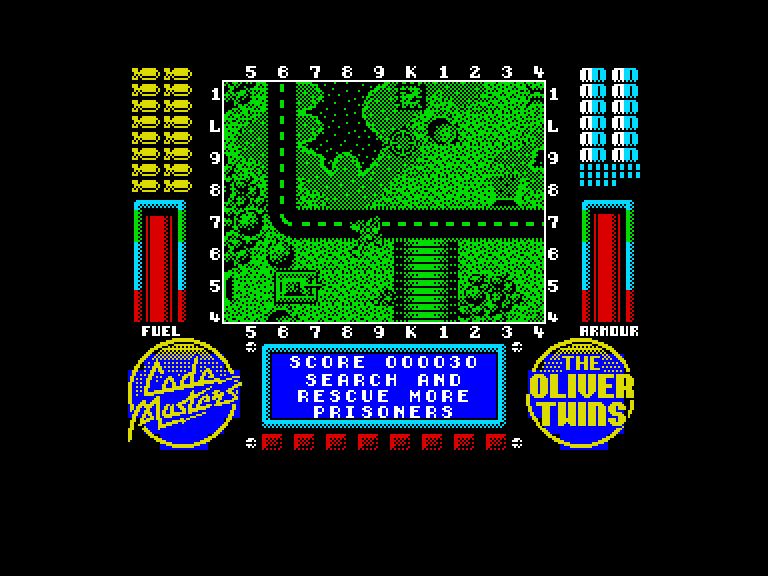
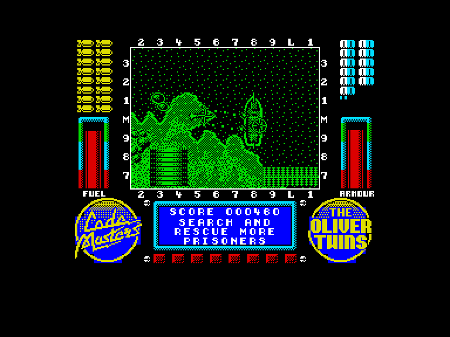

[0-9](../0/games-0.md) - [A](../a/games-a.md) - [B](../b/games-b.md) - [C](../c/games-c.md) - [D](../d/games-d.md) - [E](../e/games-e.md) - [F](../f/games-f.md) - [G](../g/games-g.md) - [H](../h/games-h.md) - [I](../i/games-i.md) - [J](../j/games-j.md) - [K](../k/games-k.md) - [L](../l/games-l.md) - [M](../m/games-m.md) - [N](../n/games-n.md) - [O](../o/games-o.md) - [P](../p/games-p.md) - [Q](../q/games-q.md) - [R](../r/games-r.md) - [S](../s/games-s.md) - [T](../t/games-t.md) - [U](../u/games-u.md) - [V](../v/games-v.md) - [W](../w/games-w.md) - [X](../x/games-x.md) - [Y](../y/games-y.md) - [Z](../z/games-z.md)

Ігри для [Enterprise 64k](../games-ep64.md) - [Enterprise 128k+RAMexp](../games-epramexp.md) - [2dfx](../games-2dfx.md)

Ігри для систем [IS-DOS](../games-is-dos.md) - [SymbOS](../games-symbos.md) - [EDC Windows](../games-edcw.md)

Ігри для емуляторів [ZX Spectrum 48k/128k](../zxemu/games-zxemu.md) - [Amstrad CPC](../cpcemu/games-cpc.md) - [Sinclair ZX81](../zx81emu/games-zx81.md) - [Videoton TVC](../tvcemu/games-tvc.md) - [Commodore VIC-20](../vic20emu/games-vic20.md)

----------

# Operation Gunship

**ID:** operation-gunship-zx

**Жанри:** Екшн

## Примітка

ℹ Неофіційна конверсія з платформи ZX Spectrum.

## Скріншоти

## Опис

Ваш елітний загін спецпризначенців S.A.S. розкидана по ворожих островах.  

Ваша місія: евакуювати їх до того, як комуністична революційна армія схопить їх у свої пазурі.  

Озброєні до зубів на борту найсучаснішого у світі бойового гелікоптера, ви мчатимете на надмалих висотах, пробиваючи собі шлях крізь ворожу оборону.  

Ваша команда розраховує на вас — не підведіть їх.  

Ця гра — один із найскладніших бойових симуляторів: гігантські карти з безліччю островів, ворожими базами, танками, авіаносцями, штурмовими гелікоптерами — тут є геть усе!

## Основна інформація
- **Мови:** Англійська
- **Оригінальна платформа:** ZX Spectrum
### Загальні системні вимоги
- **Апаратні:** EP128
### Геймплей
- **Керування:** Keyboard, External Joy 1
- **Кількість гравців:** 1 player
- **Додаткові теги:** Attribute mode
### Розробка
- **Рік випуску:** 1989
- **Автор:** The Oliver Twins, Neil Adamson, David Whittaker

## Посилання
- [Опис на ep128.hu (угорською)](http://www.ep128.hu/Games/Operation_Gunship.htm)
- [Інформація про оригінальну версію](https://spectrumcomputing.co.uk/entry/9386/ZX-Spectrum/Operation_Gunship)
- [Завантажити](http://www.ep128.hu/Ep_Games/Prg/Operation_Gunship.rar)

## [Керування](../controllers.md)

`Keyboard`: `Z`, `X`, `J`, `N` + `K`  
`External Joystick 1`  

`Space`: Скинути бомбу  

Додаткові клавіші:  
`P`: Пауза  
`Q`: Вихід з поточної гри

## Детальна інформація

### Системні вимоги  

#### Мінімальні системні вимоги  

### Геймплей  

У грі є 5 місій. Щоб пройти кожну місію, ви повинні знайти та врятувати 8 своїх бійців, які застрягли на островах, і повернути їх на базу.  

Щоб підібрати людину, зависніть над нею — ваш гелікоптер автоматично опустить драбину (стежте за вікном повідомлень знизу). Продовжуйте зависати, поки боєць не опиниться на борту. Доправте бійців назад на свою базу (позначену літерою **H** від *H.Q. — штаб*) і зависніть над нею, допоки вони не висадяться.  

- Приціл показує, куди впадуть ваші бомби.  
- Зависність над базою, щоб поповнити боєкомплект.  
- За повне знищення ворога нараховується спеціальний бонус.  
- Ваш гелікоптер може вмістити одразу всіх 8 осіб, не повертайте їх на базу по одному.  
- Концентруйте вогневу потужність на найслабшій частині цілі.  
- Запам'ятовуйте розташування своїх людей, щоб економити час.  
- Швидко знищуйте точки спавну ворогів, особливо авіаносці.  
- Не летіть занадто швидко, щоб не просто пошкоджувати цілі, а знищувати їх повністю.  
- Збивайте ракети з тепловим наведенням або різко відвертайте з їхнього шляху.  
- Не витрачайте даремно броню, оскільки завершення рівня відновлює лише її половину.  
- Збивайте повітряні цілі над наземними об'єктами: падаючи, вони руйнуватимуть бази противника, заощаджуючи ваші цінні боєприпаси.  
- Уникайте зайвих повернень на базу для перезарядки, оскільки це даремно витрачає обмежений запас пального.  

### Чіти  

Наберіть достатньо очок щоб потрапити у таблицю рекордів і введіть `JET SKI` як своє ім'я (ви побачите що текст зміниться на CHEATED). Під час наступної гри натисніть `C`, щоб пропустити рівень.