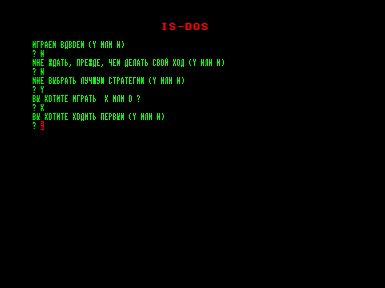
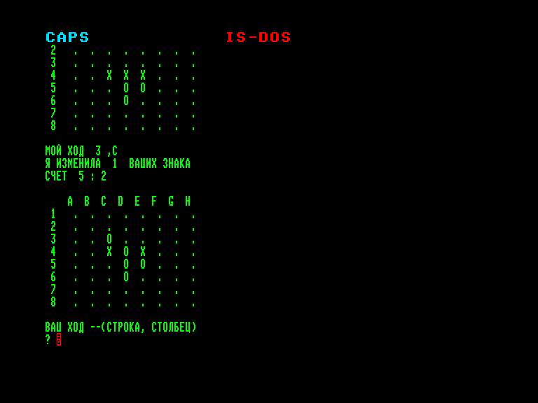
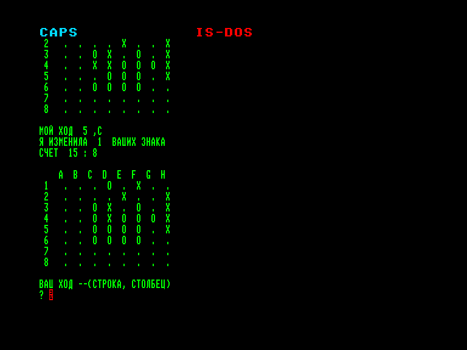
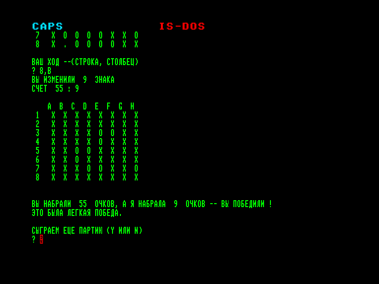

[0-9](../0/games-0.md) - [A](../a/games-a.md) - [B](../b/games-b.md) - [C](../c/games-c.md) - [D](../d/games-d.md) - [E](../e/games-e.md) - [F](../f/games-f.md) - [G](../g/games-g.md) - [H](../h/games-h.md) - [I](../i/games-i.md) - [J](../j/games-j.md) - [K](../k/games-k.md) - [L](../l/games-l.md) - [M](../m/games-m.md) - [N](../n/games-n.md) - [O](../o/games-o.md) - [P](../p/games-p.md) - [Q](../q/games-q.md) - [R](../r/games-r.md) - [S](../s/games-s.md) - [T](../t/games-t.md) - [U](../u/games-u.md) - [V](../v/games-v.md) - [W](../w/games-w.md) - [X](../x/games-x.md) - [Y](../y/games-y.md) - [Z](../z/games-z.md)

Ігри для [Enterprise 64k](../games-ep64.md) - [Enterprise 128k+RAMexp](../games-epramexp.md) - [2dfx](../games-2dfx.md)

Ігри для систем [IS-DOS](../games-is-dos.md) - [SymbOS](../games-symbos.md) - [EDC Windows](../games-edcw.md)

Ігри для емуляторів [ZX Spectrum 48k/128k](../zxemu/games-zxemu.md) - [Amstrad CPC](../cpcemu/games-cpc.md) - [Sinclair ZX81](../zx81emu/games-zx81.md) - [Videoton TVC](../tvcemu/games-tvc.md) - [Commodore VIC-20](../vic20emu/games-vic20.md)

----------

# Othello

**ID:** othello-ru-isdos

**Жанри:** Настільна гра

## Примітка

Класична гра Othello (також відома як «Реверсі») з платформи Robotron 1715

## Скріншоти

## Опис

Отелло — це класична стратегічна гра для двох гравців, що проводиться на дошці 8×8. Основна мета: захопити якомога більше фішок свого кольору до моменту, коли дошка буде повністю заповнена або жоден гравець не матиме можливих ходів.

## Основна інформація
- **Мови:** Російська
### Загальні системні вимоги
- **Апаратні:** EXDOS
- **Програмні:** IS-DOS
### Геймплей
- **Керування:** Keyboard
- **Кількість гравців:** 1 player, 2 players (versus)

## Посилання
- [Завантажити](https://criss.fun/criss/soft/othello.zip)

## [Керування](../controllers.md)

`Keyboard`  

Команди та відповіді сприймаються лише великими літерами.  
Ходи вводяться у форматі `НОМЕР_СТРІЧКИ,ЛІТЕРА_СТОВПЦЯ` (наприклад: `4,C`).

## Детальна інформація

### Тонкощі запуску  

Перед запуском гри рекомендовано завантажити кириличний шрифт у кодуванні KOI-7 H2 та увімкнути режим введення великих літер.  

### Геймплей  

Початкова розстановка: У центрі дошки перехресно виставляються 4 фішки: 2 чорні та 2 білі.  
Черговість ходів: Гравці ходять по черзі, роблячи хід фішкою свого кольору. Зазвичай першими ходять чорні.  
Захоплення: Фішка виставляється на вільну клітинку так, щоб між нею та іншою фішкою того ж кольору утворилася безперервна пряма лінія (по горизонталі, вертикалі чи діагоналі) з фішок суперника. Усі фішки суперника, затиснуті в цій лінії з двох боків, перевертаються і змінюють колір на колір поточного гравця.  
Обов’язковість ходу: Гравець зобов'язаний зробити хід, який захоплює принаймні одну фішку суперника. Якщо такого ходу немає, гравець пропускає хід.  
Завершення гри: Гра закінчується, коли дошка заповнена, або коли жоден із гравців не може зробити допустимий хід. Перемагає той, у кого на дошці більше фішок його кольору.