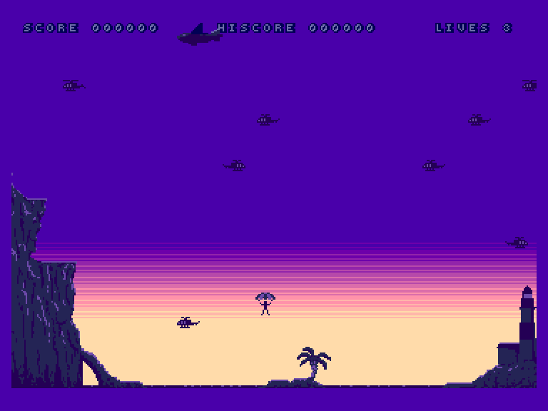
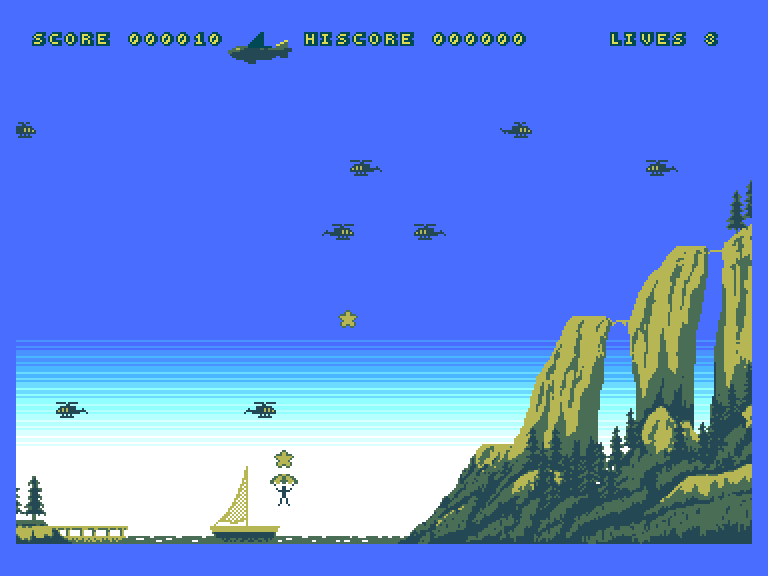
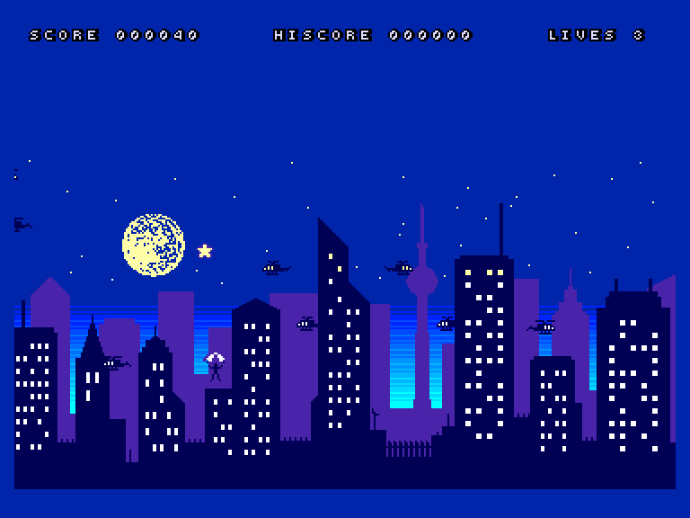

# Oh Chute!

| | | | |
| --- | --- | --- | --- |
|||||

Жанр: аркада  
Кількість гравців: 1-2 (по черзі)

## Опис

Ви – Рон Денджер, каскадер і любитель екстремальних видів спорту. Ви просто не можете насититися стрибками з парашутом, але місцевим пілотам вертольотів набридли ваші витівки, і вони полюють на вас... Саме ви маєте показати їм, хто тут головний! Додаткові бали (і зірки) нараховуються за особливо небезпечні трюки, такі як пізнє відкриття парашута або небезпечне наближення до вертольота.

## Системні вимоги

|Мінімальні системні вимоги:|Рекомендовані системні вимоги:|
|---------------------------|------------------------------|
|Оперативна пам'ять: **128 КБ**|Оперативна пам'ять: **128 КБ (або більше)**|  

## Керування та тонкощі запуску
### Елементи керування меню:

`↔️`: Вибір рівня  
`Fire`, `Space`: Почати гру для одного гравця  
`Fire2`, `Enter`: Почати гру для двох гравців  

### Основні [елементи керування](../controllers.md):
⌨ Клавіатура (`O`, `P`, `Space`)  
🕹 Вбудований джойстик  
🎮 Зовнішній джойстик 1/2  

`↔️`: Керування під час спуску (тільки коли розкритий парашут)  
`Fire`, `Space`: Вистрибнути / Розкрити парашут  
`Hold/Pause`: Пауза  
`Right Shift`: Soft Reset  

## Посилання

▶ [Easy Load&Play](https://t.me/EP128k_Load_n_Play/678) *(Telegram-канал Vibrant Waves)*  
💾 [Завантажити гру](http://www.ep128.hu/Ep_Games/Prg/Oh_Chute.rar)  
📃 [Опис гри](http://www.ep128.hu/Ep_Games/Leiras/OhChute.htm) (угорська)  
🗨 [Тема на форумі enterpriseforever.com](https://enterpriseforever.com/cpc-rl/oh-chute!/)  
🏡 [Домашня сторінка гри](https://cwiiis.itch.io/oh-chute)

## Автори
### Оригінальний реліз
🖥 Платформа: [Amstrad CPC+](https://www.cpc-power.com//index.php?page=detail&num=19279)  
👨‍💻 Розробники: Chris Lord, Laura Nailor  
📅 Рік релізу: 2024  

### Версія гри для Enterprise
👨‍💻 Портування: [Geco](../../community/geco.md)  
📅 Рік релізу: 2024