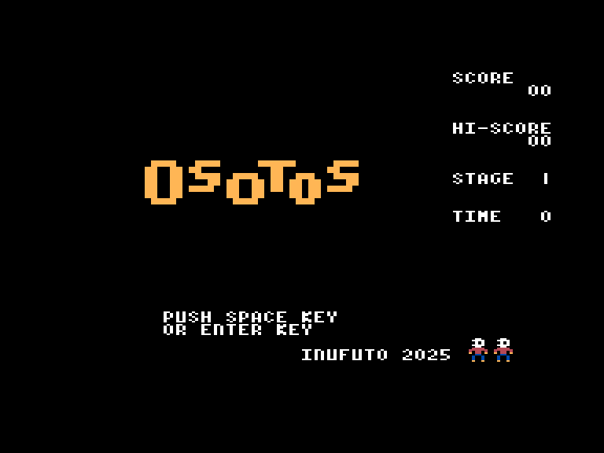
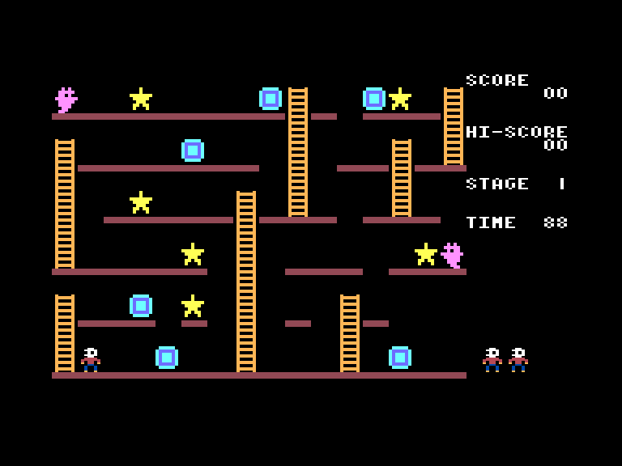
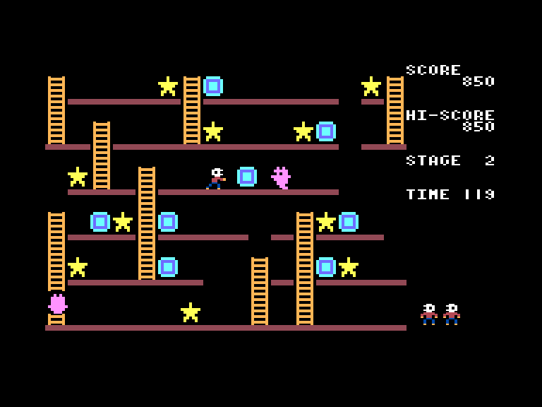
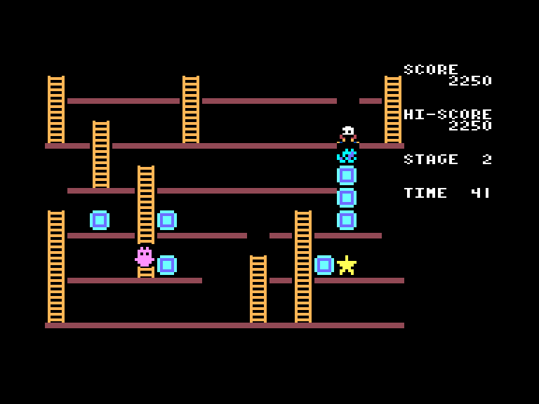

# Osotos

| | | | |
| --- | --- | --- | --- |
|||||

Жанр: аркада, платформер  
Кількість гравців: 1  
Мова гри: англійська  

## Опис

Вам необхідно зібрати усі зірки на рівні. Герой може ламати та жбурляти ящики. Якщо попасти ящиком по привиду, то він зникне. 

У грі 8 різних рівней, після чого вони починають повторюватись.

## Системні вимоги

|Мінімальні системні вимоги:|Рекомендовані системні вимоги:|
|---------------------------|------------------------------|
|Оперативна пам'ять: **64 КБ** (тільки картридж-версія)|Оперативна пам'ять: **128 КБ (або більше)**|  

## Керування та тонкощі запуску
### Елементи керування меню:

`Enter`/`Space`/`X`/`Z`: Почати гру  

### Основні [елементи керування](../controllers.md):
⌨ Клавіатура (`L`, `,`, `.`, `/`)  
🕹 Вбудований джойстик  

`Space`/`Z`: Жбурнути або зламати ящик  
`Space`/`Z` + `↓`: Зламати ящик під ногами

## Посилання

▶ [Easy Load&Play](https://t.me/EP128k_Load_n_Play/837) *(Telegram-канал Vibrant Waves)*  
💾 [Завантажити гру](http://www.ep128.hu/Ep_Games/Prg/Osotos.rar)  
📃 [Опис гри](http://www.ep128.hu/Games/Osotos.htm) (угорська)  
🏡 [Домашня сторінка гри](http://inufuto.web.fc2.com/8bit/osotos/#ep64)

## Автори
👨‍💻 Розробник: [Inufuto](../../community/inufuto.md)  
📅 Рік релізу: [2025](../release_years/2025.md)  