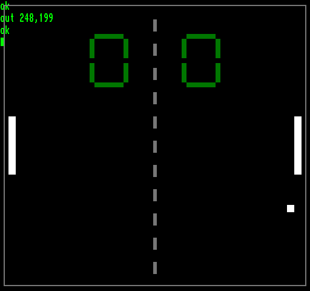

[0-9](../0/games-0.md) - [A](../a/games-a.md) - [B](../b/games-b.md) - [C](../c/games-c.md) - [D](../d/games-d.md) - [E](../e/games-e.md) - [F](../f/games-f.md) - [G](../g/games-g.md) - [H](../h/games-h.md) - [I](../i/games-i.md) - [J](../j/games-j.md) - [K](../k/games-k.md) - [L](../l/games-l.md) - [M](../m/games-m.md) - [N](../n/games-n.md) - [O](../o/games-o.md) - [P](../p/games-p.md) - [Q](../q/games-q.md) - [R](../r/games-r.md) - [S](../s/games-s.md) - [T](../t/games-t.md) - [U](../u/games-u.md) - [V](../v/games-v.md) - [W](../w/games-w.md) - [X](../x/games-x.md) - [Y](../y/games-y.md) - [Z](../z/games-z.md)

Ігри для [Enterprise 64k](../games-ep64.md) - [Enterprise 128k+RAMexp](../games-epramexp.md) - [2dfx](games-2dfx.md)

Ігри для систем [IS-DOS](../games-is-dos.md) - [SymbOS](../games-symbos.md) - [EDC Windows](../games-edcw.md)

Ігри для емуляторів [ZX Spectrum 48k/128k](../zxemu/games-zxemu.md) - [Amstrad CPC](../cpcemu/games-cpc.md) - [Sinclair ZX81](../zx81emu/games-zx81.md) - [Videoton TVC](../tvcemu/games-tvc.md) - [Commodore VIC-20](../vic20emu/games-vic20.md)

----------

# Pong

**Альтернативні назви:**
 - klasszikus Pong
 - classic Pong

**ID:** pong-bas

**Жанри:** Аркада

## Примітка

ℹ Гра вбудована в графічний акселератор [2dfx](../../hardware/hv-2dfx.md) у якості демонстрації.  
⚠ Для запуску вимагає невеличку програму на Basic або іншій мові програмування.

## Скріншоти

## Опис

Проста іграбельна гра Pong, яка демонструє, як за допомогою кількох спрайтів та 2D-примітивів можна створити майже повноцінну гру використовуючи 2dfx.

## Основна інформація
- **Оригінальна платформа:** Enterprise
### Загальні системні вимоги
- **Апаратні:** 2dfx, EP64, EP128
- **Програмні:** IS-Basic
### Геймплей
- **Керування:** Keyboard
- **Кількість гравців:** 2 players (versus)
### Розробка
- **Рік випуску:** 2026
- **Автор:** Károly Vaczkó (kvaczko)

## Посилання
- [Домашня сторінка](https://2dfx.net)

## [Керування](../controllers.md)

`Keyboard`

## Детальна інформація

### Історія розробки  

Деталі можна дізнатись з [посібника для 2dfx](../../manuals/2dfx/commands/egg_c7.md).