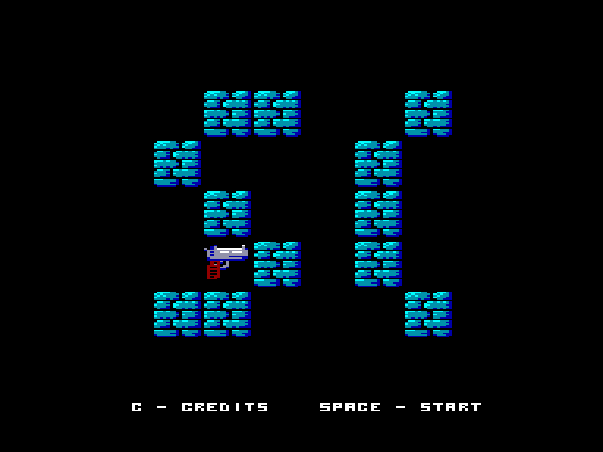
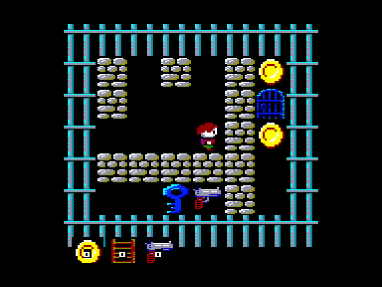
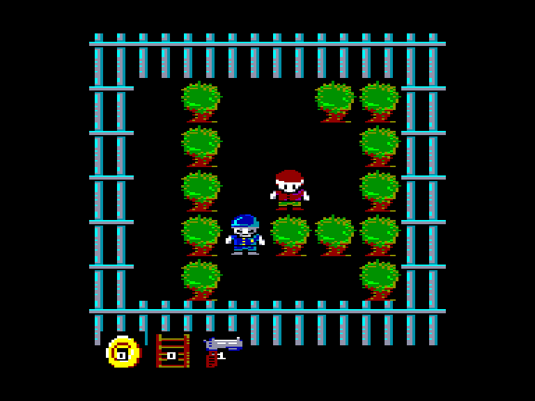
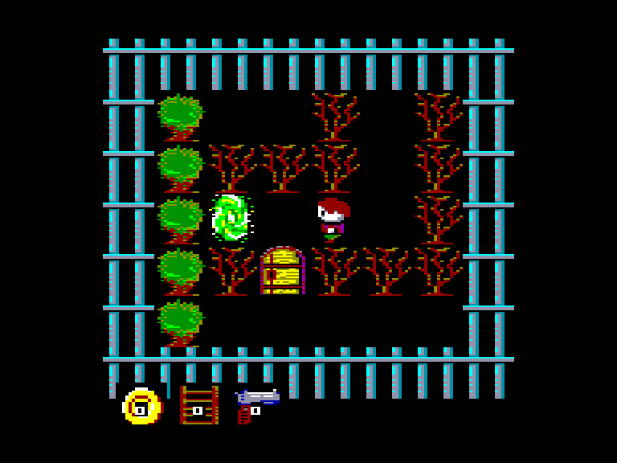

[0-9](../0/games-0.md) - [A](../a/games-a.md) - [B](../b/games-b.md) - [C](../c/games-c.md) - [D](../d/games-d.md) - [E](../e/games-e.md) - [F](../f/games-f.md) - [G](../g/games-g.md) - [H](../h/games-h.md) - [I](../i/games-i.md) - [J](../j/games-j.md) - [K](../k/games-k.md) - [L](../l/games-l.md) - [M](../m/games-m.md) - [N](../n/games-n.md) - [O](../o/games-o.md) - [P](../p/games-p.md) - [Q](../q/games-q.md) - [R](../r/games-r.md) - [S](../s/games-s.md) - [T](../t/games-t.md) - [U](../u/games-u.md) - [V](../v/games-v.md) - [W](../w/games-w.md) - [X](../x/games-x.md) - [Y](../y/games-y.md) - [Z](../z/games-z.md)

Ігри для [Enterprise 64k](../games-ep64.md) - [Enterprise 128k+RAMexp](../games-epramexp.md)

Ігри для систем [IS-DOS](../games-is-dos.md) - [SymbOS](../games-symbos.md) - [EDC Windows](../games-edcw.md)

Ігри для емуляторів [ZX Spectrum 48k/128k](../zxemu/games-zxemu.md) - [Amstrad CPC](../cpcemu/games-cpc.md) - [Sinclair ZX81](../zx81emu/games-zx81.md) - [Videoton TVC](../tvcemu/games-tvc.md) - [Commodore VIC-20](../vic20emu/games-vic20.md)

----------

# Prison Break

**ID:** prison-break-tvc

**Жанри:** Логічна, Лабіринт

## Примітка

ℹ Конверсія з платформи Videoton TVC.

## Скріншоти

## Опис

Мета гри: втекти з в'язниці. (Хто б міг подумати? :)  
Класична гра-лабіринт із ключами, охоронцями...

## Основна інформація
- **Мови:** Англійська
- **Оригінальна платформа:** Videoton TVC
### Загальні системні вимоги
- **Апаратні:** EP128
### Геймплей
- **Керування:** Keyboard, Internal Joy
- **Кількість гравців:** 1 player
- **Додаткові теги:** 16-color mode, DevTool
### Розробка
- **Рік випуску:** 2023
- **Автор:** Kis Róbert
- **Компанія:** AnyStone games

## Посилання
- [Домашня сторінка гри](https://anystone.games)
- [Опис гри на ep128.hu (угорською)](https://www.ep128.hu/Ep_Games/Leiras/Prison_Break.htm)
- [Завантажити гру](https://www.ep128.hu/Ep_Games/Prg/Prison_Break.rar)
- [Завантажити гру](https://downloads.anystone.games/prisonbreak-enterprise-com)
- [Easy Load&Play](https://t.me/EP128k_Load_n_Play/769) *(Telegram-канал Vibrant Waves)*

## Відео

<iframe src="https://www.youtube.com/embed/FgOfA-CFN8Y"  
style="width:75%; aspect-ratio:16/9;" allowfullscreen></iframe>

## [Керування](../controllers.md)

`Keyboard`: `W`, `A`, `S`, `D`, `Space`  
`Internal Joystick`  

`Fire`: Скористатись предметом  

### Додаткові клавіши  

`X` / `Q`: повернутись на екран вибору рівня  
`M`: перемикання між музикою та звуками  
`1`: швидкість прокрутки екрану – **32** пікселя  
`2`: швидкість прокрутки екрану – **16** пікселів  
`3`: швидкість прокрутки екрану – **8** пікселів (за-замовчуванням)  
`4`: швидкість прокрутки екрану – **4** пікселя

## Детальна інформація

### Системні вимоги  

#### Мінімальні системні вимоги  

Оперативна пам'ять: **128 КБ**  

### Геймплей  

Початкова кімната - це головне меню. Червоні двері - це рівні (кожен рівень доступний після завершення попереднього).  
Якщо у початковій кімнаті зайти у сині двері, то можна ввести код, щоб відкрити червоні двері (гра відображає назву рівня, яка також є кодом, при вході).  
Жовті двері відкриваються, коли ви пройдете всі 10 рівней. Якщо ви вийдете через ці двері, ви здійсните втечу.  
Щоб завершити кожен рівень, вам необхідно знайти якнайменше 3 монети та вийти через червоні двері.  

На деяких рівнях можуть бути присутніми двері інших кольорів що відкриваються відповідними ключами.  
Інколи ви можете зустріти охоронців, які не завдадуть вам шкоди, але заблокують вам шлях. Їх можна позбутись за допомогою пістолета.  
За допомогою драбини можна перелізати через стіни (дуже зручно, але використовується лише один раз).  
Портали телепортують вас у обох напрямках.  

### Чіти  

### Коди рівней  

Коди можна вводити, якщо зайти у сині двері на екрані з вибором рівней.  
`ROOM`, `PORTAL`, `MAZE`, `VIDA`, `FOREST`, `REFERENCZ`, `NIGHT`, `MARTIN`, `PRISONBREAK`, `THEEND`