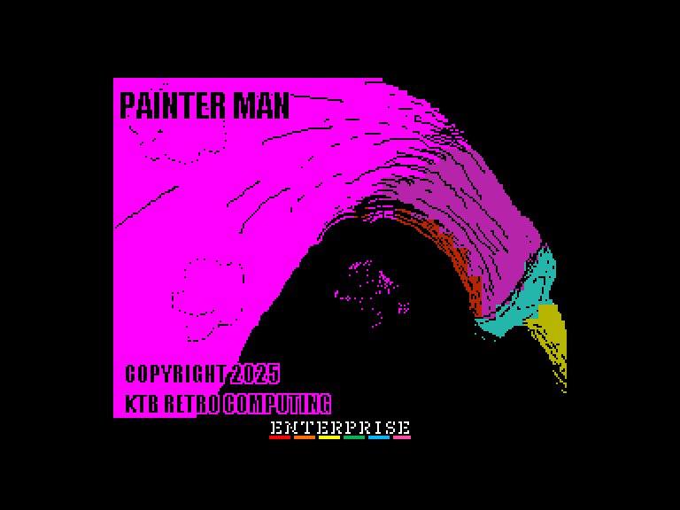
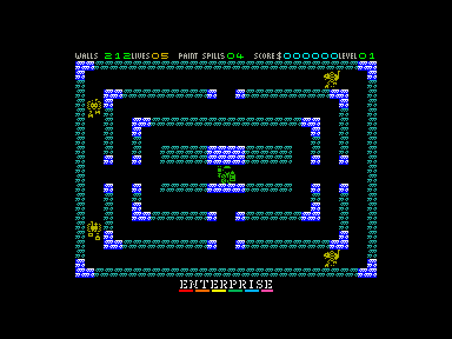
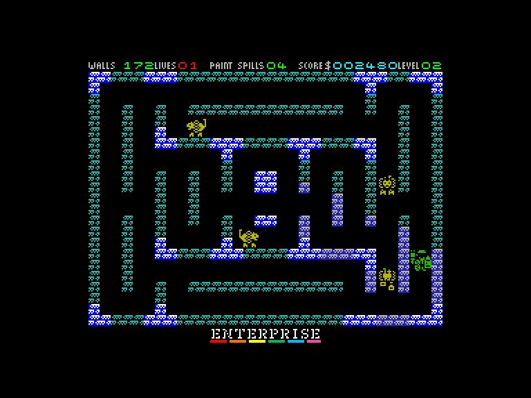
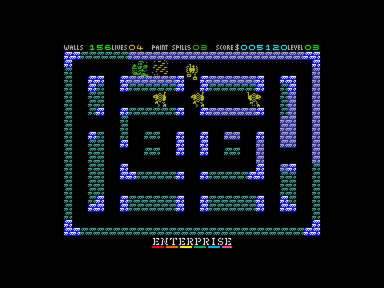

# Painter Man!!

 
 
 

Жанр: аркада  
Кількість гравців: 1  
Мова гри: англійська  

## Опис

Ласкаво просимо до неймовірної пригоди з розфарбовування замку на День свят. Представляємо вам відомого дядька Роббі, Банкі Ван Дайма, також відомого як "маляр!!".

Озброєний лише відром фарби та шестидюймовим пензлем із чистої щетини, Банкі Ван Дайм вирішує максимально використати вихідні на День свят та розфарбувати свій вишуканий замок.

На жаль, він вирішив це зробити у невдалий час. Атака шкідливого програмного забезпечення в місцевому зоопарку роботів розлютила левів зі штучним інтелектом, і вони знайшли дорогу до замку!

Банкі не дозволяє таким дрібним проблемам, як леви-вбивці, стати на заваді гарному фарбуванню кам'яного будинку, тому він продовжує рухатися вперед; час від часу розливаючи трохи фарби на підлогу (що бентежить левів зі штучним інтелектом і змушує їх розвертатися).

Як тільки рівень (кімната) завершено і всі стіни пофарбовані, Банкі може перейти до наступної кімнати. А потім до наступної кімнати. І так до нескінченності.  
(Ну, не зовсім до нескінченності!)

У грі 10 рівнів неймовірного екшену!

Чи зможете ви перемогти їх усіх?

## Системні вимоги

|Мінімальні системні вимоги:|Рекомендовані системні вимоги:|
|---------------------------|------------------------------|
|Оперативна пам'ять: **64 КБ**|Оперативна пам'ять: **128 КБ (або більше)**|  

## Керування та тонкощі запуску
### Основні [елементи керування](../controllers.md):
⌨ Клавіатура (`Q`, `A`, `O`, `P`, `M`)  
🕹 Вбудований джойстик  
🎮 Зовнішній джойстик 1/2

## Посилання

▶ [Easy Load&Play](https://t.me/EP128k_Load_n_Play/911) *(Telegram-канал Vibrant Waves)*  
💾 [Завантажити гру](http://www.ep128.hu/Ep_Games/Prg/Painter_Man.rar)  
📃 [Опис гри]() (угорська)  
🏡 [Домашня сторінка гри](https://ktbproductions.itch.io/enterprise-games)

## Автори
👨‍💻 Автор: Mas  
📅 Рік релізу: 2025  