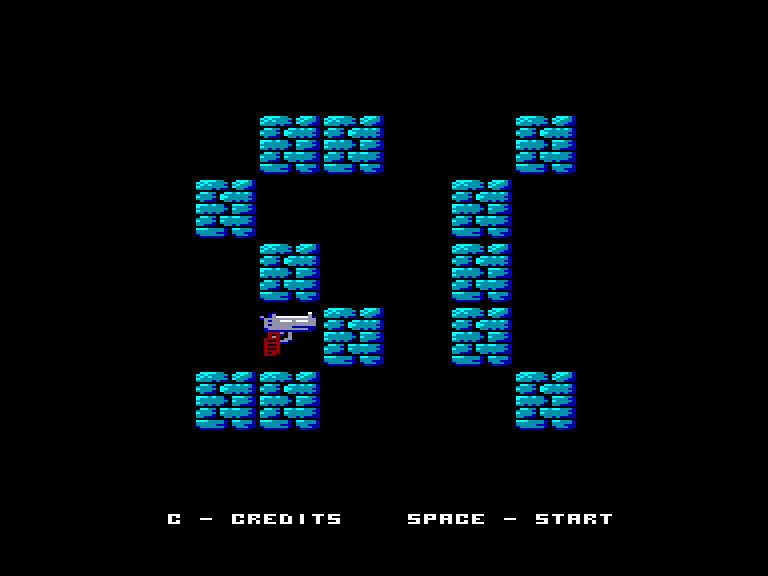
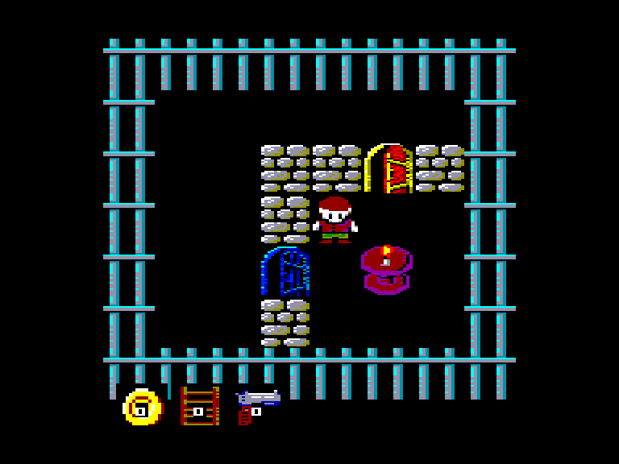
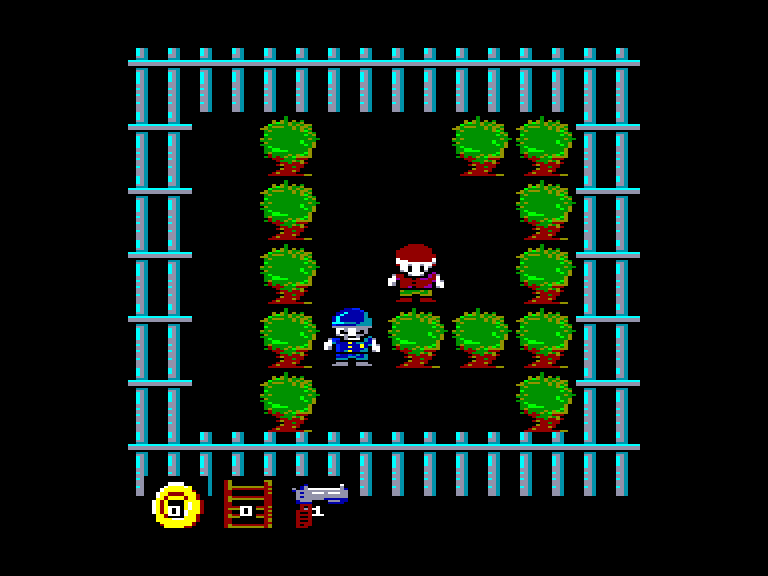

# Prison Break

 
 
 

Жанр: пригода, лабіринт  
Кількість гравців: 1  
Мова гри: англійська  

## Опис

Вам необхідно втекти із в'язниці. Для цього вам потрібно пройти 10 рівнів.

Початкова кімната - це головне меню. Червоні двері - це рівні (кожен рівень доступний після завершення попереднього).  
Якщо у початковій кімнаті зайти у сині двері, то можна ввести код, щоб відкрити червоні двері (гра відображає назву рівня, яка також є кодом, при вході).  
Жовті двері відкриваються, коли ви пройдете всі 10 рівней. Якщо ви вийдете через ці двері, ви здійсните втечу.  
Щоб завершити кожен рівень, вам необхідно знайти якнайменше 3 монети та вийти через червоні двері.  

На деяких рівнях можуть бути присутніми двері інших кольорів що відкриваються відповідними ключами.  
Інколи ви можете зустріти охоронців, які не завдадуть вам шкоди, але заблокують вам шлях. Їх можна позбутись за допомогою пістолета.  
За допомогою драбини можна перелізати через стіни (дуже зручно, але використовується лише один раз).  
Портали телепортують вас у обох напрямках.

<iframe width="560" height="315" src="https://www.youtube.com/embed/FgOfA-CFN8Y" title="YouTube video player" frameborder="0" allowfullscreen></iframe>

## Системні вимоги
### Мінімальні системні вимоги
Оперативна пам'ять: **128 КБ**  

## Керування

### Основні [елементи керування](../controllers.md):
⌨ Клавіатура (`W`, `A`, `S`, `D`, `Space`)  
🕹 Вбудований джойстик

`Fire`: Скористатись предметом

### Додаткові клавіши:
`X` / `Q`: повернутись на екран вибору рівня  
`M`: перемикання між музикою та звуками  
`1`: швидкість прокрутки екрану – **32** пікселя  
`2`: швидкість прокрутки екрану – **16** пікселів  
`3`: швидкість прокрутки екрану – **8** пікселів (по-замовчуванні)  
`4`: швидкість прокрутки екрану – **4** пікселя  

## Чіт-коди та допомога у проходженні

### Коди рівней:
Коди можна вводити, якщо зайти у сині двері на екрані з вибором рівней.  
`ROOM`, `PORTAL`, `MAZE`, `VIDA`, `FOREST`, `REFERENCZ`, `NIGHT`, `MARTIN`, `PRISONBREAK`, `THEEND`

### Відеопроходження:

## Посилання

▶ [Easy Load&Play](https://t.me/EP128k_Load_n_Play/769) *(Telegram-канал Vibrant Waves)*  
💾 [Завантажити гру](https://downloads.anystone.games/prisonbreak-enterprise-com)  
📃 [Опис гри]() (угорська)  

## Автори
### Оригінальний реліз
🖥 Платформа: [Videoton TVC](http://tvc.hu/html/k.html)  
👨‍💻 Програмісти: [Kis Róbert (AnyStone Games)](../../community/anystone.md)  
📅 Рік релізу: 2023  

### Версія гри для Enterprise
👨‍💻 Портування: [Kis Róbert (AnyStone Games)](../../community/anystone.md)  
📅 Рік релізу: [2025](../release_years/2025.md)  