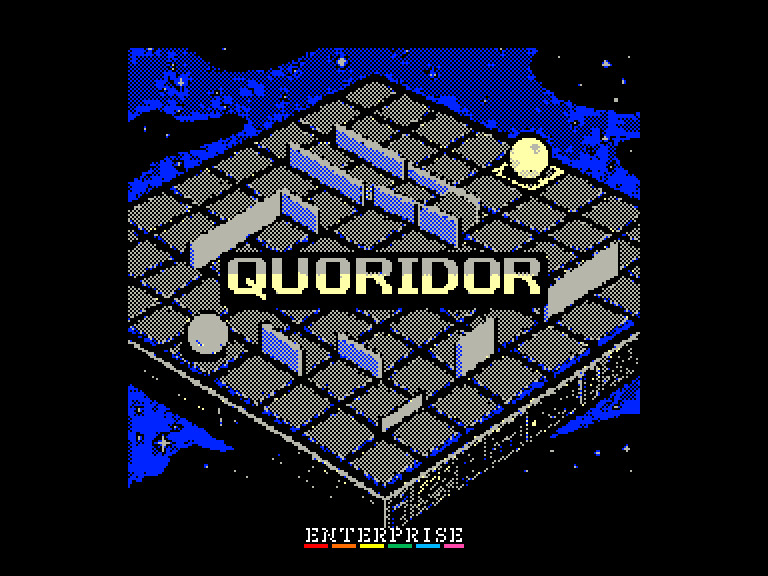
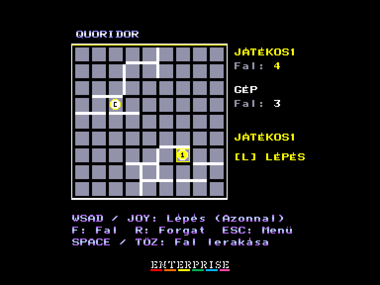
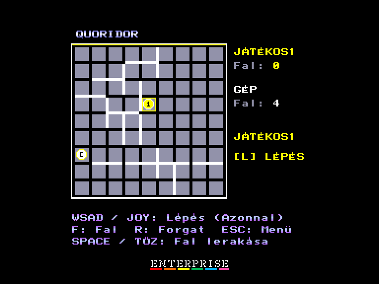
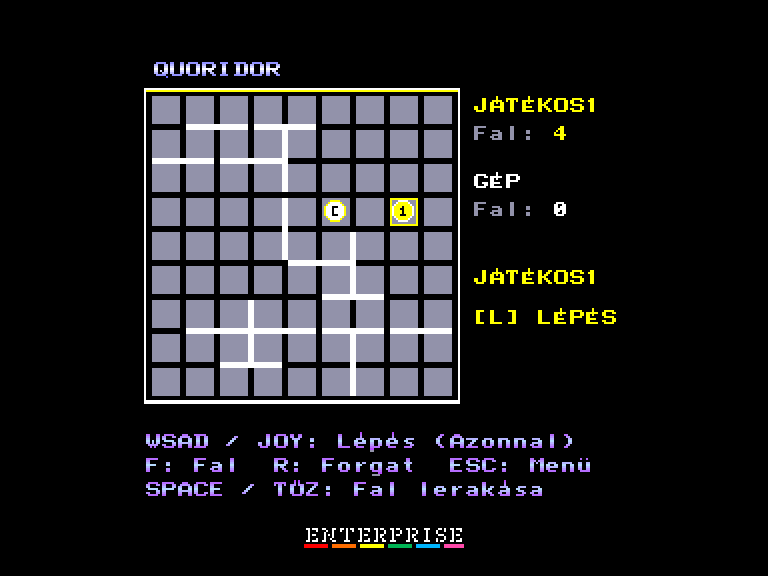

[0-9](../0/games-0.md) - [A](../a/games-a.md) - [B](../b/games-b.md) - [C](../c/games-c.md) - [D](../d/games-d.md) - [E](../e/games-e.md) - [F](../f/games-f.md) - [G](../g/games-g.md) - [H](../h/games-h.md) - [I](../i/games-i.md) - [J](../j/games-j.md) - [K](../k/games-k.md) - [L](../l/games-l.md) - [M](../m/games-m.md) - [N](../n/games-n.md) - [O](../o/games-o.md) - [P](../p/games-p.md) - [Q](../q/games-q.md) - [R](../r/games-r.md) - [S](../s/games-s.md) - [T](../t/games-t.md) - [U](../u/games-u.md) - [V](../v/games-v.md) - [W](../w/games-w.md) - [X](../x/games-x.md) - [Y](../y/games-y.md) - [Z](../z/games-z.md)

Ігри для [Enterprise 64k](../games-ep64.md) - [Enterprise 128k+RAMexp](../games-epramexp.md) - [2dfx](../games-2dfx.md)

Ігри для систем [IS-DOS](../games-is-dos.md) - [SymbOS](../games-symbos.md) - [EDC Windows](../games-edcw.md)

Ігри для емуляторів [ZX Spectrum 48k/128k](../zxemu/games-zxemu.md) - [Amstrad CPC](../cpcemu/games-cpc.md) - [Sinclair ZX81](../zx81emu/games-zx81.md) - [Videoton TVC](../tvcemu/games-tvc.md) - [Commodore VIC-20](../vic20emu/games-vic20.md)

----------

# Quoridor

**ID:** quoridor-tvc

**Жанри:** Стратегія

## Примітка

ℹ Сучасна схвалена конверсія з платформи Videoton TVC.

## Скріншоти

## Опис

Quoridor — це абстрактна настільна стратегічна гра для двох гравців. Мета кожного гравця — першим довести свою фішку до протилежного боку дошки та завадити суперникові зробити те саме.  

Назва гри походить від слова corridor, яке є в багатьох мовах і означає «коридор».

## Основна інформація
- **Мови:** Угорська
- **Оригінальна платформа:** Videoton TVC
### Загальні системні вимоги
- **Апаратні:** EP64, EP128
### Геймплей
- **Керування:** Keyboard, Internal Joy, External Joy 1, External Joy 2
- **Кількість гравців:** 1 player, 2 players (versus)
- **Додаткові теги:** 4-color mode
### Розробка
- **Рік випуску:** 2026
- **Автор:** KKS2003

## Посилання
- [Тема на форумі enterpriseforever](https://enterpriseforever.com/tvc-rl/quoridor/)
- [Easy Load&Play](https://t.me/EP128k_Load_n_Play/1193) *(Telegram-канал Vibrant Waves)*

## Відео

<iframe src="https://www.youtube.com/embed/2PKRsR6Sv9s"  
style="width:75%; aspect-ratio:16/9;" allowfullscreen></iframe>

## [Керування](../controllers.md)

`Keyboard`: `W`, `A`, `S`, `D`  
`Internal Joystick`  
`External Joystick 1`  
`External Joystick 2`  

`Space`, `Fire`, `Enter`: встановити стіну  
`F`: режим встановлення стіни  
`L`: режим пересування фішки  
`R`: повернути стіну  
`Esc`: вихід з поточної гри

## Детальна інформація

### Геймплей  

Ігрове поле розміром 9×9 клітинок. Кожному гравцю видається по 10 стін — довжина яких дорівнює ширині двох клітинок. Дошка влаштована так, що ці пластинки можна встановлювати у проміжки між клітинками на власний розсуд.  

Гравці починають гру з центральної клітинки найближчого до них ряду дошки. Мета — ступити своєю фішкою на будь-яку клітинку початкового ряду протилежного боку, чим здобути перемогу в партії. Гравці заважають супернику, встановлюючи стіни.  

Гравці ходять по черзі. У свій хід гравець може зробити один крок фішкою або встановити одну стіну. Якщо в нього більше немає стін, він зобов'язаний ходити фішкою. Стіну завжди потрібно розміщувати так, щоб вона проходила вздовж точно двох клітинок (тобто між двома парами клітинок); елементи, зрозуміло, не можуть перетинатися один з одним. Поставити стіну можна в будь-якому вільному місці на дошці, де це технічно можливо. Встановлену стіну під час гри вже не можна прибирати чи переставляти.  

Заборонено будувати стіну, яка повністю перекриває всі шляхи до мети для суперника.  

Фішка може зробити один крок на одну з чотирьох сусідніх клітинок, якщо шлях не перегороджує стіна. Якщо на сусідній клітинці стоїть інша фішка, її можна перестрибнути за умови, що за нею є вільна та не перекрита стіною клітинка. Якщо перестрибнути фішку неможливо, гравець може вибрати одну з двох інших сусідніх клітинок з боків від цієї фішки.