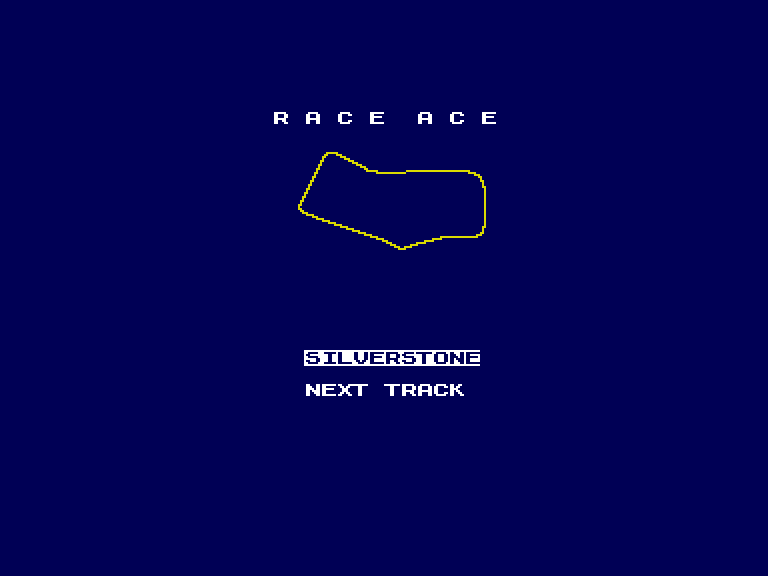
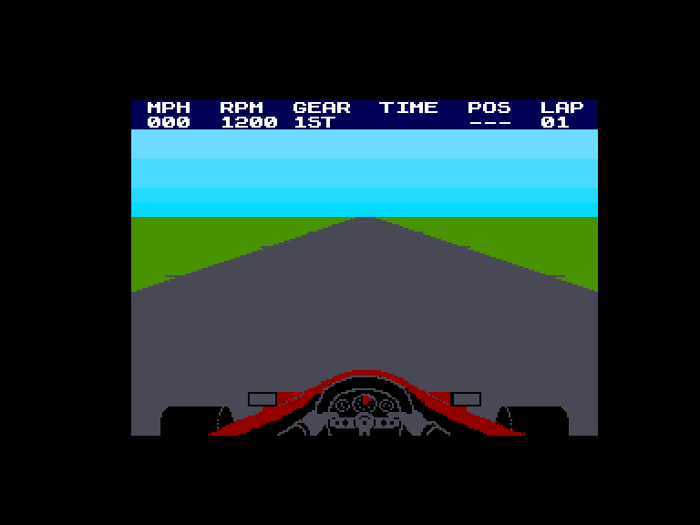
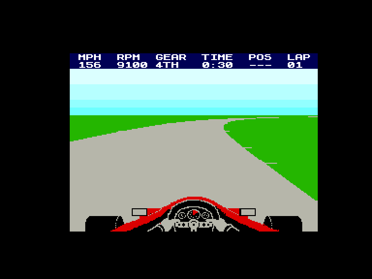
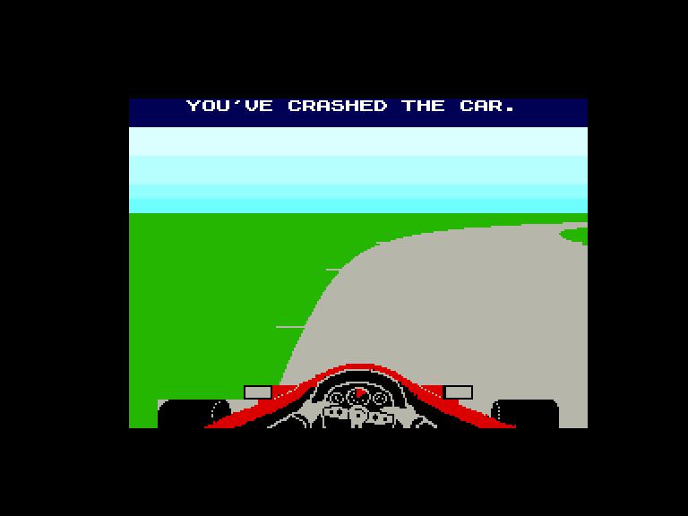

[0-9](../0/games-0.md) - [A](../a/games-a.md) - [B](../b/games-b.md) - [C](../c/games-c.md) - [D](../d/games-d.md) - [E](../e/games-e.md) - [F](../f/games-f.md) - [G](../g/games-g.md) - [H](../h/games-h.md) - [I](../i/games-i.md) - [J](../j/games-j.md) - [K](../k/games-k.md) - [L](../l/games-l.md) - [M](../m/games-m.md) - [N](../n/games-n.md) - [O](../o/games-o.md) - [P](../p/games-p.md) - [Q](../q/games-q.md) - [R](../r/games-r.md) - [S](../s/games-s.md) - [T](../t/games-t.md) - [U](../u/games-u.md) - [V](../v/games-v.md) - [W](../w/games-w.md) - [X](../x/games-x.md) - [Y](../y/games-y.md) - [Z](../z/games-z.md)

Ігри для [Enterprise 64k](../games-ep64.md) - [Enterprise 128k+RAMexp](../games-epramexp.md)

Ігри для систем [IS-DOS](../games-is-dos.md) - [SymbOS](../games-symbos.md) - [EDC Windows](../games-edcw.md)

Ігри для емуляторів [ZX Spectrum 48k/128k](../zxemu/games-zxemu.md) - [Amstrad CPC](../cpcemu/games-cpc.md) - [Sinclair ZX81](../zx81emu/games-zx81.md) - [Videoton TVC](../tvcemu/games-tvc.md) - [Commodore VIC-20](../vic20emu/games-vic20.md)

----------

# Race Ace

**ID:** race-ace

**Жанри:** Перегони

## Примітка

ℹ Офіційний реліз.  
(на інших платформах виходила під назвою: **Formula 1 Simulator**)

## Скріншоти

## Опис

Ця гра дає вам можливість випробувати свої сили за кермом гоночного боліда Формули-1.  

Вона імітує приголомшливе прискорення, потужне гальмування та мертве зчеплення з дорогою, властиві найкращим гоночним авто. Щоб обігнати інших пілотів, вам доведеться правильно вибирати траєкторію на поворотах і витискати максимум з двигуна.

## Основна інформація
- **Мови:** Англійська
- **Оригінальна платформа:** Enterprise
### Загальні системні вимоги
- **Апаратні:** EP64, EP128
### Геймплей
- **Керування:** Internal Joy, External Joy 1
- **Кількість гравців:** 1 player
- **Додаткові теги:** 4-color mode
### Розробка
- **Рік випуску:** 1985

## Посилання
- [Опис гри на ep128.hu (угорською)](http://www.ep128.hu/Ep_Games/Leiras/Race_Ace.htm)
- [Завантажити гру](http://www.ep128.hu/Ep_Games/Prg/Race_Ace.rar)
- [Easy Load&Play](https://t.me/EP128k_Load_n_Play/1177) *(Telegram-канал Vibrant Waves)*

## Відео

<iframe src="https://www.youtube.com/embed/hXKek8CvEvY"  
style="width:75%; aspect-ratio:16/9;" allowfullscreen></iframe>

- [Відео](https://www.youtube.com/watch?v=ahlVVSs2b7s)

## [Керування](../controllers.md)

`Internal Joystick`  
`External Joystick 1`  

**Ручне керування коробкою передач:**  
`Fire`+⬆️: перейти на вищу передачу  
`Fire`+⬇️: перейти на нижчу передачу  

**Додаткові клавіши:**  
`F1` (затиснути): Вимкнути/увімкнути музику та звуки

## Детальна інформація

### Системні вимоги  

#### Мінімальні системні вимоги  

Оперативна пам'ять: **64 КБ (або більше)**  

### Геймплей  

На початку програми вам пропонується вибір з 10 найкращих гоночних трас. Програма покаже, як виглядає кожна з них. Для перших спроб рекомендується обирати трасу з не надто великою кількістю поворотів!  

Також вам запропонують вибір між ручною та автоматичною коробкою передач. Знову ж таки, на початку краще обрати автомат, оскільки ви й так будете зайняті спробами втримати машину на стабільній траєкторії під час руху на високій швидкості!  

Програма автоматично визначає стан траси: вона може бути сухою або мокрою. Якщо траса мокра, вам знадобиться більше обережності на поворотах та під час обгонів.  

Спочатку вам запропонують одразу вийти на старт гонки або зробити тренувальне коло, щоб відчути трасу.