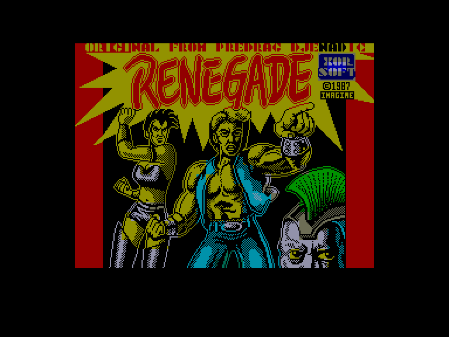
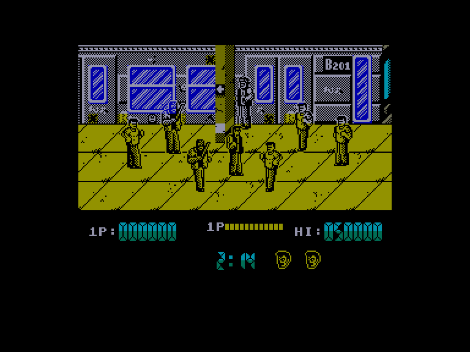
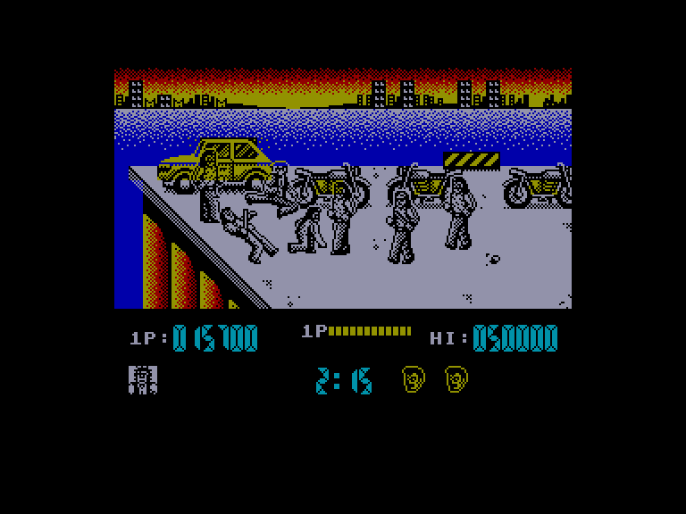
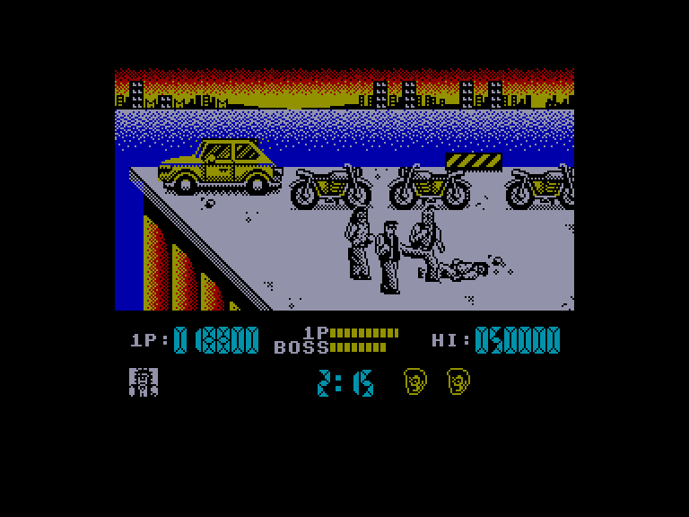

[0-9](../0/games-0.md) - [A](../a/games-a.md) - [B](../b/games-b.md) - [C](../c/games-c.md) - [D](../d/games-d.md) - [E](../e/games-e.md) - [F](../f/games-f.md) - [G](../g/games-g.md) - [H](../h/games-h.md) - [I](../i/games-i.md) - [J](../j/games-j.md) - [K](../k/games-k.md) - [L](../l/games-l.md) - [M](../m/games-m.md) - [N](../n/games-n.md) - [O](../o/games-o.md) - [P](../p/games-p.md) - [Q](../q/games-q.md) - [R](../r/games-r.md) - [S](../s/games-s.md) - [T](../t/games-t.md) - [U](../u/games-u.md) - [V](../v/games-v.md) - [W](../w/games-w.md) - [X](../x/games-x.md) - [Y](../y/games-y.md) - [Z](../z/games-z.md)

Ігри для [Enterprise 64k](../games-ep64.md) - [Enterprise 128k+RAMexp](../games-epramexp.md)

Ігри для систем [IS-DOS](../games-is-dos.md) - [SymbOS](../games-symbos.md) - [EDC Windows](../games-edcw.md)

Ігри для емуляторів [ZX Spectrum 48k/128k](../zxemu/games-zxemu.md) - [Amstrad CPC](../cpcemu/games-cpc.md) - [Sinclair ZX81](../zx81emu/games-zx81.md) - [Videoton TVC](../tvcemu/games-tvc.md) - [Commodore VIC-20](../vic20emu/games-vic20.md)

----------

# Renegade

**ID:** renegade-zx

**Жанри:** Екшн, Бітемап

## Примітка

ℹ Стара неофіційна конверсія з платформи ZX Spectrum.  
(краще користуватись сучасним портом з Amstrad CPC)

## Скріншоти

## Опис

Вулиці небезпечні! Ніч стрімко огортає місто, поки ви пробираєтеся крізь найпохмуріший його район, щоб зустріти свою дівчину. Поки що все йде добре... ваш потяг прибуває на станцію метро, але, виходячи з вагона, ви усвідомлюєте, що ви не самі!  

Станція та вулиці нагорі кишать бандитами й злочинцями... часу обмаль, тож ви мусите пробитися крізь ці території, щоб зустрітися з дівчиною, як і домовлялися. Швидке мислення та навички бойових мистецтв — це єдине, на що ви можете покластися, і ви виходите на платформу, розуміючи, що це буде найнебезпечніша прогулянка у вашому житті!  

Вам належить подолати п'ять етапів: спочатку станція метро, де ви зіткнетеся з бандою грабіжників, які прагнуть обірвати вашу подорож просто тут. Наступний етап веде крізь район пірсу, відомий як популярне місце збору байкерських банд. Третя зона — це брудні завулки міста; дівочі банди вистежують на вулицях будь-яких непідготовлених чоловіків, які наважяться ступити на їхню територію. Далі — вулиця, що веде до місця вашої зустрічі; люта банда бандитів із бритвами звикла знущатися з будь-якого випадкового перехожого просто розваги ради.  

Нарешті, ви входите до призначеного місця зустрічі, але будьте обачні — остання знешкоджена вами банда викликала підкріплення, яке чекає на вас із засідки разом зі своїм ватажком, озброєним пістолетом! Доведіть, що кохання здане подолати все, перемігши цих лиходіїв вчасно до вашого побачення!

## Основна інформація
- **Мови:** Англійська
- **Оригінальна платформа:** ZX Spectrum
### Загальні системні вимоги
- **Апаратні:** EP128
### Геймплей
- **Керування:** Keyboard, Internal Joy, External Joy 1, External Joy 2
- **Кількість гравців:** 1 player
- **Додаткові теги:** Attribute mode
### Розробка
- **Рік випуску:** 1987
- **Автор:** Mike Lamb, Ronnie Fowles, Fred Gray

## Посилання
- [Опис гри на ep128.hu (угорською)](http://www.ep128.hu/Games/Renegade.htm)
- [Інформація про оригінальну версію](https://spectrumcomputing.co.uk/entry/4082/ZX-Spectrum/Renegade)
- [Завантажити гру](http://www.ep128.hu/Ep_Games/Prg/Renegade.rar)
- [Easy Load&Play](https://t.me/EP128k_Load_n_Play/21) *(Telegram-канал Vibrant Waves)*

## [Керування](../controllers.md)

`Keyboard`: `Q`, `A`, `O`, `P`, `Space` (можна перевизначити)  
`Internal Joystick`  
`External Joystick 1`  
`External Joystick 2`  

`Fire`: Удар  
`Fire`+`⬆`: Підстрибнути  
`Fire`+`↖️`/`↗️`: Підстрибнути та ударити ногою  
`Fire`+напрямок протилежний погляду: Удар ногою назад  
`Fire`+(`⬆`,`⬅`,`➡`): Підстрибнути та ударити ногою у обидві сторони  

Додаткові можливості:  

- стоячи біля лежачого супротивника натисніть `Down` та удар щоб добити його.  
- ви можете підійти до чоловіка, вдарити його кулаком тричі, а коли він зігнеться — підійти впритул і натиснути кнопку вогню. Це дозволить вам схопити його за плечі. Не бийте його коліном у пах, а зачекайте кілька секунд і спробуйте зробити удар ногою назад — тоді чоловік полетить через повітря та вріжеться в кожного, хто опиниться у нього на шляху. (лише у 128k версії порту)

## Детальна інформація

### Системні вимоги  

#### Мінімальні системні вимоги  

Оперативна пам'ять: **128 КБ (або більше)**  

### Чіти  

(лише 128k версія порту):  
Перевизначте клавіатуру комбінацією `CHEAT`: нескінченний час та життя.