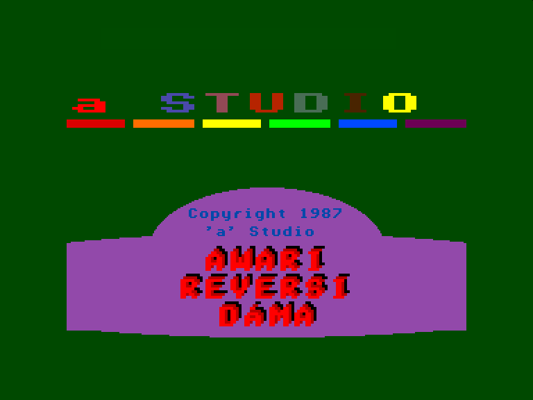
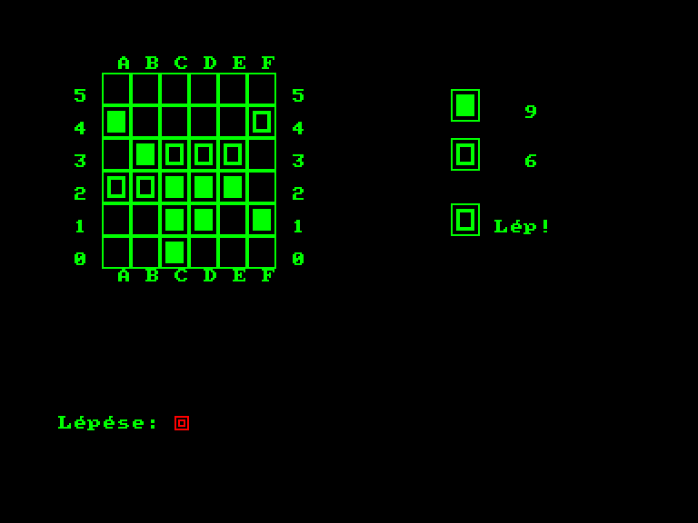
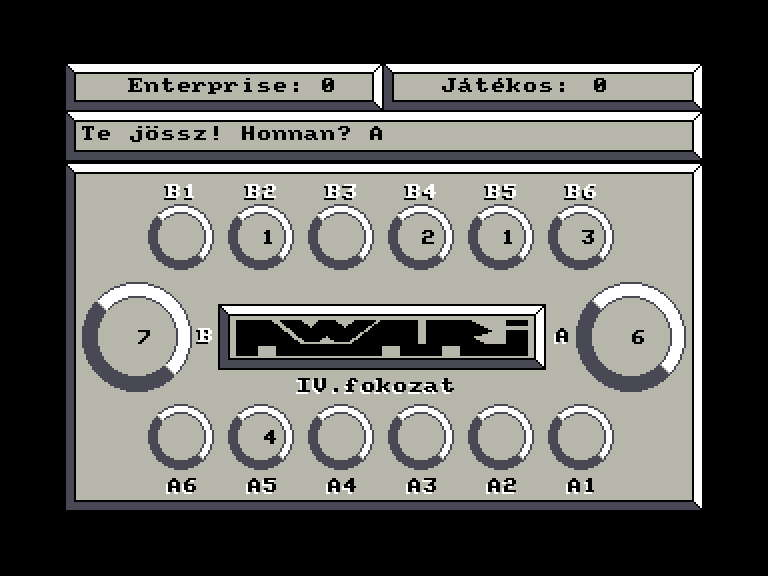
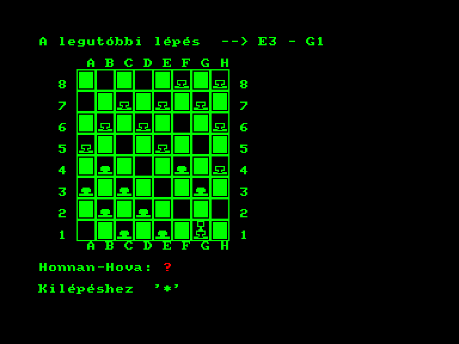

[0-9](../0/games-0.md) - [A](../a/games-a.md) - [B](../b/games-b.md) - [C](../c/games-c.md) - [D](../d/games-d.md) - [E](../e/games-e.md) - [F](../f/games-f.md) - [G](../g/games-g.md) - [H](../h/games-h.md) - [I](../i/games-i.md) - [J](../j/games-j.md) - [K](../k/games-k.md) - [L](../l/games-l.md) - [M](../m/games-m.md) - [N](../n/games-n.md) - [O](../o/games-o.md) - [P](../p/games-p.md) - [Q](../q/games-q.md) - [R](../r/games-r.md) - [S](../s/games-s.md) - [T](../t/games-t.md) - [U](../u/games-u.md) - [V](../v/games-v.md) - [W](../w/games-w.md) - [X](../x/games-x.md) - [Y](../y/games-y.md) - [Z](../z/games-z.md)

Ігри для [Enterprise 64k](../games-ep64.md) - [Enterprise 128k+RAMexp](../games-epramexp.md) - [2dfx](../games-2dfx.md)

Ігри для систем [IS-DOS](../games-is-dos.md) - [SymbOS](../games-symbos.md) - [EDC Windows](../games-edcw.md)

Ігри для емуляторів [ZX Spectrum 48k/128k](../zxemu/games-zxemu.md) - [Amstrad CPC](../cpcemu/games-cpc.md) - [Sinclair ZX81](../zx81emu/games-zx81.md) - [Videoton TVC](../tvcemu/games-tvc.md) - [Commodore VIC-20](../vic20emu/games-vic20.md)

----------

# Reversi, Dáma, Awari

**Альтернативні назви:**
 - Awari, Reversi, Dáma

**ID:** reversi-dama-awari-bas

## Скріншоти

## Опис

(temp description)

Reversi Dáma Awari — це збірка з трьох логічних настільних ігор, випущена в 1987 році компанією 'a' Studio для системи Enterprise. Програма є унікальною, оскільки була повністю написана на мові програмування IS-BASIC і демонструє принцип "мультипрограм", які завантажуються усі разом. Меню знаходиться в "Program 0", а кожна з ігор — у файлах "Program 1-2-3". Користувач може ознайомитися з правилами кожної гри, оскільки вони доступні угорською мовою безпосередньо в програмі.

Опис ігрового процесу

*Reversi*  

Це гра для двох гравців, де можна грати проти комп’ютера або проти іншого гравця. Поле може бути різного розміру: 4×4, 6×6, 8×8 або 10×10. Гравці по черзі ставлять фішки свого кольору, намагаючись оточити фішки суперника по горизонталі, вертикалі або діагоналі. Оточені фішки змінюють колір на колір гравця, який їх оточив. Якщо гравець не має можливості зробити хід, він повинен пропустити його. Гра закінчується, коли поле заповнене або в жодного гравця немає доступних ходів. Перемагає той, хто має більше фішок на дошці. Стратегічно важливо займати кутові та бічні клітинки, оскільки їх не можна оточити.

Керування: Хід виконується введенням координат (наприклад, C3). Пропустити хід можна, натиснувши '0', а здатися — '*'.

*Dáma* (Шашки)  

Правила цієї гри схожі на класичні шашки. Двоє гравців починають із 12 фішками кожен. Ходи виконуються лише по чорних клітинках по діагоналі вперед. Фішку суперника можна "збити", перестрибнувши через неї. Можливі ланцюгові стрибки, коли одним ходом можна збити кілька фішок. Коли фішка досягає останньої горизонталі, вона перетворюється на дамку, яка може рухатися і збивати фішки як вперед, так і назад. Перемагає той, хто збиває всі фішки суперника. Цю гру можна грати лише проти комп’ютера, і ви завжди починаєте першим.

Керування: Хід вказується у форматі "звідки-куди" (наприклад, A3-B4). Для ланцюгового ходу потрібно вказувати лише кінцеві координати. Здатися можна, натиснувши '*'.

*Awari* (Калах)  

Ця гра також розрахована на двох гравців, але грати можна лише проти комп’ютера. Ігрове поле складається з 14 "мисок": шість нижніх (A1-A6) належать гравцеві, шість верхніх (B1-B6) — комп’ютеру, а також по одній великій мисці для збирання фішок для кожного гравця. Мета гри — зібрати якомога більше фішок у своїй великій мисці. Гравці по черзі беруть усі фішки з однієї зі своїх маленьких мисок і розподіляють їх по одній в миски проти годинникової стрілки. Фішки не кладуться у велику миску суперника. Якщо остання фішка ходу потрапляє у вашу велику миску, ви отримуєте право на додатковий хід. Гра закінчується, коли всі маленькі миски одного з гравців порожні. Перемагає той, хто має більше фішок у своїй великій мисці, незалежно від того, хто закінчив гру.

Керування: Хід виконується натисканням цифри, що відповідає номеру миски. Здатися можна, натиснувши '*'. Клавіша 'S' дозволяє перечитати правила.

Інші ігри у цих жанрах:

Реверсі: [[softid:reversi-bas]]
 [[softid:reversi-n2-bas]]
 [[softid:otello7-bas]]
 [[softid:othello]]
 [[softid:othello-hisoftc-isdos]]
 [[softid:othello-jatek-bas]]
 [[softid:othello-bas]]
 [[softid:vice-versa-bas]]

Шашки: [[softid:draughts-genius-zx]]
 [[softid:draughts-master-zx]]

Калах: [[softid:awari-bas]]
 [[softid:awari-jatek-bas]]

## Основна інформація
- **Мови:** Угорська
### Геймплей
- **Керування:** Keyboard

## Посилання
- [Опис на ep128.hu (угорською)](http://www.ep128.hu/Ep_Games/Leiras/Reversi_Dama_Awari.htm)
- [Завантажити](http://www.ep128.hu/Ep_Games/Prg/Reversi_Dama_Avari.rar)

