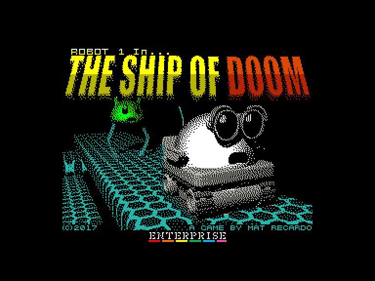
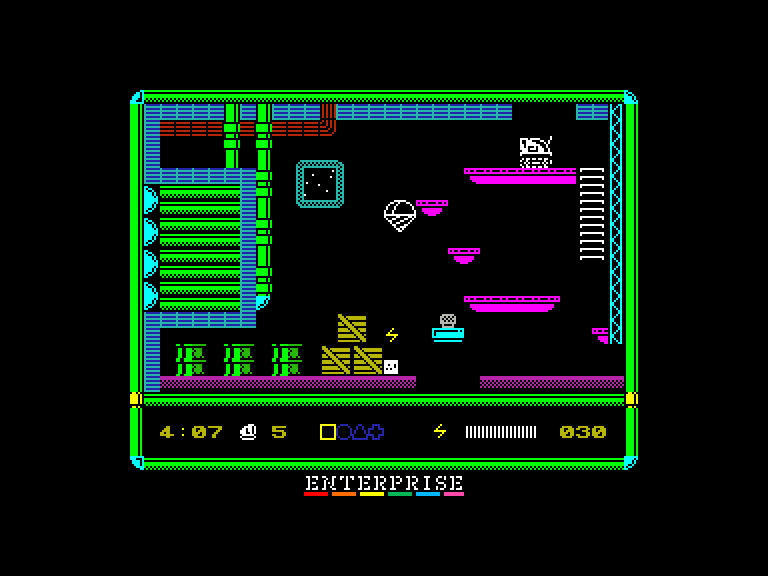
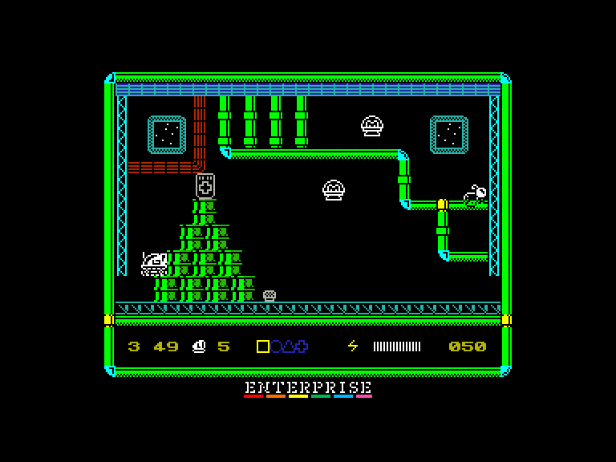
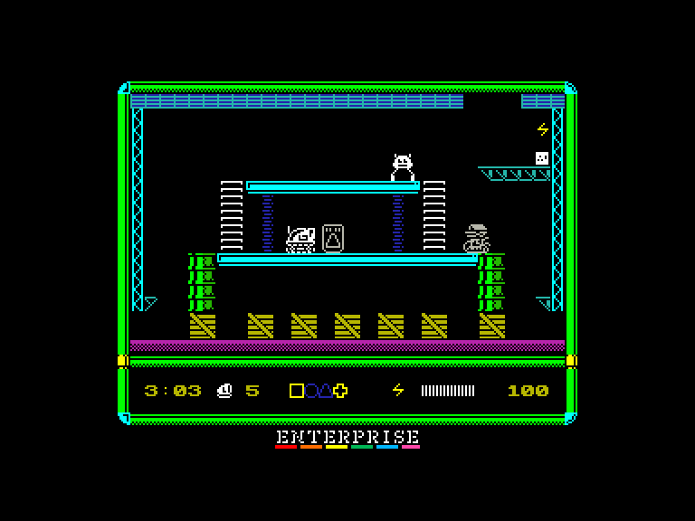

[0-9](../0/games-0.md) - [A](../a/games-a.md) - [B](../b/games-b.md) - [C](../c/games-c.md) - [D](../d/games-d.md) - [E](../e/games-e.md) - [F](../f/games-f.md) - [G](../g/games-g.md) - [H](../h/games-h.md) - [I](../i/games-i.md) - [J](../j/games-j.md) - [K](../k/games-k.md) - [L](../l/games-l.md) - [M](../m/games-m.md) - [N](../n/games-n.md) - [O](../o/games-o.md) - [P](../p/games-p.md) - [Q](../q/games-q.md) - [R](../r/games-r.md) - [S](../s/games-s.md) - [T](../t/games-t.md) - [U](../u/games-u.md) - [V](../v/games-v.md) - [W](../w/games-w.md) - [X](../x/games-x.md) - [Y](../y/games-y.md) - [Z](../z/games-z.md)

Ігри для [Enterprise 64k](../games-ep64.md) - [Enterprise 128k+RAMexp](../games-epramexp.md)

Ігри для систем [IS-DOS](../games-is-dos.md) - [SymbOS](../games-symbos.md) - [EDC Windows](../games-edcw.md)

Ігри для емуляторів [ZX Spectrum 48k/128k](../zxemu/games-zxemu.md) - [Amstrad CPC](../cpcemu/games-cpc.md) - [Sinclair ZX81](../zx81emu/games-zx81.md) - [Videoton TVC](../tvcemu/games-tvc.md) - [Commodore VIC-20](../vic20emu/games-vic20.md)

----------

# Robot 1 in... The Ship of Doom

**ID:** robot1-in-the-ship-of-doom-agd

**Жанри:** Аркада, Платформер

## Скріншоти

## Опис

### Сюжет

Команда залишила Робота 1 на борту корабля, який наближається до зірки, і незабаром зіткнеться з нею. У вас є лише п'ять хвилин, перш ніж ситуація стане критичною. Ваше завдання — зібрати чотири ключі для телепортації, а потім знайти телепорт і втекти з корабля.

### Ігровий процес

Слідкуйте за рівнем заряду своєї батареї. Якщо заряд опуститься занадто низько, потрібно знайти розетку, щоб підзарядитися. На кораблі також розкидано безліч ключів даних, збирання яких збільшує ваш рахунок.

## Основна інформація
- **Мови:** Англійська
- **Оригінальна платформа:** ZX Spectrum
### Загальні системні вимоги
- **Апаратні:** EP128, EP64
### Геймплей
- **Керування:** Keyboard, Internal Joy, External Joy 1, External Joy 2
- **Кількість гравців:** 1 Player
- **Додаткові теги:** AGD, Attribute mode
### Розробка
- **Рік випуску:** 2017
- **Автор:** Mat Recardo, MmcM

## Посилання
- [Домашня сторінка гри](https://prefim.itch.io/robot-1-in-the-ship-of-doom)
- [Опис гри на ep128.hu (угорською)](https://ep128.hu/Games/Robot1_in_The_Ship_of_Doom.htm)
- [Інформація про оригінальну версію](https://spectrumcomputing.co.uk/entry/30408/ZX-Spectrum/Robot_1_in_The_Ship_of_Doom)
- [Завантажити гру](https://ep128.hu/Ep_Games/Prg/Robot1_Ship_of_Doom.rar)
- [Easy Load&Play](https://t.me/EP128k_Load_n_Play/966) *(Telegram-канал Vibrant Waves)*

## Відео

<iframe src="https://www.youtube.com/embed/RwAbfPAH-8E"  
style="width:75%; aspect-ratio:16/9;" allowfullscreen></iframe>

## [Керування](../controllers.md)

`Keyboard` (`Z`,`X`,`P`)  
`Internal Joystick`  
`External Joystick 1`  
`External Joystick 2`  

`H`: Пауза (натисніть `Fire` щоб продовжити гру)

