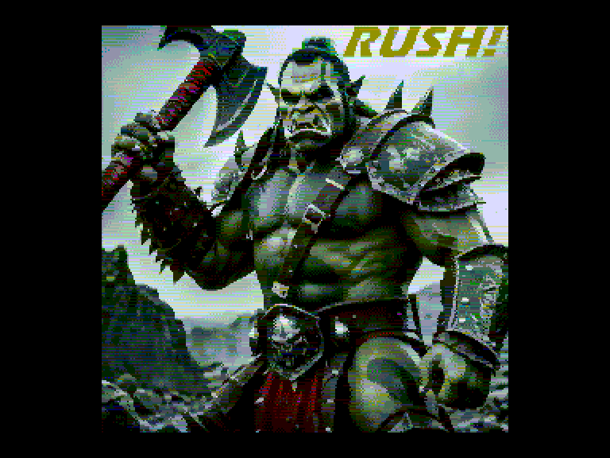
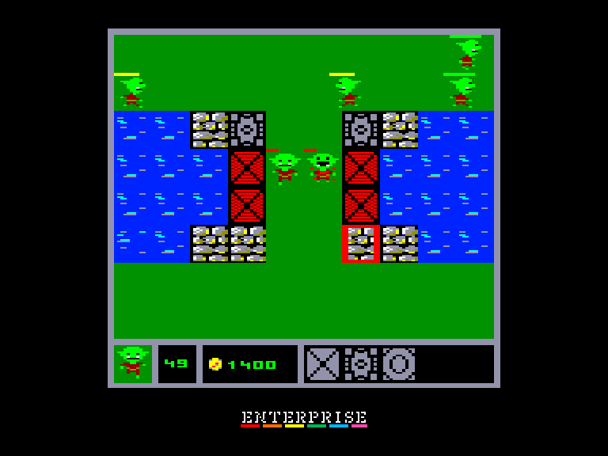
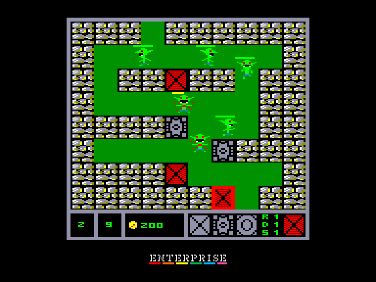
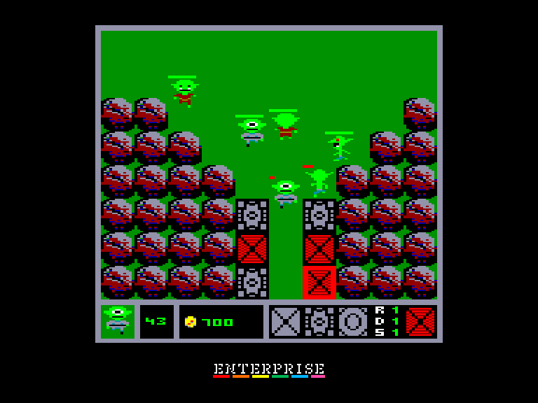

[0-9](../0/games-0.md) - [A](../a/games-a.md) - [B](../b/games-b.md) - [C](../c/games-c.md) - [D](../d/games-d.md) - [E](../e/games-e.md) - [F](../f/games-f.md) - [G](../g/games-g.md) - [H](../h/games-h.md) - [I](../i/games-i.md) - [J](../j/games-j.md) - [K](../k/games-k.md) - [L](../l/games-l.md) - [M](../m/games-m.md) - [N](../n/games-n.md) - [O](../o/games-o.md) - [P](../p/games-p.md) - [Q](../q/games-q.md) - [R](../r/games-r.md) - [S](../s/games-s.md) - [T](../t/games-t.md) - [U](../u/games-u.md) - [V](../v/games-v.md) - [W](../w/games-w.md) - [X](../x/games-x.md) - [Y](../y/games-y.md) - [Z](../z/games-z.md)

Ігри для [Enterprise 64k](../games-ep64.md) - [Enterprise 128k+RAMexp](../games-epramexp.md) - [2dfx](../games-2dfx.md)

Ігри для систем [IS-DOS](../games-is-dos.md) - [SymbOS](../games-symbos.md) - [EDC Windows](../games-edcw.md)

Ігри для емуляторів [ZX Spectrum 48k/128k](../zxemu/games-zxemu.md) - [Amstrad CPC](../cpcemu/games-cpc.md) - [Sinclair ZX81](../zx81emu/games-zx81.md) - [Videoton TVC](../tvcemu/games-tvc.md) - [Commodore VIC-20](../vic20emu/games-vic20.md)

----------

# Rush!

**ID:** rush-tvc

**Жанри:** Тауер дефенс

## Примітка

ℹ Схвалена конверсія з платформи Videoton TVC.

## Скріншоти

## Опис

Гра у жанрі «захист веж», де головна мета — не дати ворожим юнітам пройти крізь рівень.

## Основна інформація
- **Мови:** Англійська
- **Оригінальна платформа:** Videoton TVC
### Загальні системні вимоги
- **Апаратні:** EP128
### Геймплей
- **Керування:** Internal Joy, External Joy 1, External Joy 2
- **Кількість гравців:** 1 player
- **Додаткові теги:** 16-color mode, DevTool
### Розробка
- **Рік випуску:** 2024
- **Автор:** Kis Robert
- **Компанія:** AnyStone Games

## Посилання
- [Домашня сторінка](https://anystone.games)
- [Опис на ep128.hu (угорською)](http://www.ep128.hu/Ep_Games/Leiras/Rush.htm)
- [Тема на форумі enterpriseforever](https://enterpriseforever.com/tvc-rl/rush!/)
- [Завантажити](http://www.ep128.hu/Ep_Games/Prg/Rush.rar)
- [Завантажити](https://downloads.anystone.games/rush-enterprise-com)
- [Easy Load&Play](https://t.me/EP128k_Load_n_Play/915) *(Telegram-канал Vibrant Waves)*

## Відео

<iframe src="https://www.youtube.com/embed/cSt4xLlUJV4"  
style="width:75%; aspect-ratio:16/9;" allowfullscreen></iframe>

## [Керування](../controllers.md)

`Internal Joystick`  
`External Joystick 1`  
`External Joystick 2`  

### Додаткові клавіши  

`1`: встановити вежу з лучником  
`2`: встановити вежу з гарматою  
`3`: встановити вежу з чарівником  

`D`: покращити рівень пошкоджень  
`R`: покращити рівень дистанції ураження  
`S`: покращити швидкість пострілів  

`Hold`/`Pause`: Пауза  
`Stop`: Вийти у головне меню

## Детальна інформація

### Системні вимоги  

#### Мінімальні системні вимоги  

Оперативна пам'ять: **112 КБ**  

### Рекомендовані системні вимоги  

Оперативна пам'ять: **128 КБ (або більше)**  

### Геймплей  

Розставляйте вежі на мурах замку (на інтерфейсі HUD показано, які з них доступні на цей момент).  

3 типи веж:  

- Вежа лучника — стріляє по поодинокій цілі  
- Гарматна вежа — завдає шкоди ворогам поблизу цілі (шкода по площі / AoE)  
- Вежа чарівника — заморожує ціль  

Доступність веж залежить від того, чи відкриті вони та чи вистачає вам золота.  
Початкова кількість золота дається на початку кожного рівня; знищуйте ворогів, щоб заробити більше.  
Вежі діють автономно.  
Під час гри для кожної вежі можна покращувати 3 характеристики (підсвічуються білим, коли покращення доступне та ви маєте достатньо коштів):  

- **R**ange — максимальна дальність стрільби  
- **D**amage — шкода, що завдається за один постріл (для чарівника: тривалість замороження)  
- **S**peed — скорострільність  

Пройти крізь рівень можуть максимум 3 вороги. Якщо прорветься третій — рівень вважається програним.  
Ви отримаєте 3 зірки, якщо жоден ворог не пройде, 2 — якщо пройде лише 1, і 1 зірку — якщо прорвуться 2 вороги.  
Витрачайте зірки на покращення на екрані вибору рівнів (натисніть `U`).  
На початку гри доступна лише вежа лучника; розблокування двох інших коштує по 3 зірки.  
Усі інші покращення коштують по 1 зірці. Усі покращення можна скинути в будь-який момент.  

### Чіти  

> There is a built in cheat in the game, everybody should find out :D  

### Історія розробки  

> Kis Róbert:  
> Одного дня Geco, один із найактивніших учасників спільноти Enterprise, написав мені з питанням, чи планую я портувати Rush! на Enterprise. Я відповів «ні», оскільки написав її на TRSE, тож портування на DevTool (який я використовую для розробки під EP) означало б фактичне переписування гри з нуля. Його відповідь була: «Тоді я зроблю це сам».  
>   
> Далі були численні спільні вечори обговорень та роботи. Я давав йому все, що він просив, і пояснював усе необхідне, і зрештою гра зібралася до купи. Версія для EP базується на оригіналі для TVC, але зображення для титульного та фінального екранів були портовані з версії для Plus/4, а також було додано три чудові музичні треки від Csabo з версії для Plus/4.  
>   
> Величезне дякую Geco за те, що втілив це в життя!