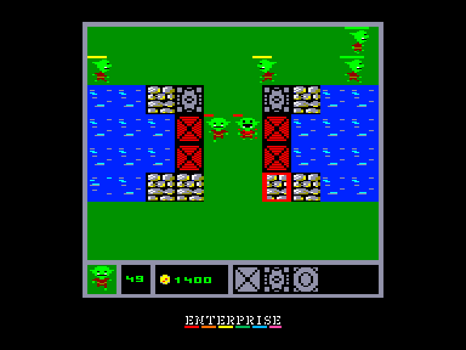
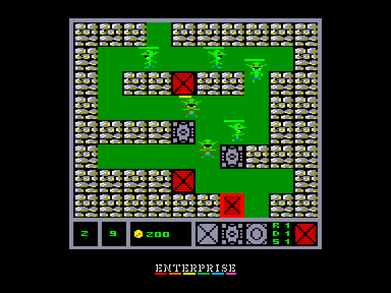
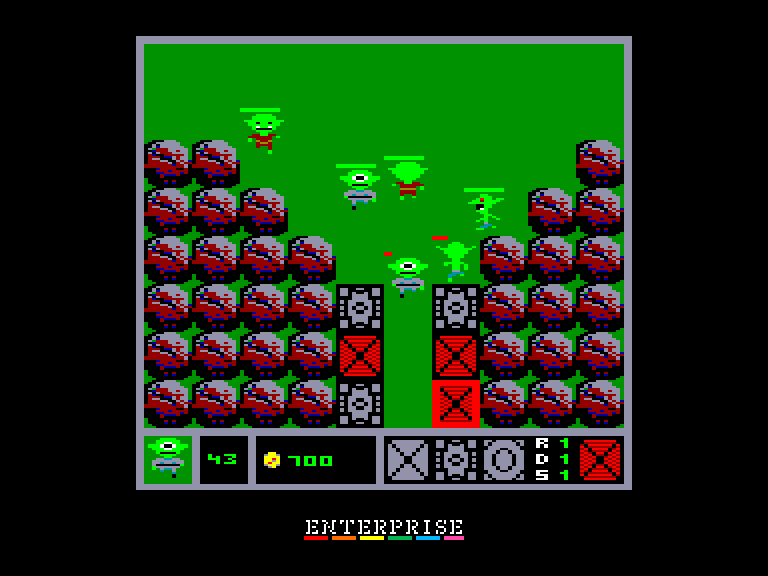

# Rush!

| | | | |
| --- | --- | --- | --- |
|||||

Жанр: стратегія, тауер дефенс  
Кількість гравців: 1  
Мова гри: англійська  

## Опис

Це гра типу Tower Defense, де мета полягає в тому, щоб не дати ворожому війську перетнути поле.
Ви можете розміщувати вежі на стіні замку за допомогою кнопок `1`, `2`, `3`.
Доступні вежі видно внизу, там же показано клавіша для будівництва, кожна вежа має 3 властивості, і кожна з них має 3 рівня розвитку. Максимальна кількість веж що може бути розміщена - 6.

Мета: завершити рівень з максимум двома пропущеними ворожими істотами, якщо пройде третя, то рівень вважається програним.

**Вороги (та нагорода за знищення):**
- ***Троль***: 50 золотих  
- ***Орк***: 100 золотих  
- ***Циклоп***: 200 золота  

**Вежі:**
- ***вежа лучника** (червона)*: просто стріляє у ворога (коштує 500 золотих)  
- ***гарматна вежа** (сіра)*: також завдає шкоди і навколишнім ворогам (коштує 1000 золотих)  
- ***вежа чарівника** (синя)*: заморожує ворога (коштує 1500 золотих)  

**Властивості веж:**
- ***Пошкодження (Damage)***: рівень пошкоджень (тривалість заморожування для вежі чарівника)  
- ***Дальність (Range)***: відстань, на яку вона може досягти
- ***Швидкість (Speed)***: швидкість пострілів  

**Ціни на покращення вежі:**
- ***2-й рівень***: 300 золотих
- ***3-й рівень***: 600 золотих

## Системні вимоги

|Мінімальні системні вимоги:|Рекомендовані системні вимоги:|
|---------------------------|------------------------------|
|Оперативна пам'ять: **112 КБ**|Оперативна пам'ять: **128 КБ (або більше)**|  

## Керування

### Основні [елементи керування](../controllers.md):
🕹 Вбудований джойстик  
🎮 Зовнішній джойстик 1/2

### Додаткові клавіши:
`1`: встановити вежу з лучником  
`2`: встановити вежу з гарматою  
`3`: встановити вежу з чарівником  

`D`: покращити рівень пошкоджень  
`R`: покращити рівень дистанції ураження  
`S`: покращити швидкість пострілів  

`Hold`/`Pause`: Пауза  
`Stop`: Вийти у головне меню  

## Чіт-коди та допомога у проходженні

> There is a built in cheat in the game, everybody should find out :D

## Посилання

▶ [Easy Load&Play](https://t.me/EP128k_Load_n_Play/915) *(Telegram-канал Vibrant Waves)*  
💾 [Завантажити гру](https://downloads.anystone.games/rush-enterprise-com)  
📃 [Опис гри](http://www.ep128.hu/Ep_Games/Leiras/Rush.htm) (угорська)  

## Автори
### Оригінальний реліз
🖥 Платформа: [Videoton TVC](http://tvc.hu/html/k.html)  
👨‍💻 Програмісти: [Kis Róbert (AnyStone Games)](../../community/anystone.md)  
📅 Рік релізу: 2024  

### Версія гри для Enterprise
👨‍💻 Портування: [Geco](../../community/geco.md)  
📅 Рік релізу: [2025](../release_years/2025.md)  