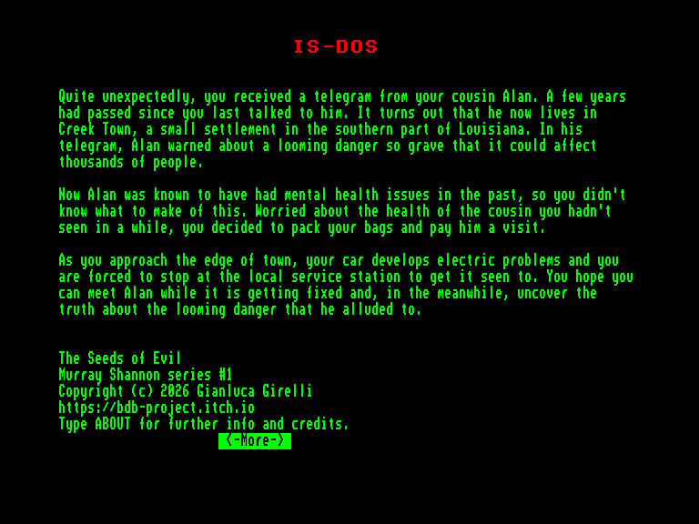
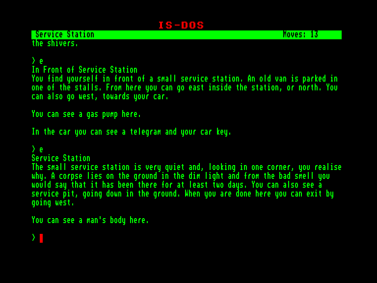
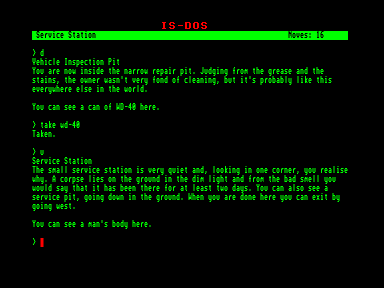
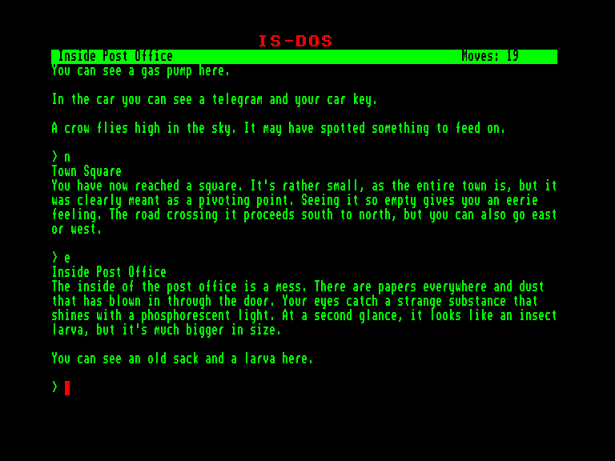

[0-9](../0/games-0.md) - [A](../a/games-a.md) - [B](../b/games-b.md) - [C](../c/games-c.md) - [D](../d/games-d.md) - [E](../e/games-e.md) - [F](../f/games-f.md) - [G](../g/games-g.md) - [H](../h/games-h.md) - [I](../i/games-i.md) - [J](../j/games-j.md) - [K](../k/games-k.md) - [L](../l/games-l.md) - [M](../m/games-m.md) - [N](../n/games-n.md) - [O](../o/games-o.md) - [P](../p/games-p.md) - [Q](../q/games-q.md) - [R](../r/games-r.md) - [S](../s/games-s.md) - [T](../t/games-t.md) - [U](../u/games-u.md) - [V](../v/games-v.md) - [W](../w/games-w.md) - [X](../x/games-x.md) - [Y](../y/games-y.md) - [Z](../z/games-z.md)

Ігри для [Enterprise 64k](../games-ep64.md) - [Enterprise 128k+RAMexp](../games-epramexp.md)

Ігри для систем [IS-DOS](../games-is-dos.md) - [SymbOS](../games-symbos.md) - [EDC Windows](../games-edcw.md)

Ігри для емуляторів [ZX Spectrum 48k/128k](../zxemu/games-zxemu.md) - [Amstrad CPC](../cpcemu/games-cpc.md) - [Sinclair ZX81](../zx81emu/games-zx81.md) - [Videoton TVC](../tvcemu/games-tvc.md) - [Commodore VIC-20](../vic20emu/games-vic20.md)

----------

# The Seeds of Evil

**ID:** seeds-of-evil-zcode

**Жанри:** Текстова пригода

## Примітка

Approved adaptation of the semi-graphic Italian adventure 'Murray Shannon: I Semi del Male'

## Скріншоти

## Опис

Цілком неочікувано ви отримали звістку від свого двоюрідного брата Алана. Пройшло чимало років з того часу, як ви востаннє розмовляли. З'ясувалося, що зараз він проживає в Крік-Тауні, невеликому населеному пункті на півдні Луїзіани. У своєму посланні Алан попереджав про дуже серйозну загрозу, яка може зачепити тисячі людей.

Враховуючи, що Алан у минулому мав певні проблеми з ментальним здоров'ям, ви були в розгубленості й не знали, як сприймати його слова. Проте, хвилюючись за родича, якого ви давно не бачили, ви вирішили спакувати речі й вирушити до нього.

Коли ви дісталися до околиць містечка, у вашої машини раптом виникли неполадки з електрикою, і вам довелося заїхати на місцеву станцію техобслуговування, щоб її відремонтувати. Ви сподівалися, що поки авто лагодитимуть, ви встигнете зустрітися з Аланом і за цей час з'ясувати правду про ту небезпеку, на яку він так туманно натякав.

## Основна інформація
- **Мови:** Англійська
### Загальні системні вимоги
- **Апаратні:** EXDOS
- **Програмні:** IS-DOS
### Геймплей
- **Керування:** Keyboard
- **Кількість гравців:** 1 player
- **Додаткові теги:** Z-code
### Розробка
- **Рік випуску:** 2026
- **Автор:** Gianluca Girelli

## Посилання
- [Домашня сторінка гри](https://bdb-project.itch.io/seeds-of-evil)
- [Інформація про гру (SolutionArchive.com)](https://www.solutionarchive.com/game/id%2C10946/Seeds+of+Evil%2C+The.html)

