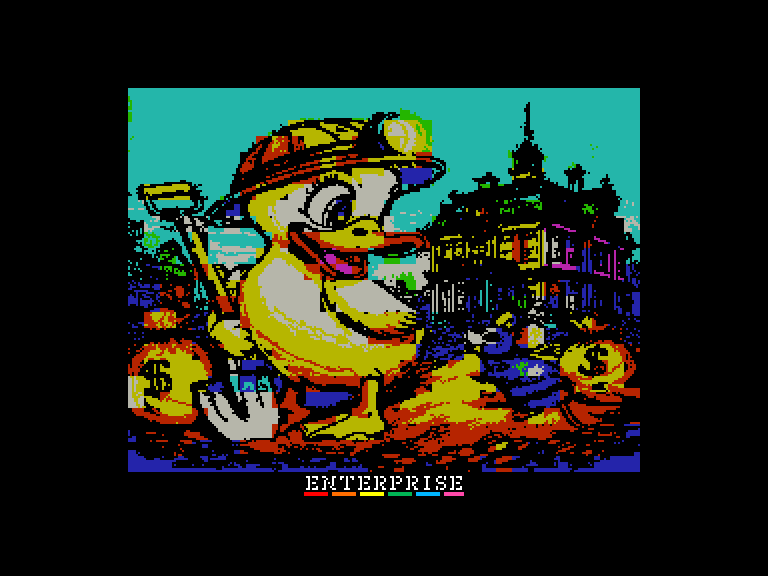
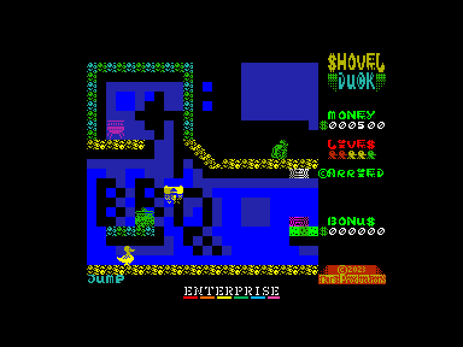
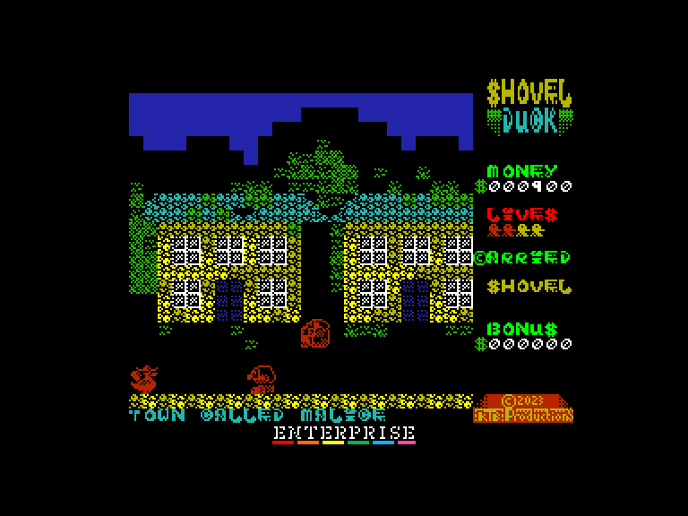
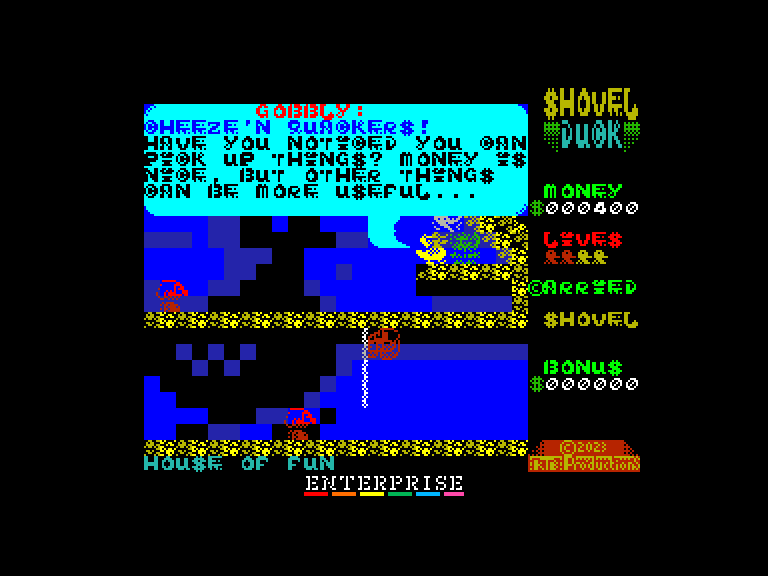

# Noon 30 Shovel Duck (featuring Dollar Bill)

 
 
 

Жанр: аркада, платформер, пригода  
Кількість гравців: 1  
Мова гри: англійська  

## Опис

Вашого «гриль-друга» Грошову Мишу викрав «Великий Сир»; і саме тоді, коли ви думали про щось більше, ніж просто встати з ліжка та поміркувати про марність усього цього.

Ви запланували барбекю, гриль готовий до розпалювання. Вам просто потрібно прибрати вдома та знайти Грошову Мишу; вони будуть у підземному лігві «Великого Сиру». Просто візьміть одну зі своїх лопат і вийдіть туди копати.

Уникайте альпіністів. Уникайте багатьох червоних чоловічків, що блукають; і будь-якою ціною не чіпайте червоних колючих істот. Червоні істоти ранять вашу душу (і коштують вам одного з ваших життів); б'юся об заклад, ви не знали, що у Качки майже стільки ж життів, скільки й у котів!?

## Системні вимоги
### Мінімальні системні вимоги
Оперативна пам'ять: **128 КБ**  

## Керування та тонкощі запуску
### Основні [елементи керування](../../controllers.md):
⌨ Клавіатура (`Q`, `A`, `O`, `P`, `M`)  
🕹 Вбудований джойстик  
🎮 Зовнішній джойстик 1/2

## Посилання

▶ [Easy Load&Play](https://t.me/EP128k_Load_n_Play/919) *(Telegram-канал Vibrant Waves)*  
💾 [Завантажити гру](http://www.ep128.hu/Ep_Games/Prg/Noon_30_Shovel_Duck.rar)  
📃 [Опис гри]() (угорська)  
🏡 [Домашня сторінка гри](https://ktbproductions.itch.io/enterprise-games)

## Автори
👨‍💻 Автор: Mas (KTB Retrocomputing Productions)  
📅 Рік релізу: 2025  