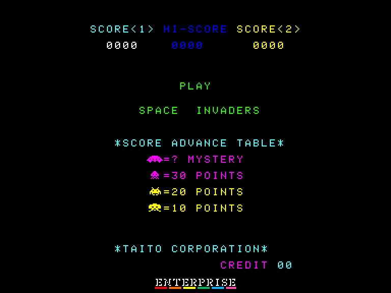
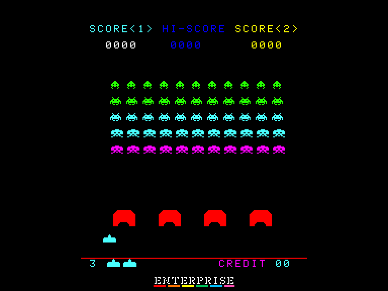
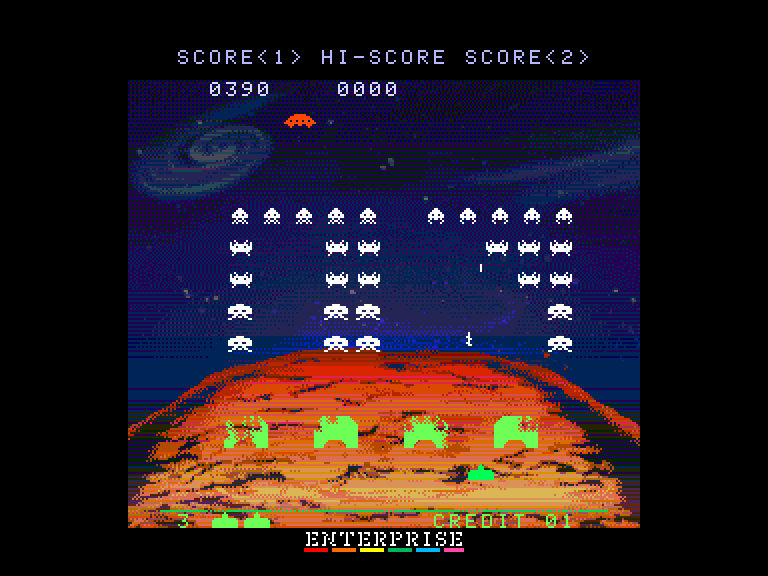
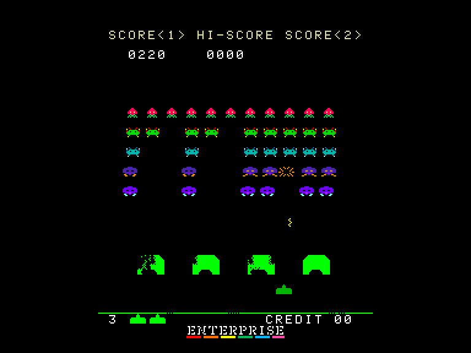

# Space Invaders Arcade

| | | | |
| --- | --- | --- | --- |
|||||

Жанр: аркада  
Кількість гравців: 1-2 (по черзі)  
Мова гри: англійська  

## Опис

Space Invaders - це просто найвпливовіша відеогра всіх часів і народів. Гравець керуючи озброєною «лазерною базою» розстрілює нескінченні хвилі прибульців, які невпинно рухаються вниз по екрану до Землі.

Внизу екрану є чотири захисні споруди за якими гравець може сховатися, але зрештою вони будуть зруйновані або ворожими пострілами, або прямим контактом із самими загарбниками. Постріли гравця їх також руйнують.

Спуск інопланетян прискорюється в міру їх знищення, що робить їх ліквідацію дедалі важчою. Через верхню частину екрану буде регулярно пролітати літаюча тарілка в яку можна влучити, щоб заробити додаткові очки.

### Нарахування балів

- Великий загарбник: **10** очок.
- Середній загарбник: **20** очок.
- Малий загарбник: **30** очок.
- НЛО: від **50** до **300** очок.

### Поради у проходженні

https://www.arcade-history.com/?n=space-invaders&page=detail&id=2537

## Системні вимоги

| Мінімальні системні вимоги:            | Рекомендовані системні вимоги:              |
| -------------------------------------- | ------------------------------------------- |
| Оперативна пам'ять: **64 КБ** *(тільки класична версія гри без звуку)*          | Оперативна пам'ять: **128 КБ (або більше)** |

## Керування та тонкощі запуску

Для початку гри необхідно закинути необхідну кількість монет (клавіша `F1`), а потім вибрати кількість гравців (клавіши `1` та `2`).

### Основні [елементи керування](../controllers.md):
#### Гравець 1
⌨ Клавіатура (`A`, `S`, `Ctrl`)  
🎮 Зовнішній джойстик 1
#### Гравець 2
⌨ Клавіатура (`L`, `;`, `:`) / (`L`, `Ö`, `Ä`)  
🎮 Зовнішній джойстик 2

### Додаткові клавіши:
`1` (Start1): Почати гру для одного гравця  
`2` (Start2): Почати гру для двох гравців  
`F1` (Credit): "Закинути" монету  

`F2` (DIP3): **00** = **3** життя  **10** = **5** життів  
`F3` (DIP5): **01** = **4** життя  **11** = **6** життів  
`F4` (DIP6): Бонусне життя за **1500**/**1000** очків  
`F5` (DIP7): Показувати/не показувати вартість гри на демо екрані  
`F6` (TILT): Увімкнути/вимкнути TILT режим  
`F7` (DIP4): Перейти у сервісний режим (після скидання (`F8`))  
`F8` (Reset): Перезавантажити гру  

`3` (ChngPal): Змінити палітру екрану (тільки у класичній версії)  
`4` (Rotate): Повернути екран (тільки у класичній версії)

## Посилання

▶ [Easy Load&Play](https://t.me/EP128k_Load_n_Play/753) *(Telegram-канал Vibrant Waves)*  
💾 [Завантажити гру (класична версія)](http://www.ep128.hu/Ep_Games/Prg/Space_Invaders_Arcade.rar)  
💾 [Завантажити гру ("плюс" версія)](http://www.ep128.hu/Ep_Games/Prg/Space_Invaders_Plus.rar)  
🗨 [Тема на форумі enterpriseforever.com](https://enterpriseforever.com/konvertalas/space-invaders-arcade-version/)  
🗨 [Тема на форумі enterpriseforever.com](https://enterpriseforever.com/konvertalas/space-invaders-arcade-version-2285/)  

## Автори
### Оригінальний реліз
🖥 Платформа: [Arcade](https://www.arcade-history.com/?n=space-invaders&page=detail&id=2537)  
👨‍💻 Розробник: Taito  
📅 Рік релізу: 1978  

### Версія гри для Enterprise
👨‍💻 Портування: [Geco](../../community/geco.md)  
📅 Рік релізу: [2024](../release_years/2024.md)