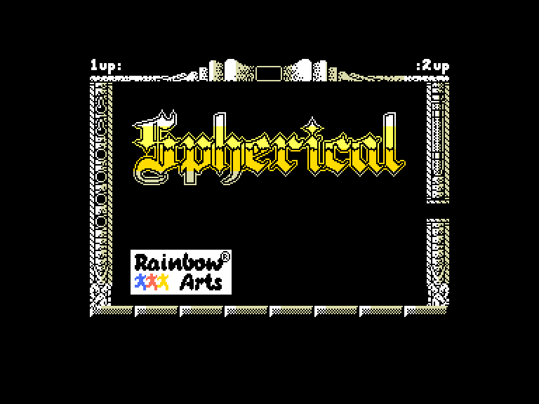
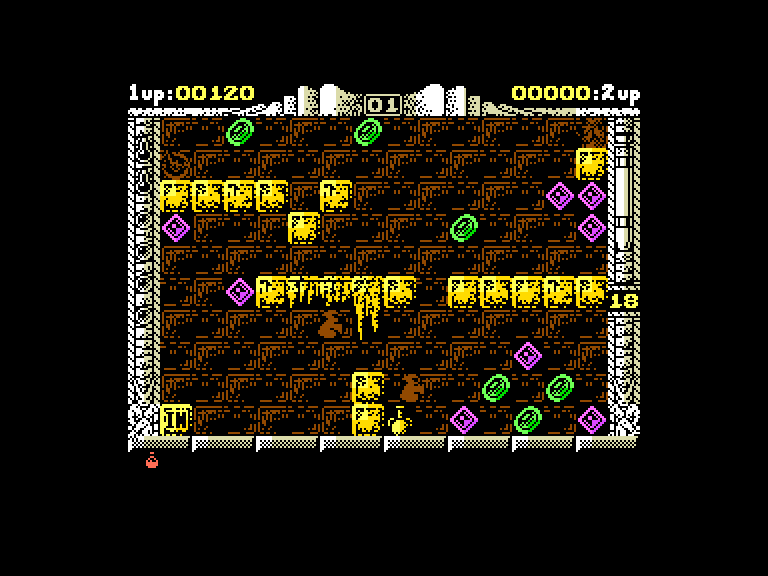
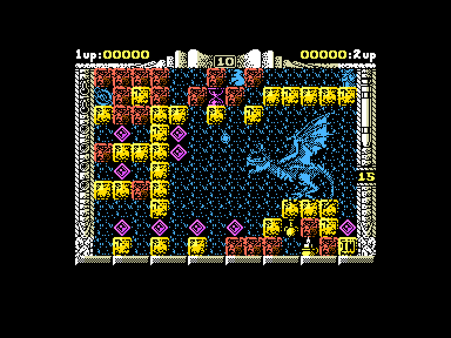
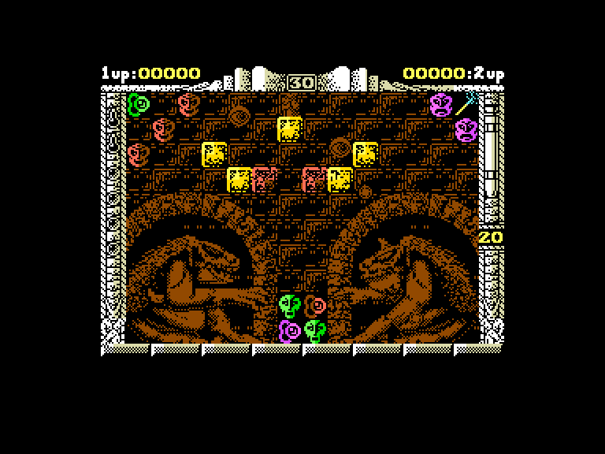

# Spherical

 
 
 

## Легенда про Пульграма та Вурона

Давним-давно, у світі, де долі людей, ельфів та гномів залежали від друїдів і магів, землі були розділені на Тальєнхорт (люди), Кендрон (гноми) та таємничий Хорндал (про який ходили моторошні чутки). Експедиції до Хорндалу безслідно зникали, тож з часом раси зосередилися на внутрішніх війнах.

Через роки у лісах Кендрона знову з'явилися ельфи, яких вважали вимерлими. Ельф Пульграм, прагнучи повернути своєму народу колишню славу, запропонував вийти з тіні. Хоча ельфи та гноми історично ворогували, Пульграм потоваришував з гномським магом Вуроном. Разом вони вивчали давні пророцтва і дійшли висновку, що світ знову в небезпеці через пробудження древнього зла.

Ймовірний ключ до розгадки проблеми лежав у стародавньому документі в бібліотеці Тальєнхорта. Попри війну між гномами та людьми, Пульграм і Вурон вирушили у небезпечну подорож, можливо, використовуючи заборонену чорну магію. Вони знайшли те, що шукали — записи мудреця Куарола про Зоряну сферу  — могутній артефакт, яким Куарол колись вигнав зло, але не до кінця.

Ціна, яку вимагала зоряна куля за її використання, була практично такою ж, як і покарання за використання чорної магії. Використовуючи енергію Зоряної сфери, користувач, у свою чергу, мав віддати своє життя, щоб приєднатися до її внутрішнього святилища — стати частиною самої Зоряної сфери.

Пізніші пророки в усьому світі вважали Вурона та Пульграма одними з найвидатніших мучеників усіх часів, оскільки вони запобігли величезній небезпеці для світу. Багато років потому знайдений щоденник Пульграма розкрив їхній відчайдушний план: використати Зоряну сферу, пожертвувавши своїми життями, щоб зупинити пробудженого дракона Міргала, який загрожував поневолити світ.

## Основи геймплею

У грі ви керуєте магічною Зоряною сферою крізь кімнати замку дракона. Ваше завдання — за допомогою магії створити шлях для кулі, направляючи її до виходу, щоб перейти до наступної кімнати.

На екрані гри є важливі індикатори:

  - **Магічна сила (ліворуч, дві пляшки):** Показує, скільки магії залишилось для утримання Зоряної сфери в цьому вимірі. Якщо магія закінчиться, куля повернеться у паралельний вимір.
  - **Часові двері (ліворуч, камені):** Вказує кількість "часових дверей", що залишились. У безнадійній ситуації можна натиснути `R`, щоб повернутися до моменту входу в кімнату.
  - **Багатство (зверху):** Поточний рівень вашого багатства (або другого героя).
  - **Номер кімнати (зверху):** Показує номер поточної кімнати. Ходять чутки, що кімнат більше сотні, і кожна змінюється залежно від кількості гравців (один чи два).
  - **Годинник (праворуч):** Відображає точний час до початку руху Зоряної сфери. На цей час може впливати пісочний годинник.
  - **Енергія героя (праворуч, пробірка):** Життєва енергія героїв. Енергія втрачається при контакті з монстрами або кислотою. Втративши всю енергію, ви мусите покинути замок.
  - **Червоні пляшки (знизу):** Кількість зібраних червоних пляшок (див. нижче).

Предмети:

 - **Діаманти**: Збільшує багатство.
 - **Червона пляшка**: Знищує все зло.
 - **Ваза**: Збільшує енергію мага.
 - **Свічка**: Куля, яка знищує супротивників.
 - **Пляшка отрути**: Маг не зможе створювати камні.
 - **Зелена пляшка**: Зупинка часу.
 - **Антиграв**: Змінює гравітацію Зоряної сфери.
 - **Чарівна лампа**: Маг невразливий.
 - **Сувій**: Маг може стрибати далі.
 - **Кубок**: Телепортує на варп-рівень.
 - **Двері** (голови) та **амулети**: Щоб відкрити двері, вам потрібен амулет того ж кольору.
 - **Чарівна паличка**: Телепортує на наступний рівень.
 - **Пісочний годинник**: Дає більше часу до моменту коли Зоряна сфера почне рухатися.
 - **Документ**: Пароль.

Клавіатура (`Q`, `A`, `O`, `P`, `Space`, `Enter`)  
Вбудований джойстик  
Зовнішній джойстик 1  
Зовнішній джойстик 2 *(тільки для другого гравця)*  

`Fire`: Створити/забрати камінь  
`Fire`+`↓`: Створити/забрати камінь рівнем нижче  
`Enter`: Використання магії

`R`: рестарт рівня  
`Stop`: вихід в головне меню  
`Hold`/`Pause`: пауза  

Коди рівней:
**Code words are for player one**  
level 9: `RADAGAST`  
level 19: `YARMAK`  
level 39: `ORCSLAYER`  
level 59: `SKYFIRE`  
level 75: `MIRGAL`  
  
**For player two**  
level 9: `GHANIMA`  
level 19: `GLIEP`  
level 39: `MOURNBLADE`  
level 59: `JADAWIN`  
level 75: `GUMBACHACHMAL`

Enter `ILLUMINATUS` as a password to enter the CHEAT MODE - this password gives you Infinite Energy for one and two players game  
`M`: перейти на наступний рівень    
`N`: перейти на попередній рівень (⚠ не натискати на першому рівні)    

## Посилання

▶ [Easy Load&Play](https://t.me/EP128k_Load_n_Play/682) *(Telegram-канал Vibrant Waves)*  
💾 [Завантажити гру](http://www.ep128.hu/Ep_Games/Prg/Spherical.rar)  
💾 [Tipshop](https://www.the-tipshop.co.uk/cgi-bin/info.pl?wosid=0004746)  
[Map](https://maps.speccy.cz/maps/Spherical.png)  

## Автори
### Оригінальний реліз
🖥 Платформа: [ZX Spectrum](https://spectrumcomputing.co.uk/entry/4746/ZX-Spectrum/Spherical)  
👨‍💻 Програмісти: Daren White, Jason Green  
📅 Рік релізу: 1989  

### Версія гри для Enterprise
👨‍💻 Портування: (н/д)
