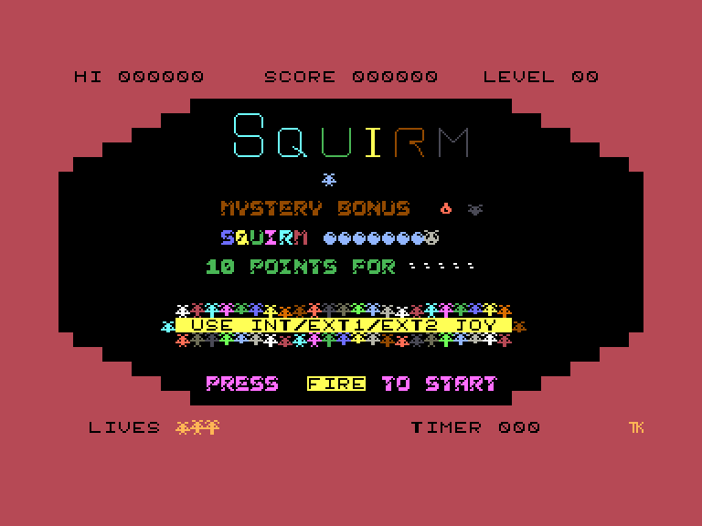
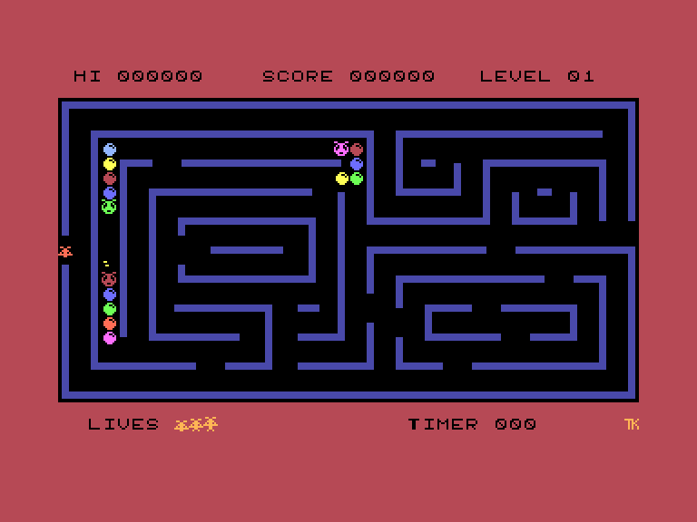
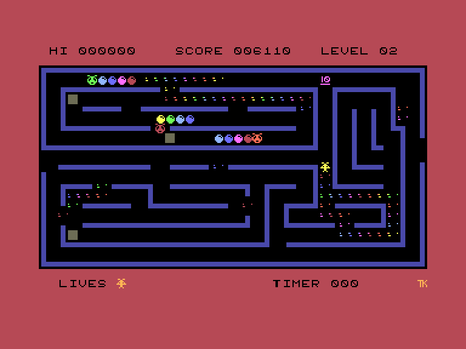
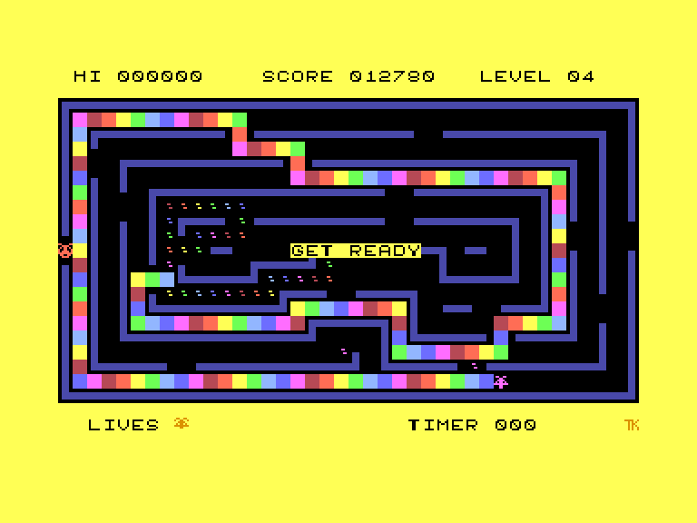

# Squirm 16

 
 
 

Жанр: аркада, PacMan-like  
Кількість гравців: 1  
Мова гри: англійська  

## Опис

Збирайте яйця що відкладає королева повзунів. Ви повинні сторонитись охоронців, які патрулюють лабіринт та збирають яйця, залишені королевою.

Зберіть 255 яєць, щоб перейти на наступний рівень. У кінці кожного рівня запуститься бонусний пробіг, під час якого ви можете з'їсти повзунів (але у цей момент ви не зможете перетинати свій пройдений шлях).

### Нарахування балів

- Крапки (яйця) — 10 балів кожне
- Випадкова кількість балів за інших жителів лабіринту

### Нарахування балів (бонусний пробіг)

- Крапки (яйця) — 10 балів кожне
- Сегмент повзуна — 100 балів
- Голова повзуна — 200 балів
- 600 балів якщо повзуна з'їсти повністю

### Режими гри

Після завантаження ви можете вибрати між класичним режимом (3 життя/3 лабіринти) та розширеним режимом (8 життів/3 класичні + 13 додаткових лабіринтів)

<iframe width="560" height="315" src="https://www.youtube.com/embed/cSfx-C0ePpA" title="YouTube video player" frameborder="0" allowfullscreen></iframe>

## Системні вимоги
### Мінімальні системні вимоги
Оперативна пам'ять: **64 КБ**  
### Рекомендовані системні вимоги
Оперативна пам'ять: **128 КБ (або більше)**  

## Керування
### Основні [елементи керування](../controllers.md):
⌨ Клавіатура (`Q`, `A`, `O`, `P`, `Space`)  
🕹 Вбудований джойстик + `Enter`  
🎮 Зовнішній джойстик 1/2

`Fire` (під час руху): Зупинитись

### Додаткові клавіши:
`F8`: Увімк./вимк. музику

## Чіт-коди та допомога у проходженні

### Комбінація клавіш під час гри:
`RShift`+`F8`: Безкінечна кількість життів

### Відеопроходження:

## Посилання

▶ [Easy Load&Play](https://t.me/EP128k_Load_n_Play/682) *(Telegram-канал Vibrant Waves)*  
💾 [Завантажити гру](http://www.ep128.hu/Ep_Games/Prg/Squirm_16.rar)  
📃 [Опис гри](http://ep128.hu/Ep_Games/Leiras/Squirm16.htm) (угорська)  
🗨 [Тема на форумі enterpriseforever.com](https://enterpriseforever.com/commodore-rol/squirm-16/)  

## Автори
### Оригінальний реліз
🖥 Платформа: [Commodore 64](https://www.lemon64.com/game/squirm)  
👨‍💻 Програмісти: Tony Kelly  
📅 Рік релізу: 1984  

### Версія гри для [Commodore 16 Plus/4](https://plus4world.powweb.com/software/Squirm_16)
👨‍💻 Портування: Gaia, Csabo  
📅 Дата релізу: 23.10.2020

### Версія гри для Enterprise
👨‍💻 Портування: [Geco](../../community/geco.md)  
👨‍💻 Додаткові рівні та музика: [Szipucsu](../../community/szipucsu.md)  
📅 Рік релізу: [2024](../release_years/2024.md)