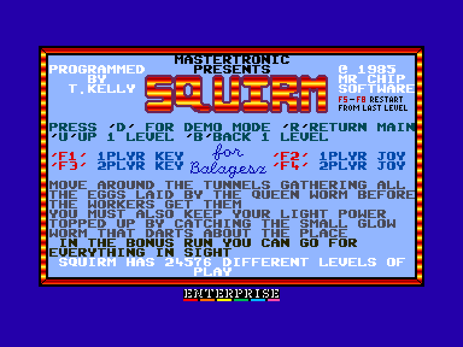
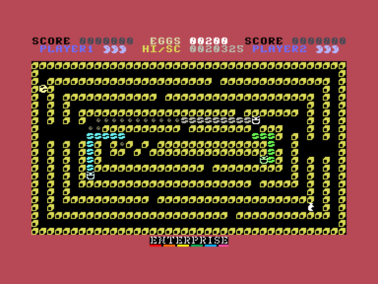
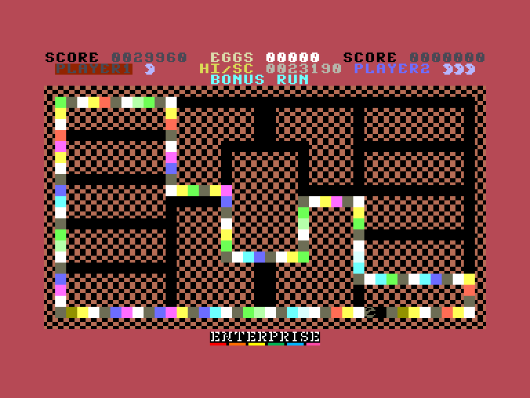
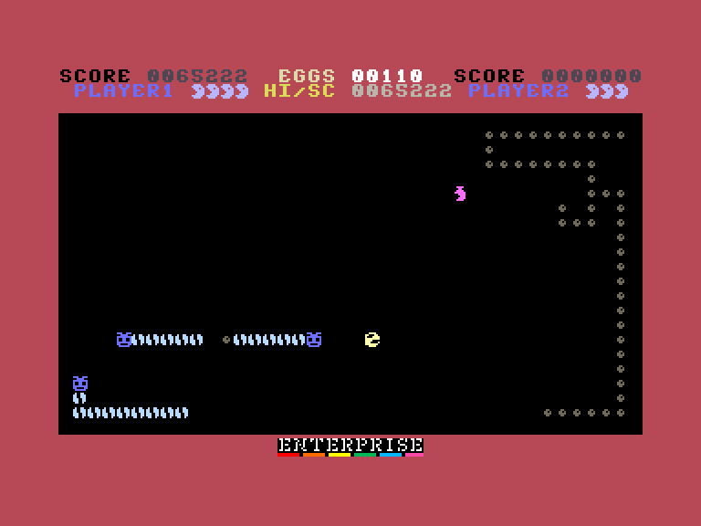

# Squirm С16 original

 
 
 

Жанр: аркада, PacMan-like  
Кількість гравців: 1-2 (по черзі)  
Мова гри: англійська  

## Опис

Збирайте яйця що відкладає королева повзунів. Ви повинні сторонитись охоронців, які патрулюють лабіринт та збирають яйця, залишені королевою.

Ловіть світлячків щоб освітлювати рівень.

Зберіть 200 яєць, щоб перейти на наступний рівень. У кінці кожного рівня запуститься бонусний пробіг, під час якого ви можете з'їсти повзунів (але у цей момент ви не зможете перетинати свій пройдений шлях).

### Нарахування балів

- Яйце — 10 балів
- Світлячок — 100 балів

### Нарахування балів (бонусний пробіг)

- Яйце — 20 балів
- Сегмент повзуна — 300 балів
- Світлячок — 300 балів
- Кожен сегмент доріжки — 1 бал

<iframe width="560" height="315" src="https://www.youtube.com/embed/l_xLnVhSVCYzEE" CFN8Yitle="YouTube video player" frameborder="0" allowfullscreen></iframe>

## Системні вимоги

|Мінімальні системні вимоги:|Рекомендовані системні вимоги:|
|---------------------------|------------------------------|
|Оперативна пам'ять: **64 КБ**|Оперативна пам'ять: **128 КБ (або більше)**|  

## Керування та тонкощі запуску
### Елементи керування меню:

`F1`: Почати гру для одного гравця за допомогою клавіатури чи вбудованого джойстика  
`F2`: Почати гру для одного гравця за допомогою зовнішніх джойстиків  
`F3`: Почати гру для двох гравців за допомогою клавіатури чи вбудованого джойстика  
`F4`: Почати гру для двох гравців за допомогою зовнішніх джойстиків  
`F5`-`F8`: Рестарт з останнього рівня що грався  
`D`: Деморежим  

### Основні [елементи керування](../controllers.md): 
⌨ Клавіатура 1 (`Q`, `A`, `O`, `P`, `Space`)  
⌨ Клавіатура 2 (`K`,`M`,`X`,`C`,`L`)  
🕹 Вбудований джойстик + `Enter`  
🎮 Зовнішній джойстик 1/2  

`Fire` (під час руху): Прискоритись  
`Left Shift`: Переключити постійне прискорення  
`U`: Наступний рівень  
`B`: Попередній рівень  
`R`: Повернутись до головного меню  

## Посилання

▶ [Easy Load&Play](https://t.me/EP128k_Load_n_Play/730) *(Telegram-канал Vibrant Waves)*  
💾 [Завантажити гру](http://www.ep128.hu/Ep_Games/Prg/Squirm.rar)  
📃 [Опис гри]() (угорська)  
🗨 [Тема на форумі enterpriseforever.com](https://enterpriseforever.com/commodore-rol/squirm-c16-original/)  

## Автори
### Оригінальний реліз
🖥 Платформа: [Commodore 16 Plus/4](https://plus4world.powweb.com/software/Squirm)  
👨‍💻 Програмісти: Tony Kelly  
📅 Рік релізу: 1985  

### Версія гри для Enterprise
👨‍💻 Портування: [Geco](../../community/geco.md)  
📅 Рік релізу: [2024](../release_years/2024.md)