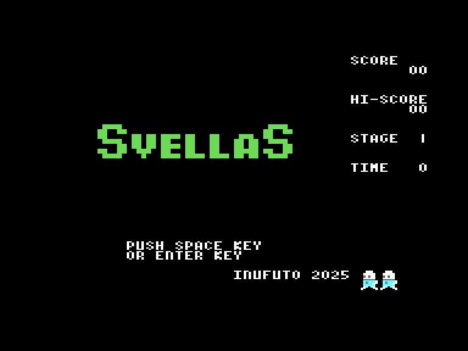
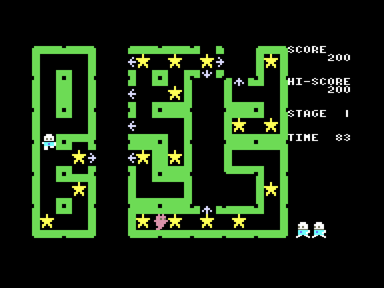
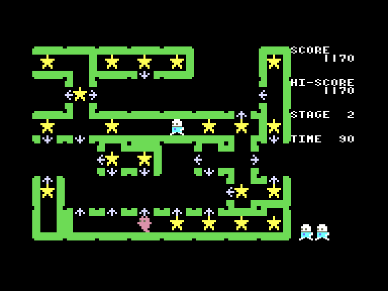
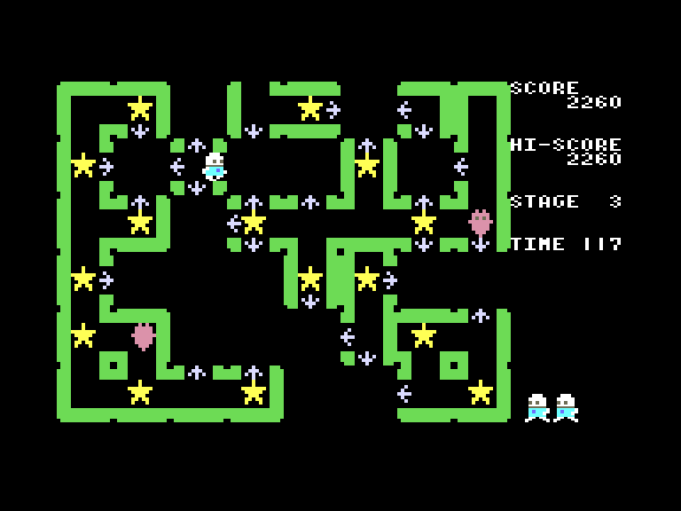

# Svellas

 
 
 

Жанр: аркада, логіка  
Кількість гравців: 1  
Мова гри: англійська  

## Опис

Ваше завдання - зібрати усі зірки за відведений час, але для цього вам доведеться змінювати конфігурацію рівня. Використовуючи стрілки, ви можете зрушувати плитки, щоб дістатися до недоступних місць. Перешкоджати цьому будуть монстри, що розгулюють лабіринтом.

<iframe width="420" height="236" src="https://www.youtube.com/embed/m2mdBqjD4UE" title="YouTube video player" frameborder="0" allowfullscreen></iframe>

## Системні вимоги
### Мінімальні системні вимоги
Оперативна пам'ять: **64 КБ** (картридж-версія)  
Оперативна пам'ять: **128 КБ**  

## Керування та тонкощі запуску
### Елементи керування меню:

`Enter`/`Space`/`X`/`Z`: Почати гру  

### Основні [елементи керування](../controllers.md):
⌨ Клавіатура (`L`, `,`, `.`, `/`, `Z`)  
🕹 Вбудований джойстик  

`Fire` *(на стрілці)*: зрушити блок рівня у відповідному напрямку  

## Посилання

▶ [Easy Load&Play](https://t.me/EP128k_Load_n_Play/947) *(Telegram-канал Vibrant Waves)*  
💾 [Завантажити гру](https://www.ep128.hu/Ep_Games/Prg/Svellas.rar)  
📃 [Опис гри](http://www.ep128.hu/Games/Svellas.htm) (угорська)  
🏡 [Домашня сторінка гри](http://inufuto.web.fc2.com/8bit/svellas/#ep64)

## Автори
👨‍💻 Розробник: [Inufuto](../../community/inufuto.md)  
📅 Рік релізу: [2025](../release_years/2025.md)  