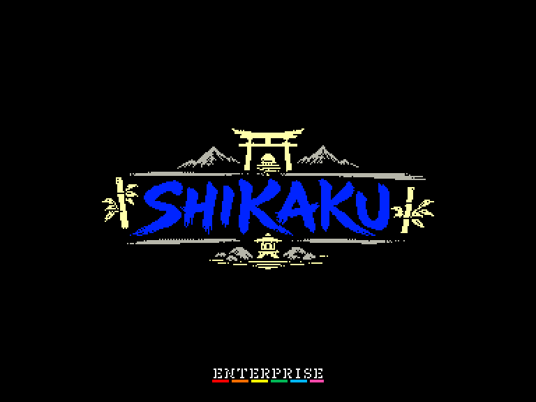
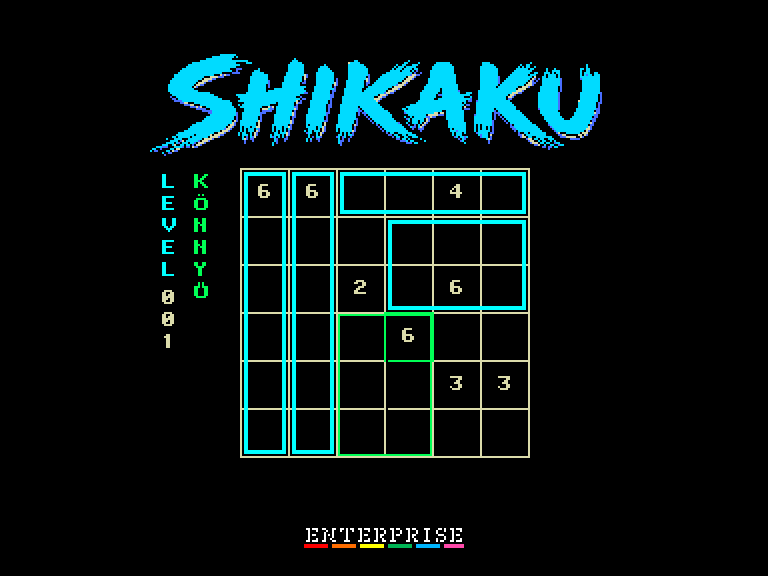
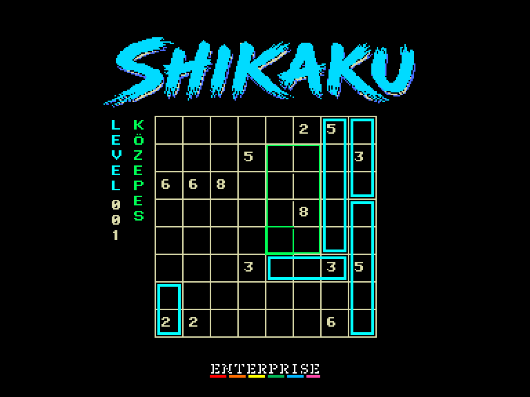
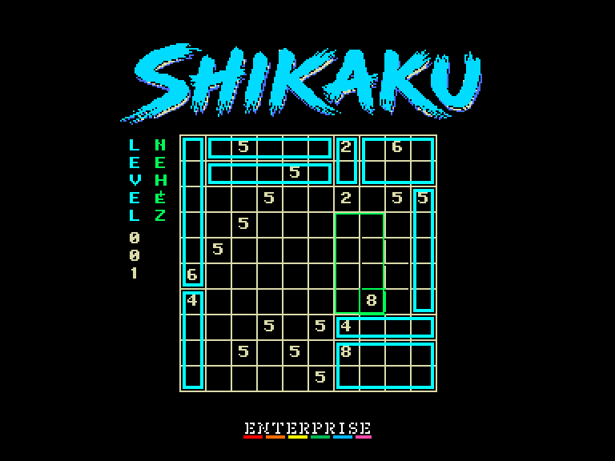

[0-9](../0/games-0.md) - [A](../a/games-a.md) - [B](../b/games-b.md) - [C](../c/games-c.md) - [D](../d/games-d.md) - [E](../e/games-e.md) - [F](../f/games-f.md) - [G](../g/games-g.md) - [H](../h/games-h.md) - [I](../i/games-i.md) - [J](../j/games-j.md) - [K](../k/games-k.md) - [L](../l/games-l.md) - [M](../m/games-m.md) - [N](../n/games-n.md) - [O](../o/games-o.md) - [P](../p/games-p.md) - [Q](../q/games-q.md) - [R](../r/games-r.md) - [S](../s/games-s.md) - [T](../t/games-t.md) - [U](../u/games-u.md) - [V](../v/games-v.md) - [W](../w/games-w.md) - [X](../x/games-x.md) - [Y](../y/games-y.md) - [Z](../z/games-z.md)

Ігри для [Enterprise 64k](../games-ep64.md) - [Enterprise 128k+RAMexp](../games-epramexp.md) - [2dfx](../games-2dfx.md)

Ігри для систем [IS-DOS](../games-is-dos.md) - [SymbOS](../games-symbos.md) - [EDC Windows](../games-edcw.md)

Ігри для емуляторів [ZX Spectrum 48k/128k](../zxemu/games-zxemu.md) - [Amstrad CPC](../cpcemu/games-cpc.md) - [Sinclair ZX81](../zx81emu/games-zx81.md) - [Videoton TVC](../tvcemu/games-tvc.md) - [Commodore VIC-20](../vic20emu/games-vic20.md)

----------

# Shikaku

**ID:** shikaku-tvc

**Жанри:** Логічна

## Примітка

ℹ Сучасна схвалена конверсія з платформи Videoton TVC.

## Скріншоти

## Опис

У Shikaku грають на сітчастій квадратній дошці. У деяких клітинках дошки містяться числа. Цю дошку потрібно розділити на прямокутники так, щоб у кожен прямокутник потрапило лише одне число, і це число відповідало площі прямокутника у клітинках. Наприклад, цифра 4 може потрапити у прямокутник розміром 1×4, 2×2 або 4×1.

## Основна інформація
- **Мови:** Угорська
- **Оригінальна платформа:** Videoton TVC
### Загальні системні вимоги
- **Апаратні:** EP64, EP128
### Геймплей
- **Керування:** Keyboard, Internal Joy, External Joy 1, External Joy 2
- **Кількість гравців:** 1 player
- **Додаткові теги:** 4-color mode
### Розробка
- **Рік випуску:** 2026
- **Автор:** KKS2003

## Посилання
- [Опис на ep128.hu (угорською)](https://www.ep128.hu/Ep_Games/Leiras/Shikaku.htm)
- [Тема на форумі enterpriseforever](https://enterpriseforever.com/tvc-rl/shikaku/)
- [Завантажити](https://www.ep128.hu/Ep_Games/Prg/Shikaku.rar)
- [Easy Load&Play](https://t.me/EP128k_Load_n_Play/1189) *(Telegram-канал Vibrant Waves)*

## Відео

<iframe src="https://www.youtube.com/embed/RfYT6dAFLQs"  
style="width:75%; aspect-ratio:16/9;" allowfullscreen></iframe>

## [Керування](../controllers.md)

`Keyboard`: `W`, `A`, `S`, `D`  
`Internal Joystick`  
`External Joystick 1`  
`External Joystick 2`  

`Space`, `Fire`, `Enter`: початок/кінець позначки  
`C`, `Esc`: очистити поле  
`N`: завантажити наступний рівень  
`M`: змінити розмір поля (6×6/8×8/10×10)  
`R`: згенерувати рандомний рівень  
`F1` - `F8`: вимкн./увімкн. музику

