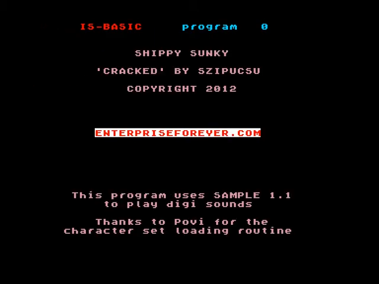
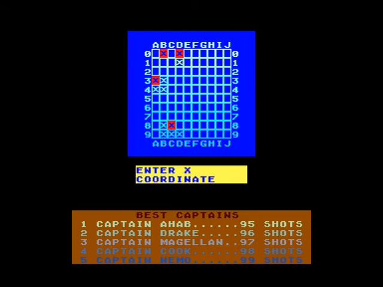
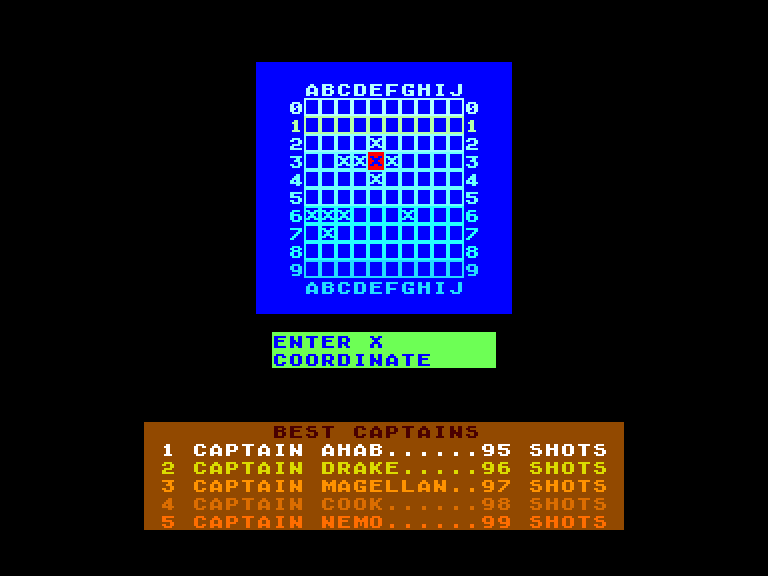
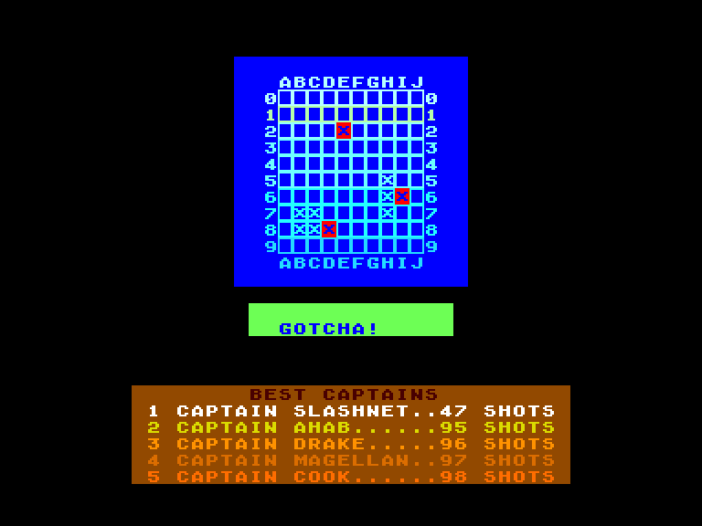

[0-9](../0/games-0.md) - [A](../a/games-a.md) - [B](../b/games-b.md) - [C](../c/games-c.md) - [D](../d/games-d.md) - [E](../e/games-e.md) - [F](../f/games-f.md) - [G](../g/games-g.md) - [H](../h/games-h.md) - [I](../i/games-i.md) - [J](../j/games-j.md) - [K](../k/games-k.md) - [L](../l/games-l.md) - [M](../m/games-m.md) - [N](../n/games-n.md) - [O](../o/games-o.md) - [P](../p/games-p.md) - [Q](../q/games-q.md) - [R](../r/games-r.md) - [S](../s/games-s.md) - [T](../t/games-t.md) - [U](../u/games-u.md) - [V](../v/games-v.md) - [W](../w/games-w.md) - [X](../x/games-x.md) - [Y](../y/games-y.md) - [Z](../z/games-z.md)

Ігри для [Enterprise 64k](../games-ep64.md) - [Enterprise 128k+RAMexp](../games-epramexp.md)

Ігри для систем [IS-DOS](../games-is-dos.md) - [SymbOS](../games-symbos.md) - [EDC Windows](../games-edcw.md)

Ігри для емуляторів [ZX Spectrum 48k/128k](../zxemu/games-zxemu.md) - [Amstrad CPC](../cpcemu/games-cpc.md) - [Sinclair ZX81](../zx81emu/games-zx81.md) - [Videoton TVC](../tvcemu/games-tvc.md) - [Commodore VIC-20](../vic20emu/games-vic20.md)

----------

# Shippy Sunky

**ID:** shippy-sunky-bas

**Жанри:** Пам'ять

## Примітка

ℹ Хоумбрю-гра.

## Скріншоти

## Опис

Гра що нагадує звичайний "Морський бій", але вам необхідно лише потопити ворожий флот за найменшу кількість пострілів. Цікавою особливістю гри є озвучування введених координат на чотирьох мовах (за вибором).

## Основна інформація
- **Мови:** Англійська
- **Оригінальна платформа:** Enterprise
### Загальні системні вимоги
- **Апаратні:** EP128, EXDOS
- **Програмні:** IS-Basic
### Геймплей
- **Керування:** Keyboard
- **Кількість гравців:** 1 player
- **Додаткові теги:** Attribute mode, HiScore saving
### Розробка
- **Рік випуску:** 2012
- **Автор:** Szipucsu

## Відео

<iframe src="https://www.youtube.com/embed/oPT-dcgIyKY"  
style="width:75%; aspect-ratio:16/9;" allowfullscreen></iframe>

- [Відео](https://www.youtube.com/watch?v=EUiZ8oJpmZA)

## [Керування](../controllers.md)

`Keyboard`  

`F1`–`F4`: зміна мови озвучування (англійська, німецька, іспанська, італійська)

## Детальна інформація

### Геймплей  

Перед початком гри на долю секунди вам показують розміщення п'яти однопалубних ворожих кораблів. Після чого, вводячи координати, вам необхідно їх потопити.