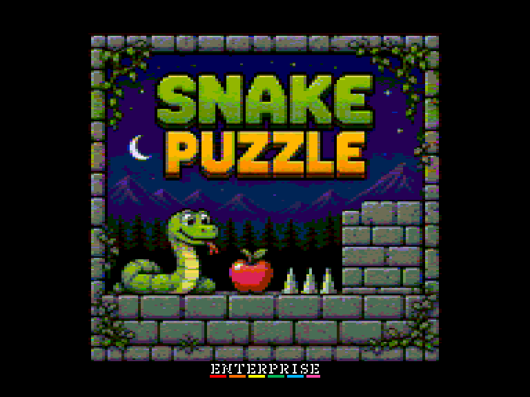
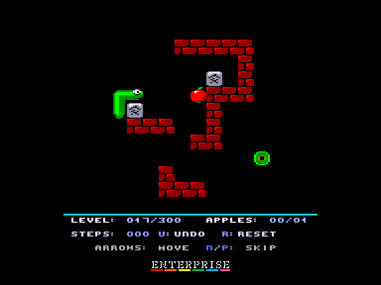
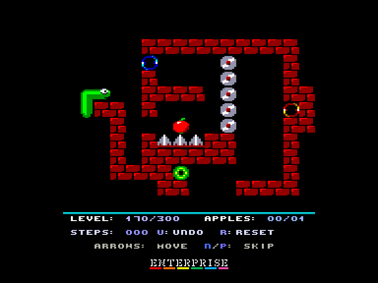
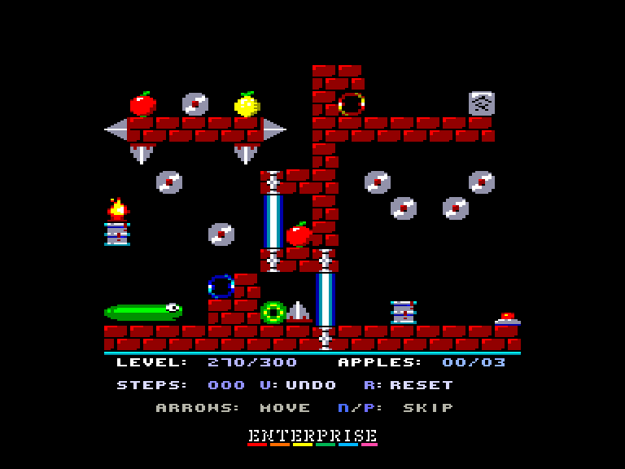

[0-9](../0/games-0.md) - [A](../a/games-a.md) - [B](../b/games-b.md) - [C](../c/games-c.md) - [D](../d/games-d.md) - [E](../e/games-e.md) - [F](../f/games-f.md) - [G](../g/games-g.md) - [H](../h/games-h.md) - [I](../i/games-i.md) - [J](../j/games-j.md) - [K](../k/games-k.md) - [L](../l/games-l.md) - [M](../m/games-m.md) - [N](../n/games-n.md) - [O](../o/games-o.md) - [P](../p/games-p.md) - [Q](../q/games-q.md) - [R](../r/games-r.md) - [S](../s/games-s.md) - [T](../t/games-t.md) - [U](../u/games-u.md) - [V](../v/games-v.md) - [W](../w/games-w.md) - [X](../x/games-x.md) - [Y](../y/games-y.md) - [Z](../z/games-z.md)

Ігри для [Enterprise 64k](../games-ep64.md) - [Enterprise 128k+RAMexp](../games-epramexp.md) - [2dfx](../games-2dfx.md)

Ігри для систем [IS-DOS](../games-is-dos.md) - [SymbOS](../games-symbos.md) - [EDC Windows](../games-edcw.md)

Ігри для емуляторів [ZX Spectrum 48k/128k](../zxemu/games-zxemu.md) - [Amstrad CPC](../cpcemu/games-cpc.md) - [Sinclair ZX81](../zx81emu/games-zx81.md) - [Videoton TVC](../tvcemu/games-tvc.md) - [Commodore VIC-20](../vic20emu/games-vic20.md)

----------

# Snake Puzzle

**ID:** snake-puzzle-tvc

**Жанри:** Логічна

## Примітка

ℹ Сучасна схвалена конверсія з платформи Videoton TVC.

## Скріншоти

## Опис

Вам потрібно провести змійку до вихода. На змійку діє гравітація. З'ївши яблуко або лимон вона подовжиться, що дозволить їй дістатися до віддаленіших місць. Ви ж швидко пройдете ці короткі 300 рівнів, правда?

## Основна інформація
- **Мови:** Англійська
- **Оригінальна платформа:** Videoton TVC
### Загальні системні вимоги
- **Апаратні:** EP64, EP128
### Геймплей
- **Керування:** Keyboard, Internal Joy, External Joy 1, External Joy 2
- **Кількість гравців:** 1 player
- **Додаткові теги:** 16-color mode
### Розробка
- **Рік випуску:** 2026
- **Автор:** Károly Kiss, Mihály Sáránszki, Zsolt Prievara

## Посилання
- [Опис на ep128.hu (угорською)](https://www.ep128.hu/Ep_Games/Leiras/Snake_Puzzle.htm)
- [Тема на форумі enterpriseforever](https://enterpriseforever.com/tvc-rl/snake-puzzle/)
- [Завантажити](https://www.ep128.hu/Ep_Games/Prg/Snake_Puzzle.rar)
- [Easy Load&Play](https://t.me/EP128k_Load_n_Play/1185) *(Telegram-канал Vibrant Waves)*

## Відео

<iframe src="https://www.youtube.com/embed/bxLqNdNMBJA"  
style="width:75%; aspect-ratio:16/9;" allowfullscreen></iframe>

## [Керування](../controllers.md)

`Keyboard`: `W`, `A`, `S`, `D`  
`Internal Joystick`  
`External Joystick 1`  
`External Joystick 2`  

`R`: Рестарт рівня  
`U`: Відмінити крок  
`N`: Наступний рівень  
`P`: Попередній рівень  
`Shift`+`N`: Перестрибнути на 10 рівней вперед  
`Shift`+`P`: Перестрибнути на 10 рівней назад

## Детальна інформація

### Системні вимоги  

#### Мінімальні системні вимоги  

Оперативна пам'ять: **64 КБ (або більше)**  

### Геймплей  

Вам потрібно вивести змійку через вихід. На змійку діє гравітація: якщо жодна з її частин не має опори, вона починає падати вниз. Якщо вона з'їдає яблуко, то подовжується на 1 одиницю, а якщо лимон — на 2 одиниці, що дозволяє їй діставатися до віддаленіших місць. У грі є камені, які можна совати; ставши на них, ви зможете дістатися туди, куди не діставали раніше. Вогонь, дискова пилка та шипи небезпечні для життя, якщо ви на них впадете. На пізніших рівнях ви зустрінете портали (входиш в один — виходиш з іншого), а також лазерні ворота, які можна вимкнути за допомогою перемикача.