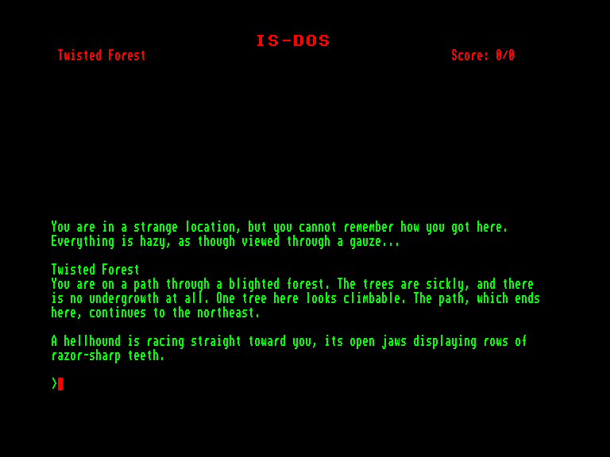
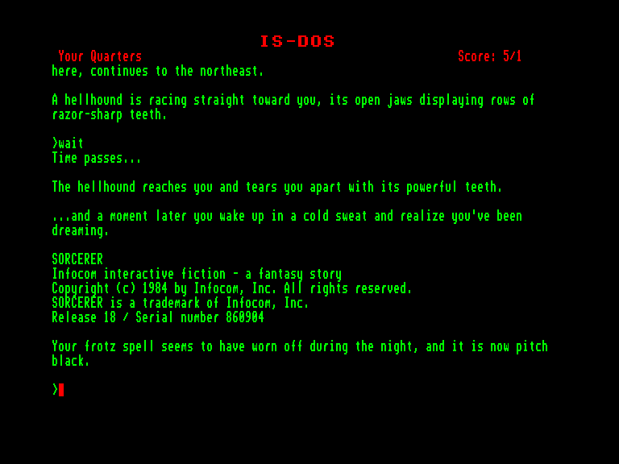
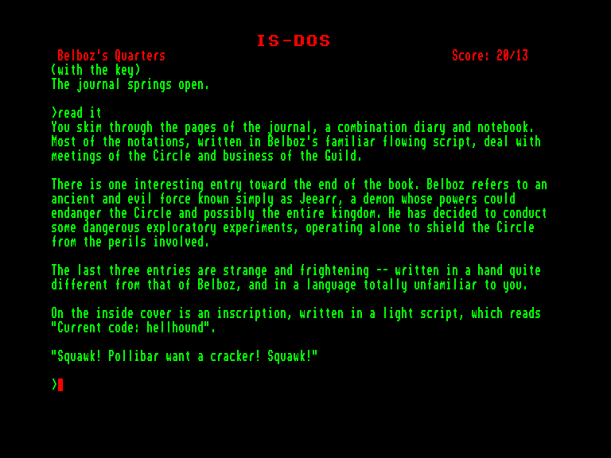

[0-9](../0/games-0.md) - [A](../a/games-a.md) - [B](../b/games-b.md) - [C](../c/games-c.md) - [D](../d/games-d.md) - [E](../e/games-e.md) - [F](../f/games-f.md) - [G](../g/games-g.md) - [H](../h/games-h.md) - [I](../i/games-i.md) - [J](../j/games-j.md) - [K](../k/games-k.md) - [L](../l/games-l.md) - [M](../m/games-m.md) - [N](../n/games-n.md) - [O](../o/games-o.md) - [P](../p/games-p.md) - [Q](../q/games-q.md) - [R](../r/games-r.md) - [S](../s/games-s.md) - [T](../t/games-t.md) - [U](../u/games-u.md) - [V](../v/games-v.md) - [W](../w/games-w.md) - [X](../x/games-x.md) - [Y](../y/games-y.md) - [Z](../z/games-z.md)

Ігри для [Enterprise 64k](../games-ep64.md) - [Enterprise 128k+RAMexp](../games-epramexp.md) - [2dfx](../games-2dfx.md)

Ігри для систем [IS-DOS](../games-is-dos.md) - [SymbOS](../games-symbos.md) - [EDC Windows](../games-edcw.md)

Ігри для емуляторів [ZX Spectrum 48k/128k](../zxemu/games-zxemu.md) - [Amstrad CPC](../cpcemu/games-cpc.md) - [Sinclair ZX81](../zx81emu/games-zx81.md) - [Videoton TVC](../tvcemu/games-tvc.md) - [Commodore VIC-20](../vic20emu/games-vic20.md)

----------

# Sorcerer

**ID:** sorcerer-zcode

**Жанри:** Текстова пригода

## Примітка

ℹ Мультиплатформенна гра на рушії Z-machine від Infocom.

## Скріншоти

## Опис

**Sorcerer** («Чаклун») — друга частина захопливої серії фентезі в найкращих традиціях Zork, яка відправить вас у магічну подорож темною стороною зоркіанських чарів. Ваша мандрівка починається з таємничого щоденника — останнього сліду зниклого Бельбоза-Некроманта, величного й могутнього очільника Гільдії Чародіїв. Є побоювання, що Бельбоз опинився під владою темної магії. Якщо це так, то під загрозою опиняється саме існування Кола Чародіїв. Щоб урятувати королівство та розшукати свого наставника в підступному тумані часу, ви мусите здобути силу та хитрість справжнього Чаклуна.

## Основна інформація
- **Мови:** Англійська
### Загальні системні вимоги
- **Апаратні:** EXDOS
- **Програмні:** IS-DOS
### Геймплей
- **Керування:** Keyboard
- **Кількість гравців:** 1 player
- **Додаткові теги:** Z-code
### Розробка
- **Рік випуску:** 1984
- **Автор:** Steve Meretzky

## Посилання
- [Інформація про гру (SolutionArchive.com)](http://solutionarchive.com/game/id%2C498/Sorcerer.html)
- [Завантажити](http://www.ep128.hu/Ep_Games/Prg/Sorcerer.rar)

## [Керування](../controllers.md)

`Keyboard`

## Детальна інформація

### Системні вимоги  

#### Мінімальні системні вимоги  

EXDOS+IS-DOS  

### Геймплей  

На початку гри у вас із собою є книга заклинань. Введіть `READ SPELL BOOK`, щоб переглянути, які закляття ви можете чаклувати та що саме вони роблять. Під час своїх пригод ви знаходитимете сувої; читайте їх і записуйте заклинання, які вони містять, у свою книгу заклинань за допомогою команди `GNUSTO <заклинання>`. Записавши заклинання до книги, ви зможете його вивчити, ввівши `LEARN <заклинання>`. Однак ви можете пам'ятати лише обмежену кількість заклинань одночасно, а після застосування закляття ви забуваєте його, і його доведеться вивчати знову. Команда `SPELLS` показує, які саме заклинання ви заучили та скільки разів їх можна використати, перш ніж вони забудуться. Втім, деякі заклинання є надто потужними, щоб їх міг записати чарівник із таким обмеженим досвідом, як у вас.  

У покоях Бельбоза ви знайдете книгу під назвою *«The Field Guide to the Creatures of Frobozz»* («Польовий путівник істотами Фробозза»), також відому як «інфотейтер». Вона містить докладний опис дванадцяти істот Фробозза.