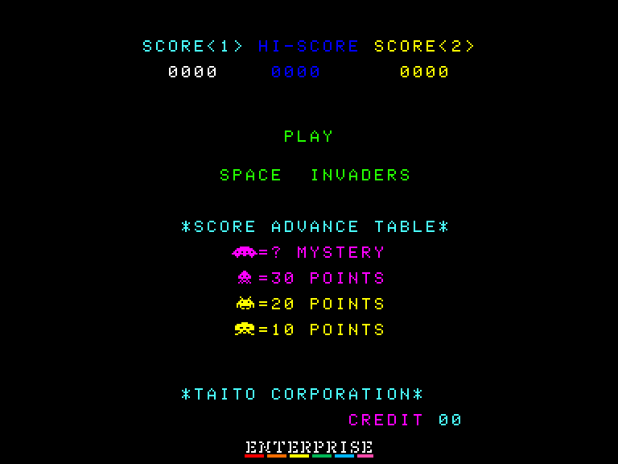
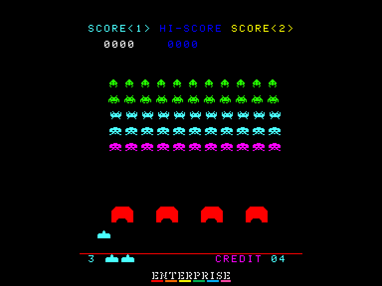
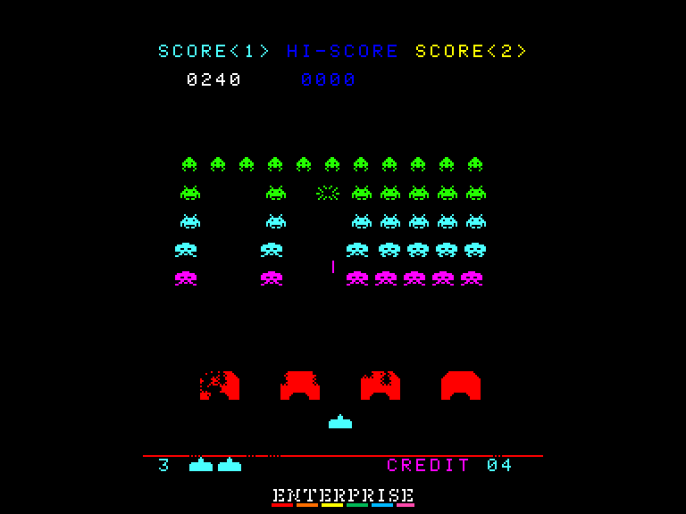
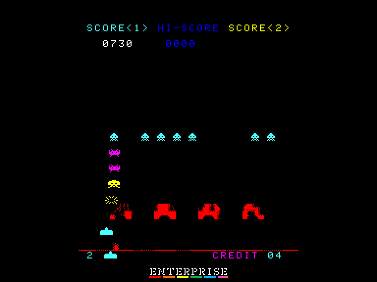

[0-9](../0/games-0.md) - [A](../a/games-a.md) - [B](../b/games-b.md) - [C](../c/games-c.md) - [D](../d/games-d.md) - [E](../e/games-e.md) - [F](../f/games-f.md) - [G](../g/games-g.md) - [H](../h/games-h.md) - [I](../i/games-i.md) - [J](../j/games-j.md) - [K](../k/games-k.md) - [L](../l/games-l.md) - [M](../m/games-m.md) - [N](../n/games-n.md) - [O](../o/games-o.md) - [P](../p/games-p.md) - [Q](../q/games-q.md) - [R](../r/games-r.md) - [S](../s/games-s.md) - [T](../t/games-t.md) - [U](../u/games-u.md) - [V](../v/games-v.md) - [W](../w/games-w.md) - [X](../x/games-x.md) - [Y](../y/games-y.md) - [Z](../z/games-z.md)

Ігри для [Enterprise 64k](../games-ep64.md) - [Enterprise 128k+RAMexp](../games-epramexp.md) - [2dfx](games-2dfx.md)

Ігри для систем [IS-DOS](../games-is-dos.md) - [SymbOS](../games-symbos.md) - [EDC Windows](../games-edcw.md)

Ігри для емуляторів [ZX Spectrum 48k/128k](../zxemu/games-zxemu.md) - [Amstrad CPC](../cpcemu/games-cpc.md) - [Sinclair ZX81](../zx81emu/games-zx81.md) - [Videoton TVC](../tvcemu/games-tvc.md) - [Commodore VIC-20](../vic20emu/games-vic20.md)

----------

# Space Invaders Arcade Classic

**ID:** space-invaders-classic-arcade

**Жанри:** Аркада, Space Invaders-подібна

## Примітка

ℹ Сучасна неофіційна конверсія з аркадного автомата.

## Скріншоти

## Опис

Space Invaders - це просто найвпливовіша відеогра всіх часів і народів. Гравець керуючи озброєною «лазерною базою» розстрілює нескінченні хвилі прибульців, які невпинно рухаються вниз по екрану до Землі.

## Основна інформація
- **Мови:** Англійська
- **Оригінальна платформа:** Arcade
### Загальні системні вимоги
- **Апаратні:** EP64, EP128
### Геймплей
- **Керування:** Keyboard, External Joy 1, External Joy 2
- **Кількість гравців:** 1 player, 2 players (alternate)
- **Додаткові теги:** Attribute mode
### Розробка
- **Рік випуску:** 1978
- **Компанія:** Taito

## Посилання
- [Тема на форумі enterpriseforever](https://enterpriseforever.com/konvertalas/space-invaders-arcade-version/)
- [Завантажити](http://www.ep128.hu/Ep_Games/Prg/Space_Invaders_Arcade.rar)
- [Easy Load&Play](https://t.me/EP128k_Load_n_Play/753) *(Telegram-канал Vibrant Waves)*

## Відео

<iframe src="https://www.youtube.com/embed/lvxaPFWGzEE"  
style="width:75%; aspect-ratio:16/9;" allowfullscreen></iframe>

## [Керування](../controllers.md)

Для початку гри необхідно закинути необхідну кількість монет (клавіша `F1`), а потім вибрати кількість гравців (клавіши `1` та `2`).  

#### Гравець 1  

`Keyboard`: `A`, `S`, `Ctrl`  
`External Joystick 1`  

#### Гравець 2  

`Keyboard`: `L`, `;`, `:` або `L`, `Ö`, `Ä` на німецькій клавіатурі.  
`External Joystick 2`  

### Додаткові клавіши  
`1` (Start1): Почати гру для одного гравця  
`2` (Start2): Почати гру для двох гравців  
`F1` (Credit): "Закинути" монету  

`F2` (DIP3): **00** = **3** життя  **10** = **5** життів  
`F3` (DIP5): **01** = **4** життя  **11** = **6** життів  
`F4` (DIP6): Бонусне життя за **1500**/**1000** очків  
`F5` (DIP7): Показувати/не показувати вартість гри на демо екрані  
`F6` (TILT): Увімкнути/вимкнути TILT режим  
`F7` (DIP4): Перейти у сервісний режим (після скидання (`F8`))  
`F8` (Reset): Перезавантажити гру  

`3` (ChngPal): Змінити палітру екрану  
`4` (Rotate): Повернути екран

## Детальна інформація

### Системні вимоги  

#### Мінімальні системні вимоги  

Оперативна пам'ять: **64 КБ** (без звуку)  

### Рекомендовані системні вимоги  

Оперативна пам'ять: **128 КБ (або більше)**  

### Геймплей  

Внизу екрану є чотири захисні споруди за якими гравець може сховатися, але зрештою вони будуть зруйновані або ворожими пострілами, або прямим контактом із самими загарбниками. Постріли гравця їх також руйнують.  

Спуск інопланетян прискорюється в міру їх знищення, що робить їх ліквідацію дедалі важчою. Через верхню частину екрану буде регулярно пролітати літаюча тарілка в яку можна влучити, щоб заробити додаткові очки.  

### Нарахування балів  

- Великий загарбник: **10** очок.  
- Середній загарбник: **20** очок.  
- Малий загарбник: **30** очок.  
- НЛО: від **50** до **300** очок.  

### Поради у проходженні  

[TIPS AND TRICKS на сайті Arcade-History](https://www.arcade-history.com/?n=space-invaders&page=detail&id=2537)