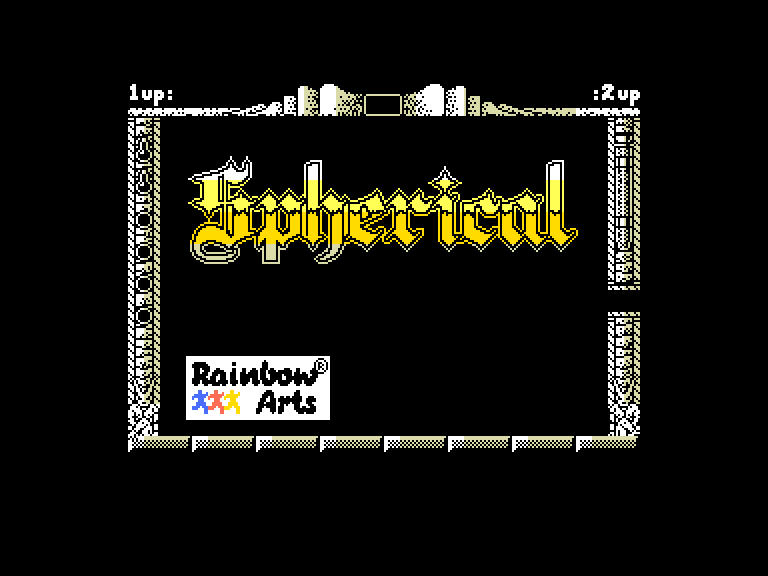
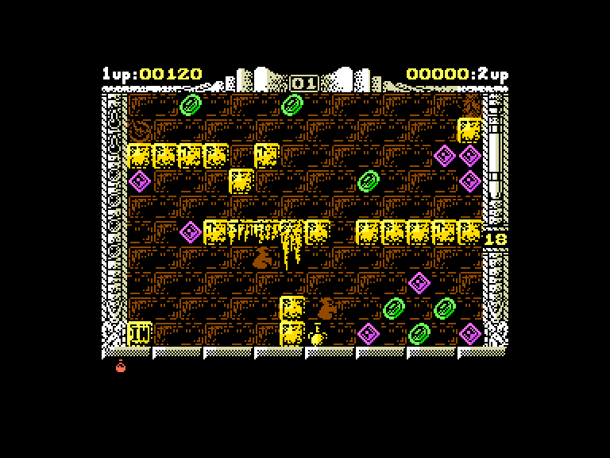
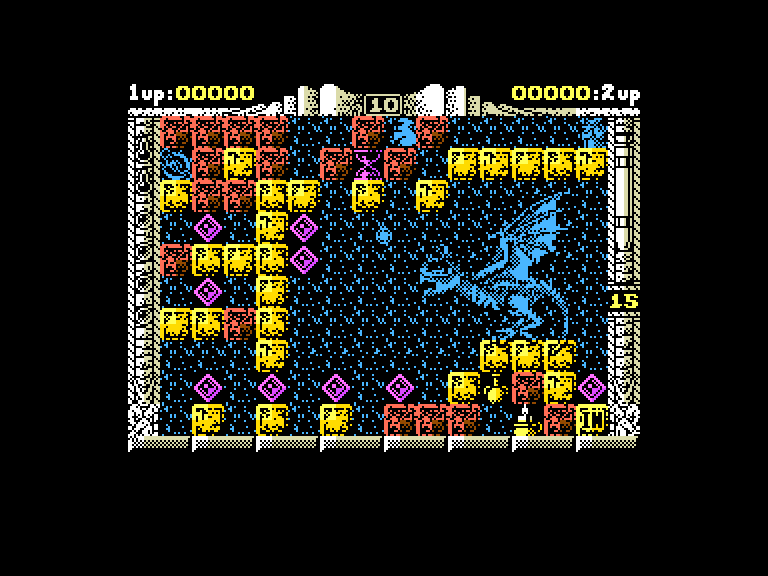
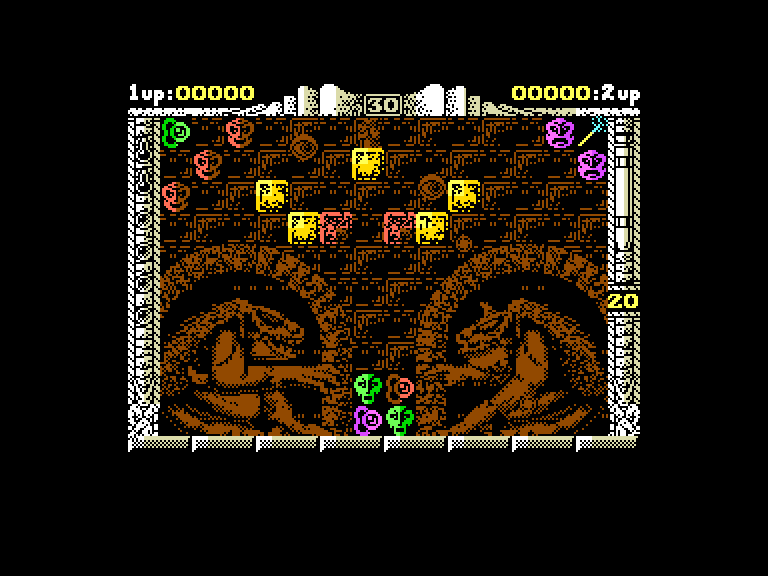

[0-9](../0/games-0.md) - [A](../a/games-a.md) - [B](../b/games-b.md) - [C](../c/games-c.md) - [D](../d/games-d.md) - [E](../e/games-e.md) - [F](../f/games-f.md) - [G](../g/games-g.md) - [H](../h/games-h.md) - [I](../i/games-i.md) - [J](../j/games-j.md) - [K](../k/games-k.md) - [L](../l/games-l.md) - [M](../m/games-m.md) - [N](../n/games-n.md) - [O](../o/games-o.md) - [P](../p/games-p.md) - [Q](../q/games-q.md) - [R](../r/games-r.md) - [S](../s/games-s.md) - [T](../t/games-t.md) - [U](../u/games-u.md) - [V](../v/games-v.md) - [W](../w/games-w.md) - [X](../x/games-x.md) - [Y](../y/games-y.md) - [Z](../z/games-z.md)

Ігри для [Enterprise 64k](../games-ep64.md) - [Enterprise 128k+RAMexp](../games-epramexp.md)

Ігри для систем [IS-DOS](../games-is-dos.md) - [SymbOS](../games-symbos.md) - [EDC Windows](../games-edcw.md)

Ігри для емуляторів [ZX Spectrum 48k/128k](../zxemu/games-zxemu.md) - [Amstrad CPC](../cpcemu/games-cpc.md) - [Sinclair ZX81](../zx81emu/games-zx81.md) - [Videoton TVC](../tvcemu/games-tvc.md) - [Commodore VIC-20](../vic20emu/games-vic20.md)

----------

# Spherical

**ID:** spherical-zx

**Жанри:** Платформер, Логічна

## Примітка

ℹ Стара неофіційна конверсія з платформи ZX Spectrum.

## Скріншоти

## Опис

Давним-давно, у світі, де долі людей, ельфів та гномів залежали від друїдів і магів, землі були розділені на Тальєнхорт (люди), Кендрон (гноми) та таємничий Хорндал (про який ходили моторошні чутки). Експедиції до Хорндалу безслідно зникали, тож з часом раси зосередилися на внутрішніх війнах.  

Через роки у лісах Кендрона знову з'явилися ельфи, яких вважали вимерлими. Ельф Пульграм, прагнучи повернути своєму народу колишню славу, запропонував вийти з тіні. Хоча ельфи та гноми історично ворогували, Пульграм потоваришував з гномським магом Вуроном. Разом вони вивчали давні пророцтва і дійшли висновку, що світ знову в небезпеці через пробудження древнього зла.  

Ймовірний ключ до розгадки проблеми лежав у стародавньому документі в бібліотеці Тальєнхорта. Попри війну між гномами та людьми, Пульграм і Вурон вирушили у небезпечну подорож, можливо, використовуючи заборонену чорну магію. Вони знайшли те, що шукали — записи мудреця Куарола про Зоряну сферу — могутній артефакт, яким Куарол колись вигнав зло, але не до кінця.  

Ціна, яку вимагала зоряна куля за її використання, була практично такою ж, як і покарання за використання чорної магії. Використовуючи енергію Зоряної сфери, користувач, у свою чергу, мав віддати своє життя, щоб приєднатися до її внутрішнього святилища — стати частиною самої Зоряної сфери.  

Пізніші пророки в усьому світі вважали Вурона та Пульграма одними з найвидатніших мучеників усіх часів, оскільки вони запобігли величезній небезпеці для світу. Багато років потому знайдений щоденник Пульграма розкрив їхній відчайдушний план: використати Зоряну сферу, пожертвувавши своїми життями, щоб зупинити пробудженого дракона Міргала, який загрожував поневолити світ.

## Основна інформація
- **Мови:** Англійська
- **Оригінальна платформа:** ZX Spectrum
### Загальні системні вимоги
- **Апаратні:** EP128
### Геймплей
- **Керування:** Keyboard, Internal Joy, External Joy 1, External Joy 2
- **Кількість гравців:** 1 player, 2 players (cooperative)
- **Додаткові теги:** Attribute mode
### Розробка
- **Рік випуску:** 1989
- **Автор:** Daren White, Jason Green

## Посилання
- [Інформація про оригінальну версію](https://spectrumcomputing.co.uk/entry/4746/ZX-Spectrum/Spherical)
- [Завантажити гру](http://www.ep128.hu/Ep_Games/Prg/Spherical.rar)

## [Керування](../controllers.md)

`Keyboard`: `Q`, `A`, `O`, `P`, `Space`, `Enter`  
`Internal Joystick`  
`External Joystick 1`  
`External Joystick 2` *(тільки для другого гравця)*  

`Fire`: Створити/забрати камінь  
`Fire`+`⬇`: Створити/забрати камінь рівнем нижче  
`Enter`: Використання магії  

`R`: рестарт рівня  
`Stop`: вихід в головне меню  
`Hold`/`Pause`: пауза

## Детальна інформація

### Системні вимоги  

#### Мінімальні системні вимоги  

Оперативна пам'ять: **128 КБ (або більше)**  

### Геймплей  

У грі ви маєте пробиратись через кімнати замку дракона. Ваше завдання — за допомогою магії створювати шлях для кулі, направляючи її до виходу, щоб перейти до наступної кімнати.  

На екрані гри є важливі індикатори:  

 - **Магічна сила (ліворуч, дві пляшки):** Показує, скільки магії залишилось для утримання Зоряної сфери в цьому вимірі. Якщо магія закінчиться, куля повернеться у паралельний вимір.  
 - **Часові двері (ліворуч, камені):** Вказує кількість "часових дверей", що залишились. У безнадійній ситуації можна натиснути `R`, щоб повернутися до моменту входу в кімнату.  
  - **Багатство (зверху):** Поточний рівень вашого багатства (або вашого поплічника).  
  - **Номер кімнати (зверху):** Показує номер поточної кімнати. Ходять чутки, що кімнат більше сотні, і кожна змінюється залежно від кількості гравців (один чи два).  
  - **Годинник (праворуч):** Відображає точний час до початку руху Зоряної сфери. На цей час може впливати пісочний годинник.  
  - **Енергія героя (праворуч, пробірка):** Життєва енергія героїв. Енергія втрачається при контакті з монстрами або кислотою. Втративши всю енергію, ви мусите покинути замок.  
  - **Червоні пляшки (знизу):** Кількість зібраних червоних пляшок (див. нижче).  

Предмети:  

 - **Діаманти**: Збільшує багатство.  
 - **Червона пляшка**: Знищує все зло.  
 - **Ваза**: Збільшує енергію мага.  
 - **Свічка**: Куля, яка знищує супротивників.  
 - **Пляшка отрути**: Маг не зможе створювати камні.  
 - **Зелена пляшка**: Зупинка часу.  
 - **Антиграв**: Змінює гравітацію Зоряної сфери.  
 - **Чарівна лампа**: Маг невразливий.  
 - **Сувій**: Маг може стрибати далі.  
 - **Кубок**: Телепортує на варп-рівень.  
 - **Двері** (голови) та **амулети**: Щоб відкрити двері, вам потрібен амулет того ж кольору.  
 - **Чарівна паличка**: Телепортує на наступний рівень.  
 - **Пісочний годинник**: Дає більше часу до моменту коли Зоряна сфера почне рухатися.  
 - **Документ**: Пароль.  

### Чіти та коди  

Коди рівней:  
**Code words are for player one**  
level 9: `RADAGAST`  
level 19: `YARMAK`  
level 39: `ORCSLAYER`  
level 59: `SKYFIRE`  
level 75: `MIRGAL`  
  
**For player two**  
level 9: `GHANIMA`  
level 19: `GLIEP`  
level 39: `MOURNBLADE`  
level 59: `JADAWIN`  
level 75: `GUMBACHACHMAL`  

Enter `ILLUMINATUS` as a password to enter the CHEAT MODE - this password gives you Infinite Energy for one and two players game  
`M`: перейти на наступний рівень    
`N`: перейти на попередній рівень (⚠ не натискати на першому рівні)