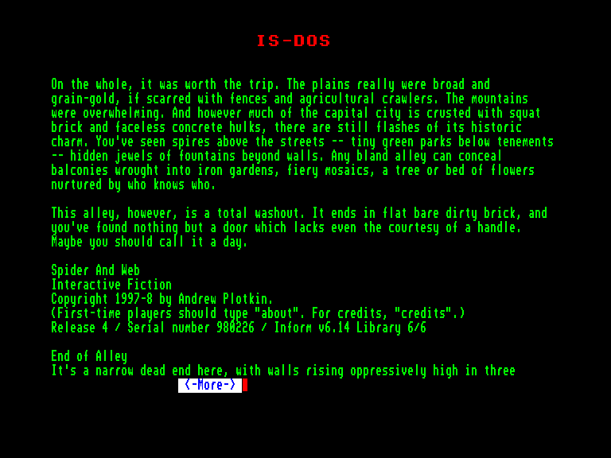
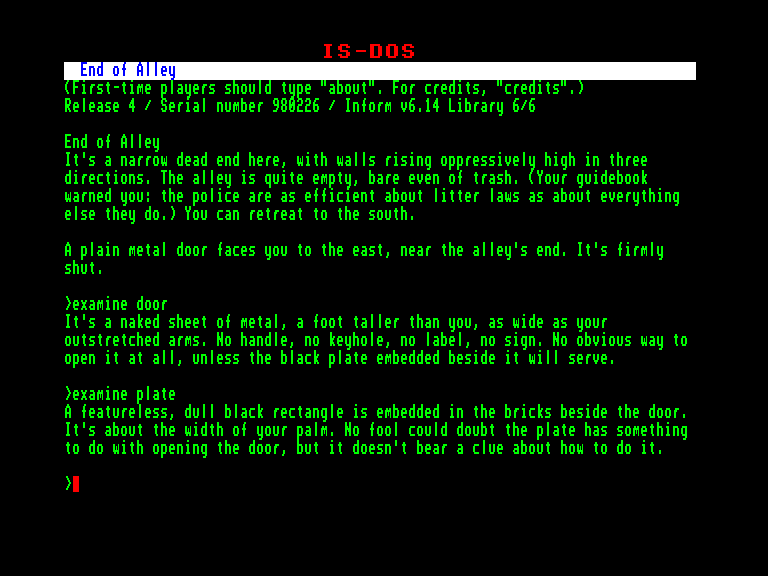
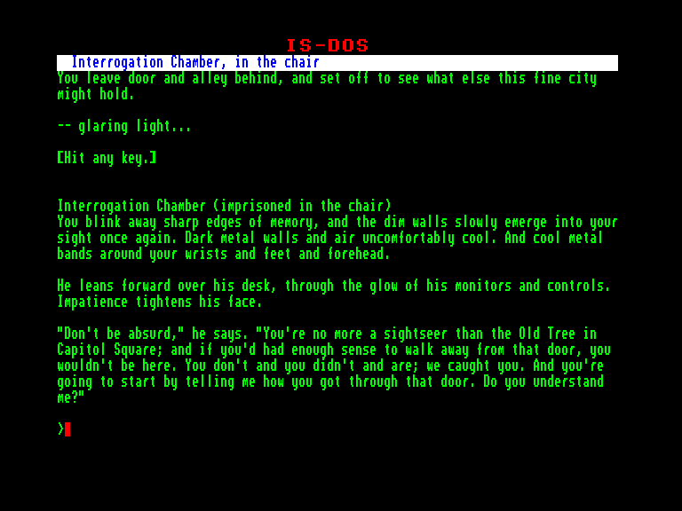

[0-9](../0/games-0.md) - [A](../a/games-a.md) - [B](../b/games-b.md) - [C](../c/games-c.md) - [D](../d/games-d.md) - [E](../e/games-e.md) - [F](../f/games-f.md) - [G](../g/games-g.md) - [H](../h/games-h.md) - [I](../i/games-i.md) - [J](../j/games-j.md) - [K](../k/games-k.md) - [L](../l/games-l.md) - [M](../m/games-m.md) - [N](../n/games-n.md) - [O](../o/games-o.md) - [P](../p/games-p.md) - [Q](../q/games-q.md) - [R](../r/games-r.md) - [S](../s/games-s.md) - [T](../t/games-t.md) - [U](../u/games-u.md) - [V](../v/games-v.md) - [W](../w/games-w.md) - [X](../x/games-x.md) - [Y](../y/games-y.md) - [Z](../z/games-z.md)

Ігри для [Enterprise 64k](../games-ep64.md) - [Enterprise 128k+RAMexp](../games-epramexp.md)

Ігри для систем [IS-DOS](../games-is-dos.md) - [SymbOS](../games-symbos.md) - [EDC Windows](../games-edcw.md)

Ігри для емуляторів [ZX Spectrum 48k/128k](../zxemu/games-zxemu.md) - [Amstrad CPC](../cpcemu/games-cpc.md) - [Sinclair ZX81](../zx81emu/games-zx81.md) - [Videoton TVC](../tvcemu/games-tvc.md) - [Commodore VIC-20](../vic20emu/games-vic20.md)

----------

# Spider and Web

**ID:** spider-and-web-zcode

**Жанри:** Текстова пригода

## Скріншоти

## Опис

Загалом, поїздка була варта того. Рівнини справді були широкими та золотистими, хоч і пошрамованими парканами та сільськогосподарськими тракторами. Гори були вражаючими. І хоч би яка велика частина столиці була вкрита присадкуватою цеглою та безликими бетонними будівлями, тут все ще є проблиски її історичної чарівності. Ви бачили шпилі над вулицями, крихітні зелені парки під багатоквартирними будинками, приховані коштовності фонтанів за стінами. Будь-який банальний провулок може приховувати балкони, викувані в залізні сади, вогняні мозаїки, дерево чи клумбу квітів, доглянуті невідомо ким.

Однак цей провулок — повне порожнеча. Він закінчується плоскою голою брудною цеглою, і ви не знайшли нічого, крім дверей, на яких навіть немає ручки. Можливо, вам варто на цьому закінчити.

## Основна інформація
- **Мови:** Англійська
### Загальні системні вимоги
- **Апаратні:** EXDOS
- **Програмні:** IS-DOS 1.1
### Геймплей
- **Керування:** Keyboard
- **Кількість гравців:** 1 player
- **Додаткові теги:** Z-code
### Розробка
- **Рік випуску:** 1998
- **Автор:** Andrew Plotkin

## Посилання
- [Інформація про гру (SolutionArchive.com)](https://solutionarchive.com/game/id%2C9645/Spider+and+Web.html)

