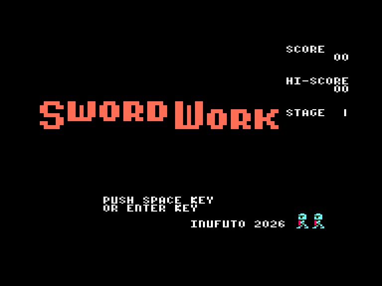
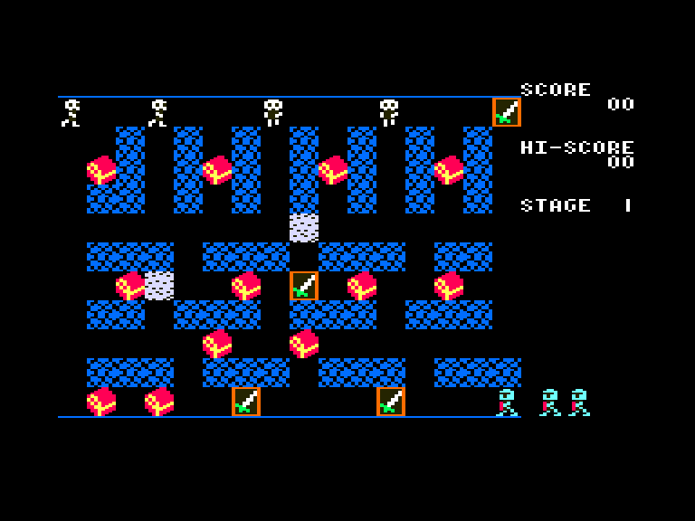
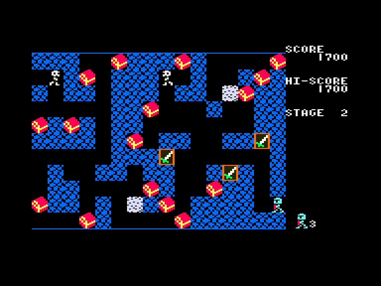
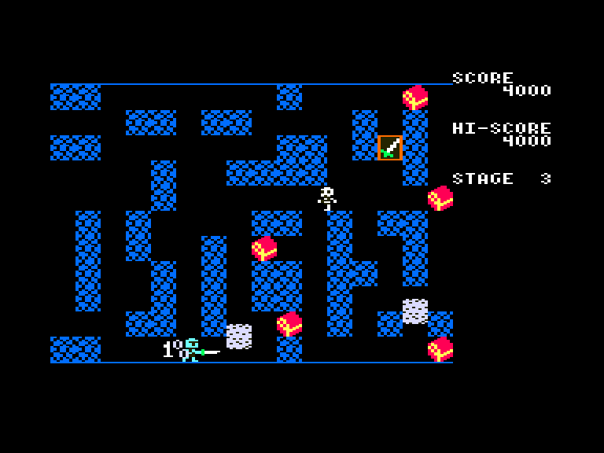

[0-9](../0/games-0.md) - [A](../a/games-a.md) - [B](../b/games-b.md) - [C](../c/games-c.md) - [D](../d/games-d.md) - [E](../e/games-e.md) - [F](../f/games-f.md) - [G](../g/games-g.md) - [H](../h/games-h.md) - [I](../i/games-i.md) - [J](../j/games-j.md) - [K](../k/games-k.md) - [L](../l/games-l.md) - [M](../m/games-m.md) - [N](../n/games-n.md) - [O](../o/games-o.md) - [P](../p/games-p.md) - [Q](../q/games-q.md) - [R](../r/games-r.md) - [S](../s/games-s.md) - [T](../t/games-t.md) - [U](../u/games-u.md) - [V](../v/games-v.md) - [W](../w/games-w.md) - [X](../x/games-x.md) - [Y](../y/games-y.md) - [Z](../z/games-z.md)

Ігри для [Enterprise 64k](../games-ep64.md) - [Enterprise 128k+RAMexp](../games-epramexp.md)

Ігри для систем [IS-DOS](../games-is-dos.md) - [SymbOS](../games-symbos.md) - [EDC Windows](../games-edcw.md)

Ігри для емуляторів [ZX Spectrum 48k/128k](../zxemu/games-zxemu.md) - [Amstrad CPC](../cpcemu/games-cpc.md) - [Sinclair ZX81](../zx81emu/games-zx81.md) - [Videoton TVC](../tvcemu/games-tvc.md) - [Commodore VIC-20](../vic20emu/games-vic20.md)

----------

# SwordWork

**ID:** swordwork

**Жанри:** Аркада, Екшн

## Скріншоти

## Опис

У цій грі вам доведеться приміряти лати відважного лицаря, чия головна мета - зібрати всі цінні скрині зі скарбами. 
Однак не чекайте легкої прогулянки: на кожному кроці вам заважатимуть невгамовні скелети, що постійно повстають з мертвих. 
У боротьбі з цими кістлявими створіннями лицарю допоможе його гострий вірний меч. 
А якщо збирати різні бонуси, можна буде покращувати володіння зброєю, відкриваючи доступ до більш стрімких та ефективних випадів.

## Основна інформація
- **Мови:** Англійська
- **Оригінальна платформа:** Multiplatform
### Системні вимоги
- **Апаратні:** EP64, EP128
### Геймплей
- **Керування:** Keyboard, Internal Joy
- **Кількість гравців:** 1 player
- **Додаткові теги:** 16-color mode
### Розробка
- **Рік випуску:** 2026
- **Автор:** Inufuto

## Посилання
- [Домашня сторінка гри](http://inufuto.web.fc2.com/8bit/sword/#ep64)
- [Завантажити гру](https://www.ep128.hu/Ep_Games/Prg/Sword_Work.rar)
- [Easy Load&Play](https://t.me/EP128k_Load_n_Play/1166) *(Telegram-канал Vibrant Waves)*

## Відео

<iframe src="https://www.youtube.com/embed/bt9u_xh2pmU"  
style="width:75%; aspect-ratio:16/9;" allowfullscreen></iframe>
