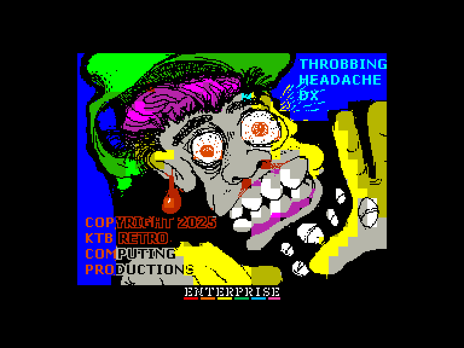
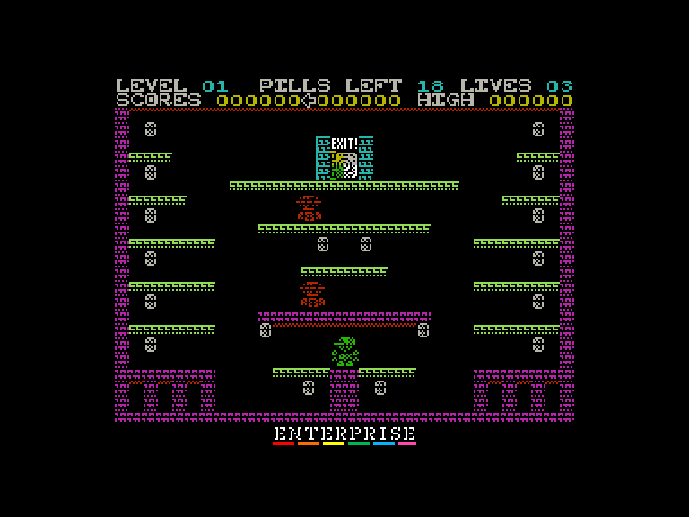
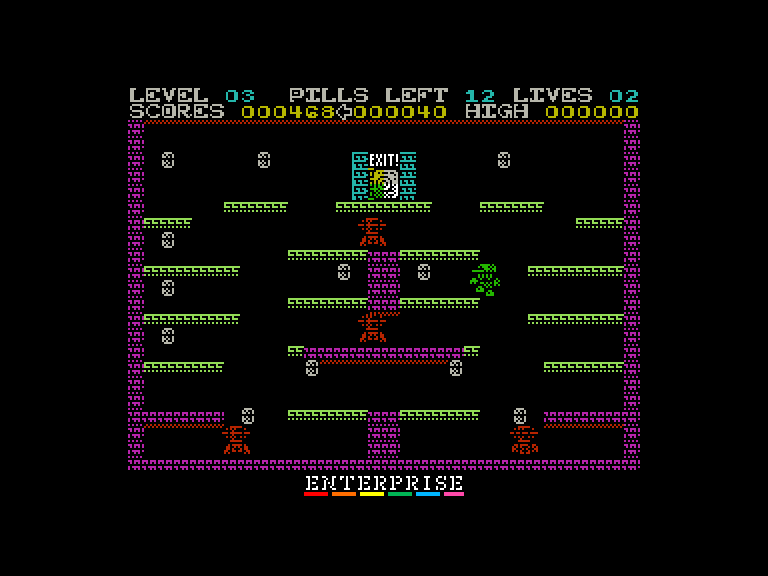
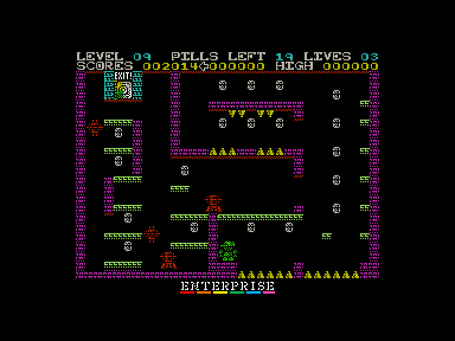

# Throbbin' Headache DX

 
 
 

Жанр: аркада, платформер  
Кількість гравців: 1  
Мова гри: англійська  

## Опис

Роббі щось підхопив; ймовірно, один із вірусів застуди чи грипу, які поширені в зимові місяці.  
Захоплений чимось схожим на сон з лихоманкою, він метушиться, збираючи парацетамол, щоб стримати вірус, знизити температуру та покращити самопочуття.

Це сон? Його будинок раніше не виглядав так? Звідки взялися ці смертельні роботи? А ці криваво-червоні шипи, мабуть, декоративні, чи не так?

Роббі має ходити з кімнати в кімнату, збираючи весь парацетамол, який бачить; весь час уникаючи роботів, шипів та незручних соціальних ситуацій. (Можливо, останнє я вигадав!)  
Коли всі таблетки будуть зібрані, двері відчиняться, і Роббі зможе піти.

Одні з цих дверей мають вести з цього кошмару, чи не так?

## Системні вимоги

|Мінімальні системні вимоги:|Рекомендовані системні вимоги:|
|---------------------------|------------------------------|
|Оперативна пам'ять: **64 КБ**|Оперативна пам'ять: **128 КБ (або більше)**|  

## Керування та тонкощі запуску
### Основні [елементи керування](../controllers.md):
⌨ Клавіатура (`Q`, `A`, `O`, `P`, `M`)  
🕹 Вбудований джойстик  
🎮 Зовнішній джойстик 1/2

`Fire`: високий стрибок  
`Напрямок`+`Fire`: довгий стрибок

## Посилання

▶ [Easy Load&Play](https://t.me/EP128k_Load_n_Play/899) *(Telegram-канал Vibrant Waves)*  
💾 [Завантажити гру](http://www.ep128.hu/Ep_Games/Prg/Throbbin_Headache_DX.rar)  
📃 [Опис гри]() (угорська)  
🏡 [Домашня сторінка гри](https://ktbproductions.itch.io/enterprise-games)

## Автори
### Оригінальний реліз
🖥 Платформа: [ZX Spectrum](https://spectrumcomputing.co.uk/entry/44015/ZX-Spectrum/Throbbing_Headache)  
👨‍💻 Автор: Mas  
📅 Рік релізу: 2025  

### Версія гри для Enterprise
👨‍💻 Автор: Mas  
📅 Рік релізу: 2025  