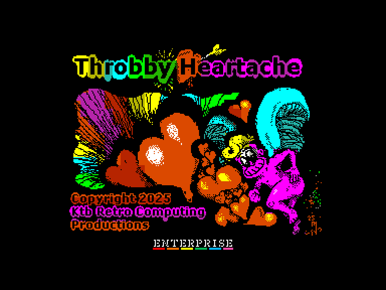
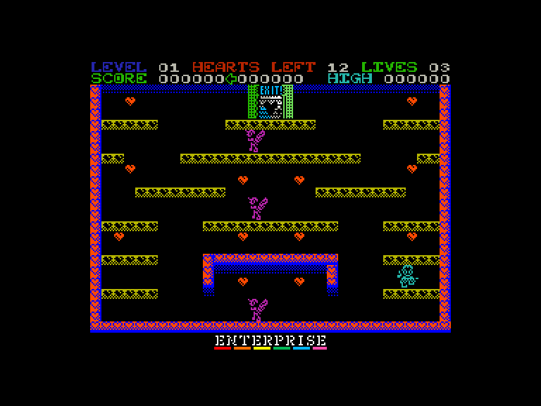
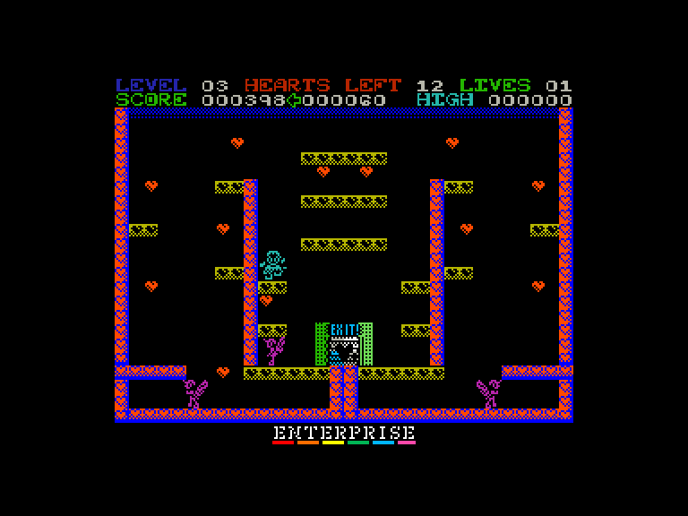

# Throbby Heartache

 
 
 

Жанр: аркада, платформер  
Кількість гравців: 1  
Мова гри: англійська  

## Опис

Роббі та Роберта (так, їх тепер двоє!) підхопили вірус Дня святого Валентина.
Але якийсь лиходій розкидав сердечка закоханих всюди.
І всюди розлючені херувими!

Уникайте херувимів. Уникайте розбитих сердець. Зберіть усі добрі, сердечка закоханих. Перейдіть на наступний рівень.
Це так просто!

Всього 20 рівнів, і деякі з них є досить підлими!

## Системні вимоги
### Мінімальні системні вимоги
Оперативна пам'ять: **64 КБ**  
### Рекомендовані системні вимоги
Оперативна пам'ять: **128 КБ (або більше)**  

## Керування та тонкощі запуску
### Основні [елементи керування](../controllers.md):
⌨ Клавіатура (`Q`, `A`, `O`, `P`, `M`)  
🕹 Вбудований джойстик  
🎮 Зовнішній джойстик 1/2

`Fire`: високий стрибок  
`Напрямок`+`Fire`: довгий стрибок

## Посилання

▶ [Easy Load&Play](https://t.me/EP128k_Load_n_Play/907) *(Telegram-канал Vibrant Waves)*  
💾 [Завантажити гру](http://www.ep128.hu/Ep_Games/Prg/Throbby_Heartache.rar)  
📃 [Опис гри]() (угорська)  
🏡 [Домашня сторінка гри](https://ktbproductions.itch.io/enterprise-games)

## Автори
### Оригінальний реліз
🖥 Платформа: [ZX Spectrum](https://spectrumcomputing.co.uk/entry/44066/ZX-Spectrum/Throbby_Heartache)  
👨‍💻 Автор: Mas  
📅 Рік релізу: 2025  

### Версія гри для Enterprise
👨‍💻 Автор: Mas  
📅 Рік релізу: 2025  