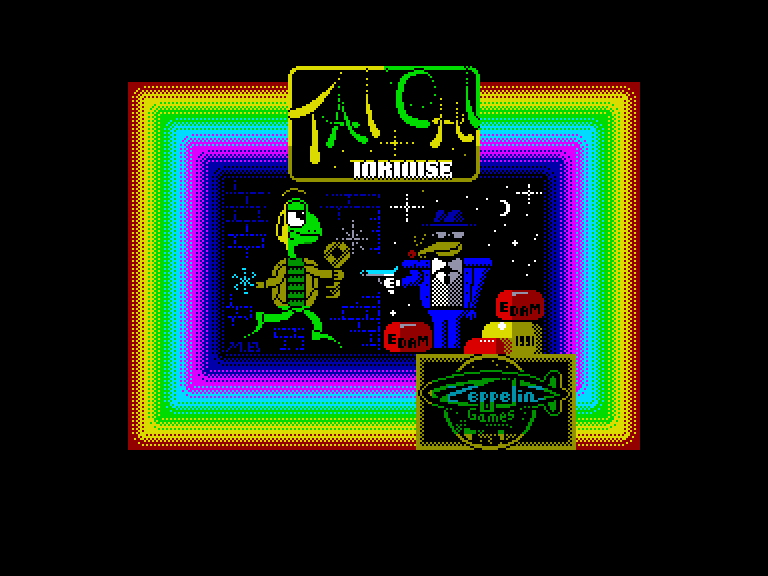
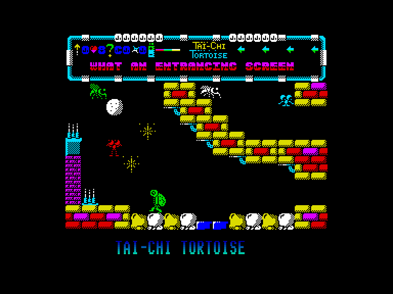
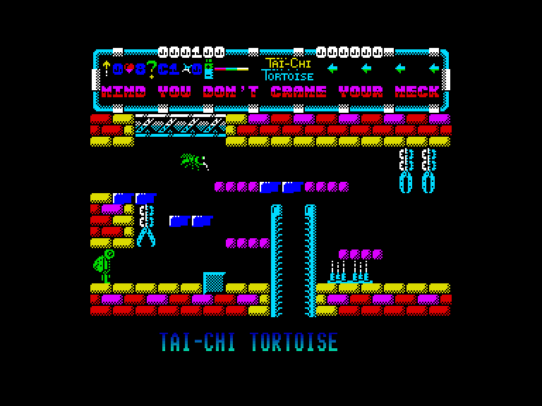
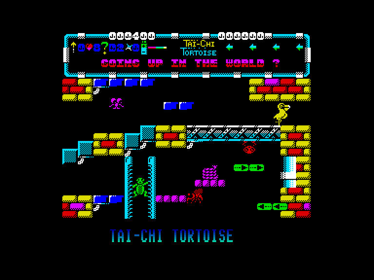

[0-9](../0/games-0.md) - [A](../a/games-a.md) - [B](../b/games-b.md) - [C](../c/games-c.md) - [D](../d/games-d.md) - [E](../e/games-e.md) - [F](../f/games-f.md) - [G](../g/games-g.md) - [H](../h/games-h.md) - [I](../i/games-i.md) - [J](../j/games-j.md) - [K](../k/games-k.md) - [L](../l/games-l.md) - [M](../m/games-m.md) - [N](../n/games-n.md) - [O](../o/games-o.md) - [P](../p/games-p.md) - [Q](../q/games-q.md) - [R](../r/games-r.md) - [S](../s/games-s.md) - [T](../t/games-t.md) - [U](../u/games-u.md) - [V](../v/games-v.md) - [W](../w/games-w.md) - [X](../x/games-x.md) - [Y](../y/games-y.md) - [Z](../z/games-z.md)

Ігри для [Enterprise 64k](../games-ep64.md) - [Enterprise 128k+RAMexp](../games-epramexp.md) - [2dfx](games-2dfx.md)

Ігри для систем [IS-DOS](../games-is-dos.md) - [SymbOS](../games-symbos.md) - [EDC Windows](../games-edcw.md)

Ігри для емуляторів [ZX Spectrum 48k/128k](../zxemu/games-zxemu.md) - [Amstrad CPC](../cpcemu/games-cpc.md) - [Sinclair ZX81](../zx81emu/games-zx81.md) - [Videoton TVC](../tvcemu/games-tvc.md) - [Commodore VIC-20](../vic20emu/games-vic20.md)

----------

# Tai Chi Tortoise

**ID:** tai-chi-tortoise-zx

## Скріншоти

## Опис

(temporary description generated by AI)

**Опис гри:**

У грі "Tai Chi Tortoise" ви граєте за Вінсента Рататуя, який вирушає в подорож, щоб повернути вкрадені сири світу. Вам потрібно буде подолати понад 100 екранів платформ та драбин, використовуючи свої навички бойових мистецтв. Збирайте різні предмети, такі як лопата та черевики для стрибків, щоб допомогти собі в цій пригоді.

**Правила гри:**

1. Гравець управляє персонажем, який повинен проходити рівні, збираючи предмети.
2. Деякі платформи зникають, коли ви на них стоїте, але вони відновлюються, якщо ви покинете екран і повернетеся.
3. Використовуйте зібрані предмети для подолання перешкод та досягнення нових рівнів.
4. Гра передбачає елементи бойових мистецтв, тому використовуйте свої навички для боротьби з ворогами.
5. Мета гри - повернути всі вкрадені сири, подолавши всі рівні.

Бажаємо успіху у вашій пригоді!

## Основна інформація
- **Оригінальна платформа:** ZX Spectrum

## Посилання
- [Інформація про оригінальну версію](https://spectrumcomputing.co.uk/entry/5112/ZX-Spectrum/Tai_Chi_Tortoise)
- [Завантажити](http://www.ep128.hu/Ep_Games/Prg/Tai-Chi_Tortoise.rar)

