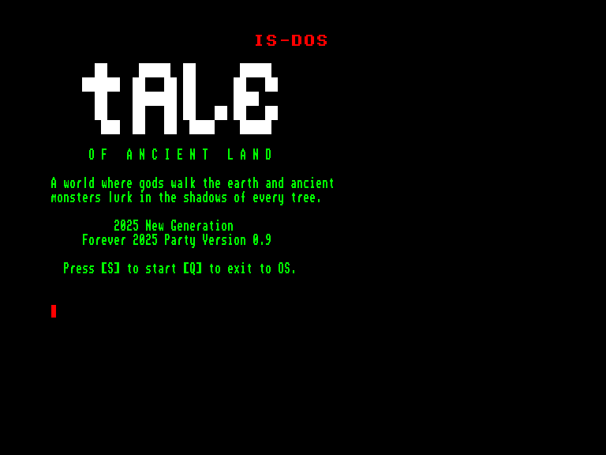
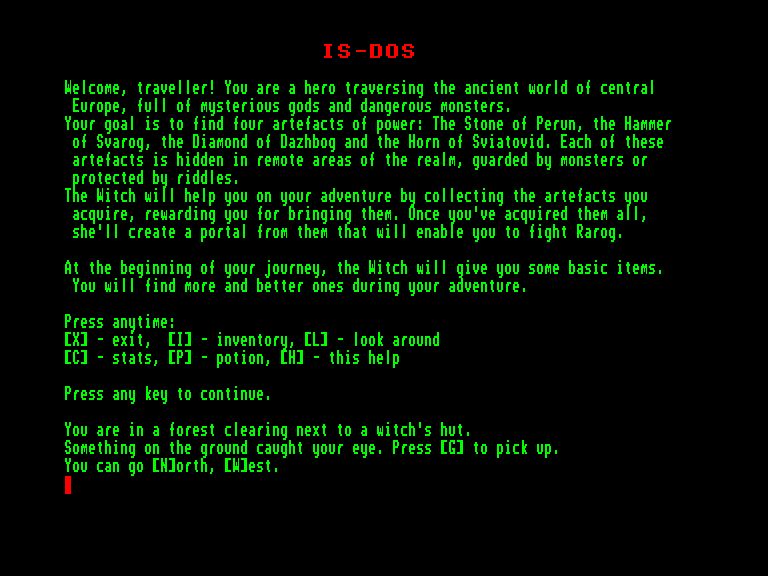
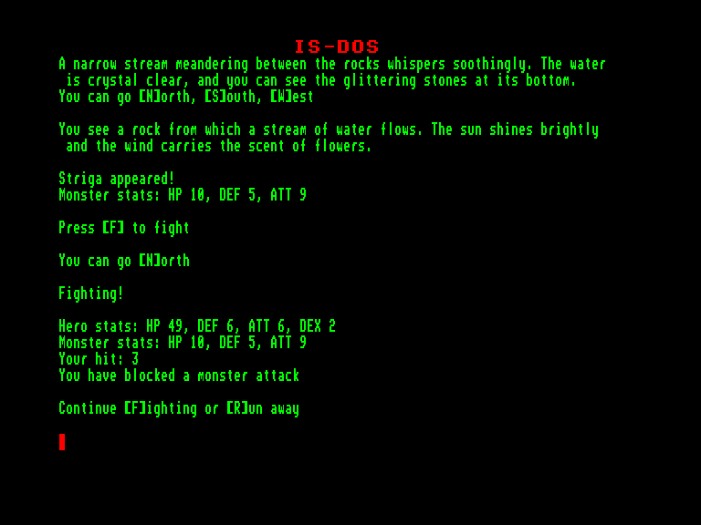
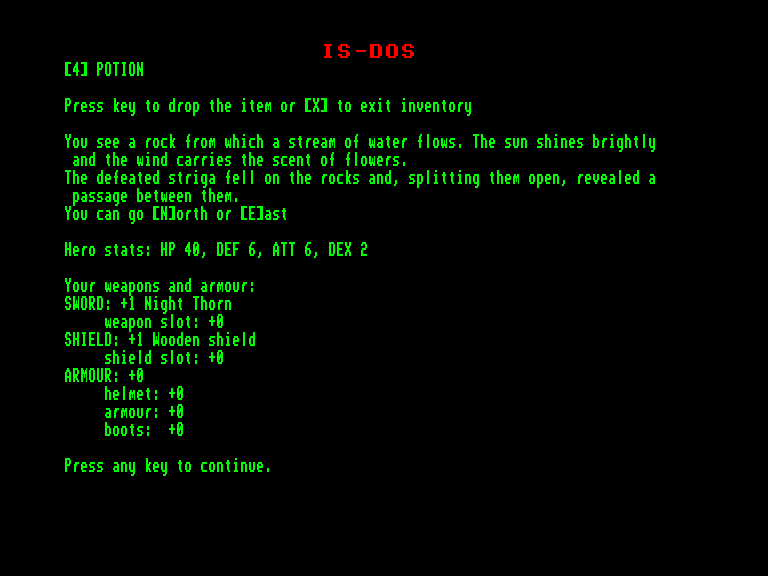

[0-9](../0/games-0.md) - [A](../a/games-a.md) - [B](../b/games-b.md) - [C](../c/games-c.md) - [D](../d/games-d.md) - [E](../e/games-e.md) - [F](../f/games-f.md) - [G](../g/games-g.md) - [H](../h/games-h.md) - [I](../i/games-i.md) - [J](../j/games-j.md) - [K](../k/games-k.md) - [L](../l/games-l.md) - [M](../m/games-m.md) - [N](../n/games-n.md) - [O](../o/games-o.md) - [P](../p/games-p.md) - [Q](../q/games-q.md) - [R](../r/games-r.md) - [S](../s/games-s.md) - [T](../t/games-t.md) - [U](../u/games-u.md) - [V](../v/games-v.md) - [W](../w/games-w.md) - [X](../x/games-x.md) - [Y](../y/games-y.md) - [Z](../z/games-z.md)

Ігри для [Enterprise 64k](../games-ep64.md) - [Enterprise 128k+RAMexp](../games-epramexp.md)

Ігри для систем [IS-DOS](../games-is-dos.md) - [SymbOS](../games-symbos.md) - [EDC Windows](../games-edcw.md)

Ігри для емуляторів [ZX Spectrum 48k/128k](../zxemu/games-zxemu.md) - [Amstrad CPC](../cpcemu/games-cpc.md) - [Sinclair ZX81](../zx81emu/games-zx81.md) - [Videoton TVC](../tvcemu/games-tvc.md) - [Commodore VIC-20](../vic20emu/games-vic20.md)

----------

# Tale of Ancient Land

**ID:** tale-of-ancient-land-isdos

**Жанри:** Текстова пригода, RPG

## Примітка

ℹ Мультиплатформенна гра.

## Скріншоти

## Опис

Вітаємо, мандрівнику! Ти — герой, який подорожує стародавнім світом Центральної Європи, повним таємничих богів та небезпечних монстрів.  

Твоя мета — знайти чотири артефакти сили: Камінь Перуна, Молот Сварога, Діамант Дажбога та Ріг Світовида. Кожен із цих артефактів захований у найвіддаленіших куточках королівства, під охороною монстрів або запечатаний загадками.  

Відьма допомагатиме тобі в пригоді, збираючи знайдені артефакти та винагороджуючи за них. Щойно ти збереш їх усі, вона створить із них портал, який дозволить тобі вступити в бій із Рарогом.  

На початку вашої подорожі Відьма дасть тобі кілька базових предметів. Більше та кращі речі ти знайдеш під час своїх пригод.

## Основна інформація
- **Мови:** Англійська
- **Оригінальна платформа:** Multiplatform
### Загальні системні вимоги
- **Апаратні:** EXDOS
- **Програмні:** IS-DOS
### Геймплей
- **Керування:** Keyboard
- **Кількість гравців:** 1 player
- **Додаткові теги:** Text80 mode
### Розробка
- **Рік випуску:** 2025
- **Автор:** Daniel Koźmiński (dely)

## Посилання
- [Домашня сторінка гри](https://gitlab.com/delysio/adventure/)

## [Керування](../controllers.md)

`Keyboard`  

`H`: вивести перелік додаткових клавіш керування  
`I`: вивести поточний інвентар  
`L`: "оглянути" навколишнє середовище  
`C`: вивести поточний стан героя  
`P`: випити цілюще зілля  
`X`: вихід

## Детальна інформація

### Системні вимоги  

#### Мінімальні системні вимоги  

EXDOS + IS-DOS