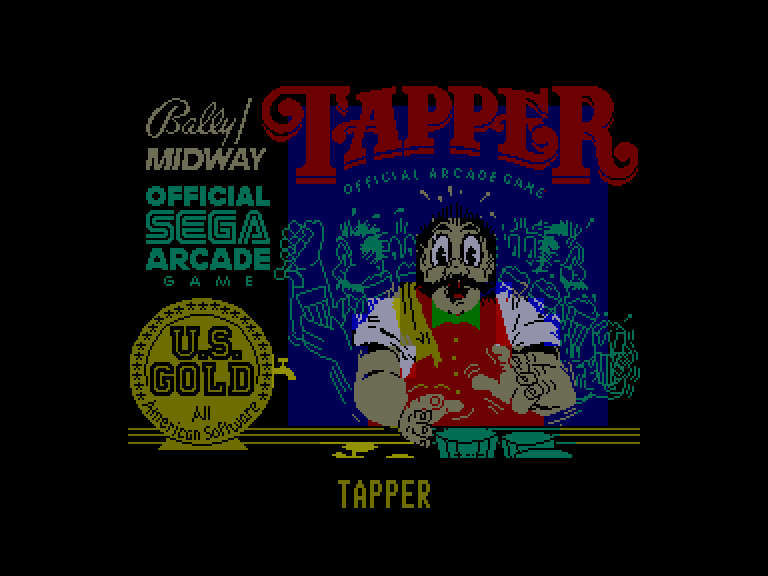
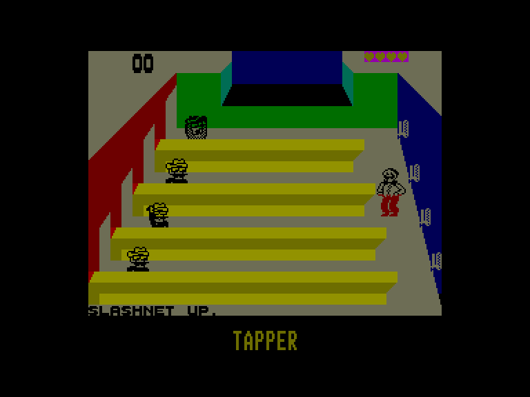
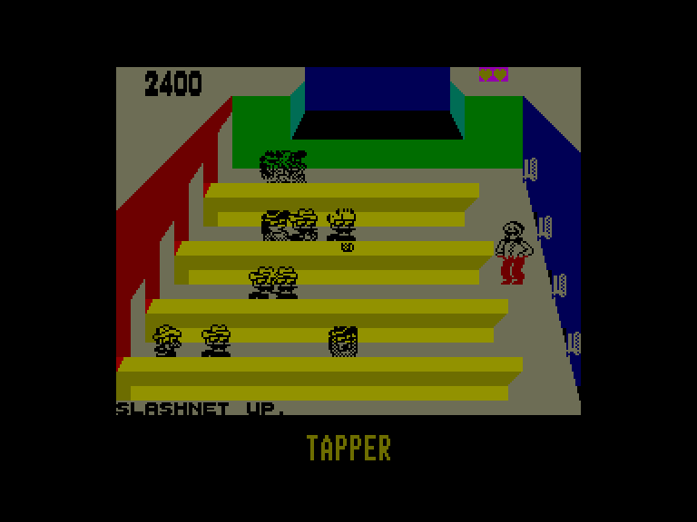
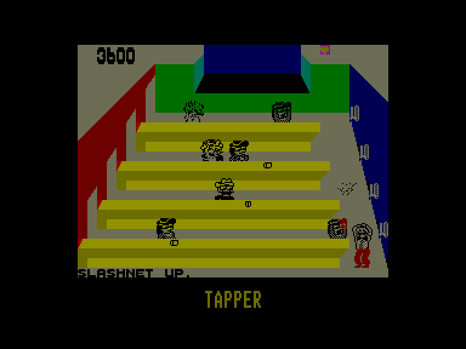

[0-9](../0/games-0.md) - [A](../a/games-a.md) - [B](../b/games-b.md) - [C](../c/games-c.md) - [D](../d/games-d.md) - [E](../e/games-e.md) - [F](../f/games-f.md) - [G](../g/games-g.md) - [H](../h/games-h.md) - [I](../i/games-i.md) - [J](../j/games-j.md) - [K](../k/games-k.md) - [L](../l/games-l.md) - [M](../m/games-m.md) - [N](../n/games-n.md) - [O](../o/games-o.md) - [P](../p/games-p.md) - [Q](../q/games-q.md) - [R](../r/games-r.md) - [S](../s/games-s.md) - [T](../t/games-t.md) - [U](../u/games-u.md) - [V](../v/games-v.md) - [W](../w/games-w.md) - [X](../x/games-x.md) - [Y](../y/games-y.md) - [Z](../z/games-z.md)

Ігри для [Enterprise 64k](../games-ep64.md) - [Enterprise 128k+RAMexp](../games-epramexp.md)

Ігри для систем [IS-DOS](../games-is-dos.md) - [SymbOS](../games-symbos.md) - [EDC Windows](../games-edcw.md)

Ігри для емуляторів [ZX Spectrum 48k/128k](../zxemu/games-zxemu.md) - [Amstrad CPC](../cpcemu/games-cpc.md) - [Sinclair ZX81](../zx81emu/games-zx81.md) - [Videoton TVC](../tvcemu/games-tvc.md) - [Commodore VIC-20](../vic20emu/games-vic20.md)

----------

# Tapper

**ID:** tapper-zx

## Скріншоти

## Опис

(temporary description generated by AI [ChatGPT])

**Опис гри: Tapper**

Tapper (оригінальна назва: Root Beer Tapper) — це аркадна гра, випущена в 1983 році, в якій гравець виконує роль бармена, що обслуговує відвідувачів у пивній. Гравець повинен швидко подавати пиво, уникати падіння порожніх кухлів і заробляти підказки, щоб підвищити свій рахунок.

**Правила гри:**
1. Гравець обирає кількість гравців (1 або 2) та рівень складності (легкий, середній, важкий).
2. Гравець обслуговує відвідувачів, подаючи їм пиво, яке потрібно налити з крана.
3. Якщо гравець не встигає обслужити відвідувача, той може покинути бар, що призведе до втрати життя.
4. Гравець отримує бали за кожного обслуговуваного відвідувача, а також за підказки та виконання рівнів у визначений час.
5. Після успішного виконання рівня гравець бере участь у дуелі з бандитом, де потрібно слідкувати за непошкодженим кухлем.
6. Гравець може заробити додаткові життя, досягнувши певної кількості балів.

**Система набрання балів:**
- 50 балів за кожного ковбоя, що виходить з бару.
- 75 балів за кожного спортсмена.
- 100 балів за кожного панк-рокера.
- 150 балів за кожного прибульця.
- 100 балів за знаходження непошкодженого кухля.
- 1500 балів за підказки.
- 1000 балів за виконання рівня.
- 3000 балів за виконання рівня вчасно.
- Додаткові життя за досягнення 10000, 20000 або 60000 балів в залежності від рівня складності.

Успіх у грі вимагає швидкості, уважності та вміння управляти ситуацією!

## Основна інформація
- **Оригінальна платформа:** ZX Spectrum

## Посилання
- [Опис гри на ep128.hu (угорською)](http://www.ep128.hu/Games/Tapper.htm)
- [Інформація про оригінальну версію](https://spectrumcomputing.co.uk/entry/5143/ZX-Spectrum/Tapper)
- [Завантажити гру](http://www.ep128.hu/Ep_Games/Prg/Tapper.rar)

