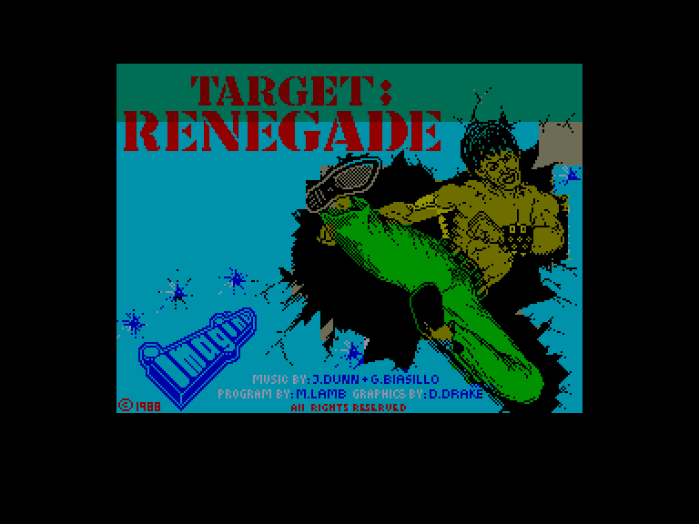
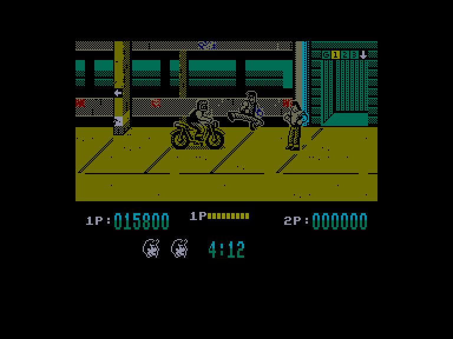
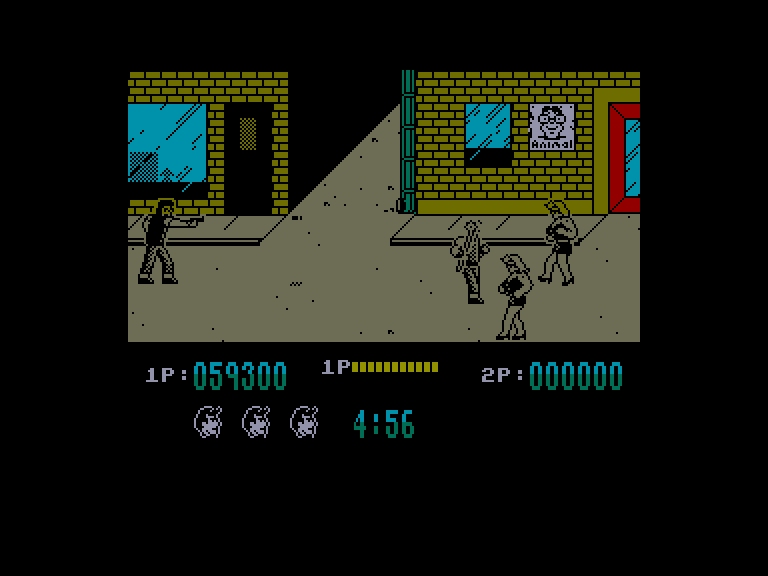
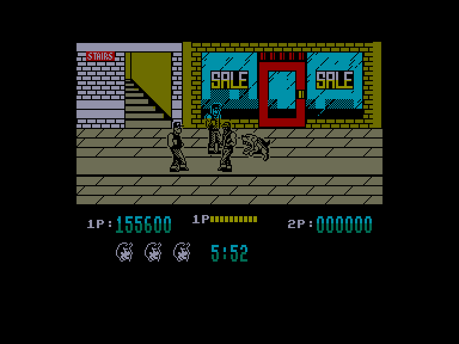

[0-9](../0/games-0.md) - [A](../a/games-a.md) - [B](../b/games-b.md) - [C](../c/games-c.md) - [D](../d/games-d.md) - [E](../e/games-e.md) - [F](../f/games-f.md) - [G](../g/games-g.md) - [H](../h/games-h.md) - [I](../i/games-i.md) - [J](../j/games-j.md) - [K](../k/games-k.md) - [L](../l/games-l.md) - [M](../m/games-m.md) - [N](../n/games-n.md) - [O](../o/games-o.md) - [P](../p/games-p.md) - [Q](../q/games-q.md) - [R](../r/games-r.md) - [S](../s/games-s.md) - [T](../t/games-t.md) - [U](../u/games-u.md) - [V](../v/games-v.md) - [W](../w/games-w.md) - [X](../x/games-x.md) - [Y](../y/games-y.md) - [Z](../z/games-z.md)

Ігри для [Enterprise 64k](../games-ep64.md) - [Enterprise 128k+RAMexp](../games-epramexp.md)

Ігри для систем [IS-DOS](../games-is-dos.md) - [SymbOS](../games-symbos.md) - [EDC Windows](../games-edcw.md)

Ігри для емуляторів [ZX Spectrum 48k/128k](../zxemu/games-zxemu.md) - [Amstrad CPC](../cpcemu/games-cpc.md) - [Sinclair ZX81](../zx81emu/games-zx81.md) - [Videoton TVC](../tvcemu/games-tvc.md) - [Commodore VIC-20](../vic20emu/games-vic20.md)

----------

# Target: Renegade

**Альтернативні назви:**
 - Target Renegade

**ID:** target-renegade-zx

**Жанри:** Екшн, Beat em Up

## Примітка

ℹ Стара неофіційна конверсія з платформи ZX Spectrum.

## Скріншоти

## Опис

Він повернувся — ще лютіший, жорсткіший і спраглий помсти!  

Ваш брат Метт, що розслідував мерзенні справи «Містера Біга», був схоплений. Бос злочинного світу розправився з ним у своєму звичному жорстокому стилі, і тепер ваше серце калатає, поки ви зважуєте можливі варіанти. «Око за око» — ця фраза пульсує у вашій підсвідомості. План розроблено — ви стаєте до дії та пробиваєтеся крізь різні рівні до вирішальної сутички.  

Типи супротивників, яких ви зустрінете на кожному рівні, істотно відрізняються, тож аби досягти успіху, доведеться виробити відповідну стратегію. Буденні предмети можна використовувати як зброю, але не втрачайте їх, адже їх можуть застосувати проти вас!  

Простіше кажучи, ваша мета — вижити протягом п'яти етапів і зійтися у протистоянні з Містером Бігом. Помста може стати вашою — якщо ви виживете!

## Основна інформація
- **Мови:** Англійська
- **Оригінальна платформа:** ZX Spectrum
### Загальні системні вимоги
- **Апаратні:** EP128
### Геймплей
- **Керування:** Keyboard, Internal Joy, External Joy 1, External Joy 2
- **Кількість гравців:** 1 player, 2 players (cooperative)
- **Додаткові теги:** Attribute mode
### Розробка
- **Рік випуску:** 1988
- **Автор:** Mike Lamb, Dawn Drake, Simon Butler, Jonathan Dunn, Gari Biasillo

## Посилання
- [Опис гри на ep128.hu (угорською)](http://www.ep128.hu/Games/Target_Renegade.htm)
- [Інформація про оригінальну версію](https://spectrumcomputing.co.uk/entry/4087/ZX-Spectrum/Target_Renegade)
- [Завантажити гру](http://www.ep128.hu/Ep_Games/Prg/Target_Renegade.rar)
- [Easy Load&Play](https://t.me/EP128k_Load_n_Play/27?single) *(Telegram-канал Vibrant Waves)*

## Відео

<iframe src="https://www.youtube.com/embed/alV2mKkjTHA"  
style="width:75%; aspect-ratio:16/9;" allowfullscreen></iframe>

## [Керування](../controllers.md)

`Keyboard` (гравець 1): `Q`, `A`, `E`, `R`, `Z` (можна перевизначити)  
`Keyboard` (гравець 2): `I`, `K`, `O`, `P`, `M` (можна перевизначити)  
`Internal Joystick` (гравець 1)  
`External Joystick 1` (гравець 1)  
`External Joystick 2` (гравець 2)  

**Бій** (персонаж дивиться праворуч):  
`⬇️`+`Fire`: добити лежачого супротивника  
`⬆️`+`Fire`: удар у стрибку  
`↖️`+`Fire`: удар у стрибку  
`↗️`+`Fire`: удар у стрибку  
`⬅️`+`Fire`: ударити назад  
`➡️`+`Fire`: удар / схопити  

`Hold`: Пауза

## Детальна інформація

### Системні вимоги  

#### Мінімальні системні вимоги  

Оперативна пам'ять: **128 КБ (або більше)**  

### Геймплей  

Події цієї гри розгортаються в злачному містечку Скамвілл. Вам належить пройти крізь п'ять локацій, кожна з яких складніша за попередню. На кожному рівні ви зустрінете новий тип лиходіїв, які намагатимуться приборкати вас різноманітними смертоносними способами. За допомогою комбінації ударів кулаками й ногами ви пробиваєтеся до Містера Біга. Зброю можна здобути, знешкодивши супротивника з нею, або просто підібравши її з землі.  

**Рівень 1 — Багатоповерхова автостоянка**  

Тут ви зустрінете банду байкерів, які намагатимуться або переїхати вас, або вдарити своєю зброєю. Байкерів на мотоциклах спочатку потрібно збити з коліс ударом ноги, однак це вирубить їх лише на дуже короткий час. Також остерігайтеся членів банди та їхніх спільників, які непомітно підкрадатимуться до вас, намагаючись вбити.  

**Рівень 2 — Злачна вулиця вночі**  

Ви зіткнетеся з «нічними метеликами», які намагатимуться відгамселити вас у зовсім не ледіподібній манері. Крім того, поруч буде «бос» цих леді, який пильнуватиме, щоб ви не здобули перемогу. Озброєний пістолетом із обмеженою кількістю набоїв, він намагатиметься застрелити вас, тож вам доведеться ухилятися, поки в нього не закінчаться набої — після чого ви зможете напасти на нього в рукопашному бою.  

**Рівень 3 — Парк**  

Тут група небажаних скінхедів намагатиметься зробити з вас відбивну. Старі-добрі удари кулаками й ногами — єдиний спосіб просунутися на наступний рівень. Використовуючи зброю, яку можна знайти на землі, ви мусите пробити собі шлях до вирішальної сутички.  

**Рівень 4 — Торговий центр**  

У місто приїхали Beasty Boys, і деякі з їхніх найзапекліших фанатів зібралися в торговому центрі, знаючи, що ваше просування до Містера Біга майже добігло кінця. Разом зі своїми собаками вони намагатимуться всілякими способами зробити цей рівень для вас останнім.  

**Рівень 5 — Бар**  

Перш ніж вам дозволять зійтися з Містером Бігом на його власній території, ви мусите здолати його лютих охоронців, які ні перед чим не зупиняться, аби ви не загрожували їхньому ватажку. Майте на увазі: навіть якщо вам вдасться здолати цих підлабузників, сам ватажок є надзвичайно потужним супротивником.