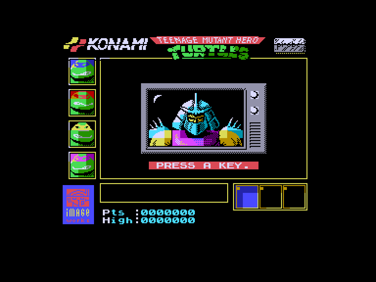
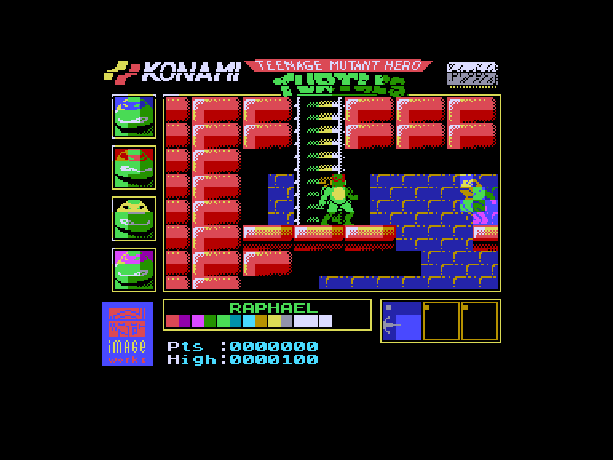
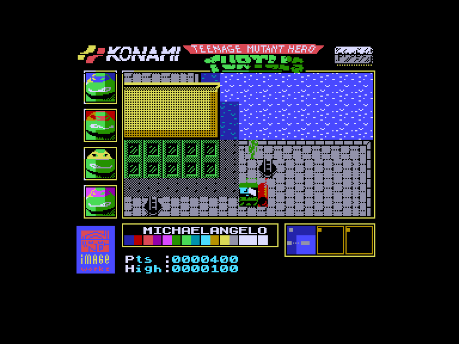
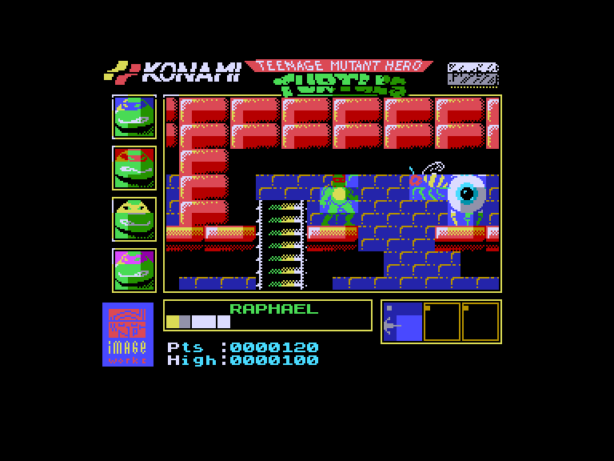

[0-9](../0/games-0.md) - [A](../a/games-a.md) - [B](../b/games-b.md) - [C](../c/games-c.md) - [D](../d/games-d.md) - [E](../e/games-e.md) - [F](../f/games-f.md) - [G](../g/games-g.md) - [H](../h/games-h.md) - [I](../i/games-i.md) - [J](../j/games-j.md) - [K](../k/games-k.md) - [L](../l/games-l.md) - [M](../m/games-m.md) - [N](../n/games-n.md) - [O](../o/games-o.md) - [P](../p/games-p.md) - [Q](../q/games-q.md) - [R](../r/games-r.md) - [S](../s/games-s.md) - [T](../t/games-t.md) - [U](../u/games-u.md) - [V](../v/games-v.md) - [W](../w/games-w.md) - [X](../x/games-x.md) - [Y](../y/games-y.md) - [Z](../z/games-z.md)

Ігри для [Enterprise 64k](../games-ep64.md) - [Enterprise 128k+RAMexp](../games-epramexp.md)

Ігри для систем [IS-DOS](../games-is-dos.md) - [SymbOS](../games-symbos.md) - [EDC Windows](../games-edcw.md)

Ігри для емуляторів [ZX Spectrum 48k/128k](../zxemu/games-zxemu.md) - [Amstrad CPC](../cpcemu/games-cpc.md) - [Sinclair ZX81](../zx81emu/games-zx81.md) - [Videoton TVC](../tvcemu/games-tvc.md) - [Commodore VIC-20](../vic20emu/games-vic20.md)

----------

# Teenage Mutant Hero Turtles

**ID:** teenage-mutant-hero-turtles-zx

## Скріншоти

## Опис

(temporary description generated by AI Assistant)

**Опис гри: "Teenage Mutant Hero Turtles"**

Гравці беруть на себе роль чотирьох черепашок-ніндзя, які вирушають на порятунок своєї подруги Ейпріл, викраденої людьми Шреддера. Гра відбувається в Нью-Йорку, де черепашки повинні долати вулиці, каналізаційні системи та битися з ворогами, щоб досягти своєї мети. Використовуючи свої унікальні бойові навички та зброю, гравці мають боротися з численними супротивниками та, зрештою, зіткнутися з самим Шреддером.

**Правила гри:**
1. Гравець може вибрати одного з чотирьох персонажів: Донателло, Рафаель, Мікеланджело або Леонардо.
2. Грається в двох режимах: зверху (вулиці) та збоку (каналізація).
3. Гравці повинні уникати автомобілів на вулицях і боротися з ворогами в каналізації.
4. Для відновлення енергії можна збирати шматочки піци, які розкидані по всьому рівню.
5. Якщо персонаж втрачає всю енергію, він не помирає, а потрапляє в полон, але його можна звільнити, перемігши відповідного ворога.
6. Гравці можуть в будь-який момент переключитися на іншого черепашку, використовуючи клавішу ENTER.
7. Гра закінчується, коли всі черепашки будуть звільнені або коли буде знищено Шреддера.

Вдалого геймінгу!

## Основна інформація
- **Оригінальна платформа:** ZX Spectrum

## Посилання
- [Опис гри на ep128.hu (угорською)](http://www.ep128.hu/Games/Teenage_Mutant_Turtles.htm)
- [Інформація про оригінальну версію](https://spectrumcomputing.co.uk/entry/5168/ZX-Spectrum/Teenage_Mutant_Hero_Turtles)
- [Завантажити гру](http://www.ep128.hu/Ep_Games/Prg/Teenage_Mutant_Hero_Turtles.rar)

**Дата генерації:** 29.07.2026

## Відео

<iframe src="https://www.youtube.com/embed/e8rLCYTZT9U"  
style="width:75%; aspect-ratio:16/9;" allowfullscreen></iframe>
