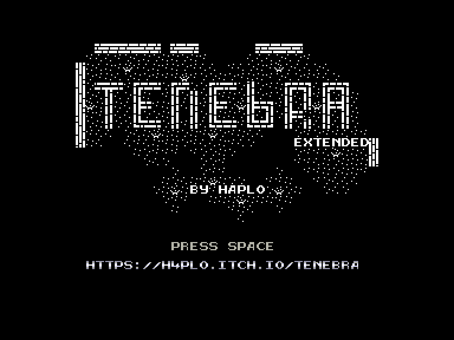
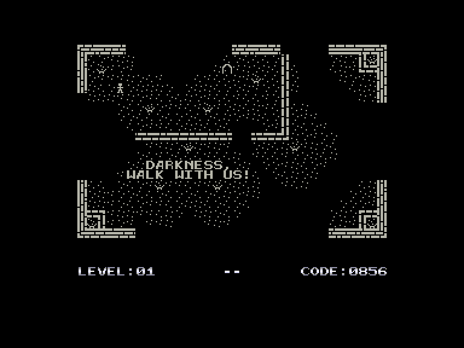
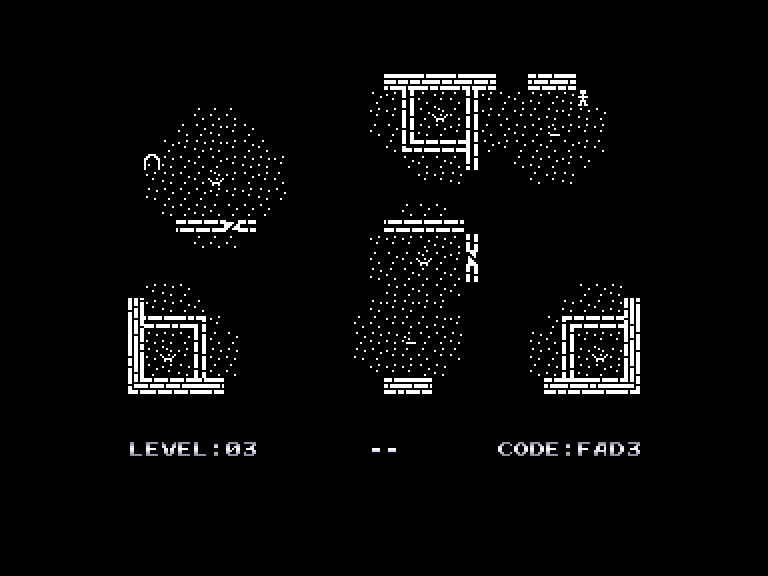
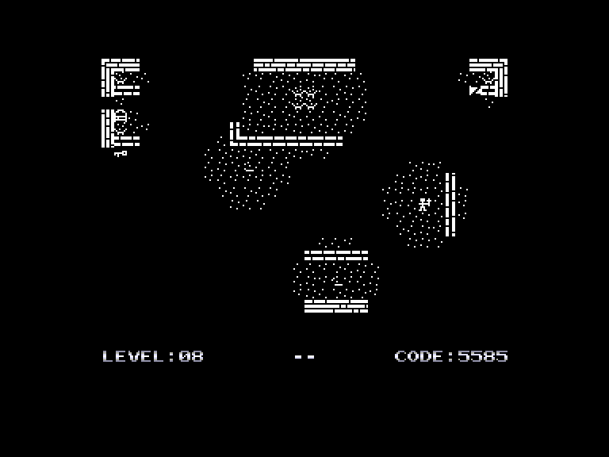

[0-9](../0/games-0.md) - [A](../a/games-a.md) - [B](../b/games-b.md) - [C](../c/games-c.md) - [D](../d/games-d.md) - [E](../e/games-e.md) - [F](../f/games-f.md) - [G](../g/games-g.md) - [H](../h/games-h.md) - [I](../i/games-i.md) - [J](../j/games-j.md) - [K](../k/games-k.md) - [L](../l/games-l.md) - [M](../m/games-m.md) - [N](../n/games-n.md) - [O](../o/games-o.md) - [P](../p/games-p.md) - [Q](../q/games-q.md) - [R](../r/games-r.md) - [S](../s/games-s.md) - [T](../t/games-t.md) - [U](../u/games-u.md) - [V](../v/games-v.md) - [W](../w/games-w.md) - [X](../x/games-x.md) - [Y](../y/games-y.md) - [Z](../z/games-z.md)

Ігри для [Enterprise 64k](../games-ep64.md) - [Enterprise 128k+RAMexp](../games-epramexp.md)

Ігри для систем [IS-DOS](../games-is-dos.md) - [SymbOS](../games-symbos.md) - [EDC Windows](../games-edcw.md)

Ігри для емуляторів [ZX Spectrum 48k/128k](../zxemu/games-zxemu.md) - [Amstrad CPC](../cpcemu/games-cpc.md) - [Sinclair ZX81](../zx81emu/games-zx81.md) - [Videoton TVC](../tvcemu/games-tvc.md) - [Commodore VIC-20](../vic20emu/games-vic20.md)

----------

# Tenebra

**Альтернативні назви:**
 - Tenebra: Extended

**ID:** tenebra-zx

**Жанри:** Логічна

## Скріншоти

## Опис

(temporary description generated by AI [ChatGPT])

**Опис гри:**
Tenebra - це захоплююча гра, в якій гравець повинен вибратися з темного місця, переміщуючись лише в освітлених зонах. Гравець має обмежений доступ до світла і може пересуватися тільки в радіусі дії світильників або факелів. Гра пропонує різноманітні перешкоди та об'єкти, які можуть допомогти або ускладнити проходження.

**Правила гри:**
1. Гравець може пересуватися тільки в освітлених зонах.
2. Використовуйте факели та світильники для створення освітлення.
3. Обмежтеся двома предметами в інвентарі, крім факела.
4. Взаємодійте з об'єктами, такими як:
   - Непереміщувані світильники.
   - Факели, які можна підбирати та ставити.
   - Двері, які потребують ключа для відкриття.
   - Обвалені переходи, які можна використовувати лише один раз.
   - Замкнені ворота, які відкриваються за допомогою світлового перемикача.
5. Гра не має обмеження часу, тож ви можете грати в своєму темпі.
6. Існує 31 рівень складності, кожен з яких має свій шістнадцятковий код для вибору.

**Управління:**
- Використовуйте джойстик KEMPSTON, INTERFACE II або клавіатуру (O, P, K, A, SPACE або M).
- R - перезапустити рівень.
- F - вмикати/вимикати мерехтіння.
- S - вмикати/вимикати звук.

## Основна інформація
- **Мови:** Англійська
- **Оригінальна платформа:** ZX Spectrum
### Загальні системні вимоги
- **Апаратні:** EP64, EP128
### Геймплей
- **Керування:** Keyboard, Internal Joy, External Joy 1
- **Кількість гравців:** 1 player
- **Додаткові теги:** Attribute mode
### Розробка
- **Рік випуску:** 2022
- **Автор:** Ali Pouladi

## Посилання
- [Домашня сторінка гри](https://h4plo.itch.io/tenebra)
- [Опис гри на ep128.hu (угорською)](http://www.ep128.hu/Games/Tenebra.htm)
- [Інформація про оригінальну версію](https://spectrumcomputing.co.uk/entry/38867/ZX-Spectrum/Tenebra)
- [Завантажити гру](http://www.ep128.hu/Ep_Games/Prg/Tenebra.rar)
- [Easy Load&Play](https://t.me/EP128k_Load_n_Play/202) *(Telegram-канал Vibrant Waves)*

## Відео

<iframe src="https://www.youtube.com/embed/MyJ8fejJvlo"  
style="width:75%; aspect-ratio:16/9;" allowfullscreen></iframe>

