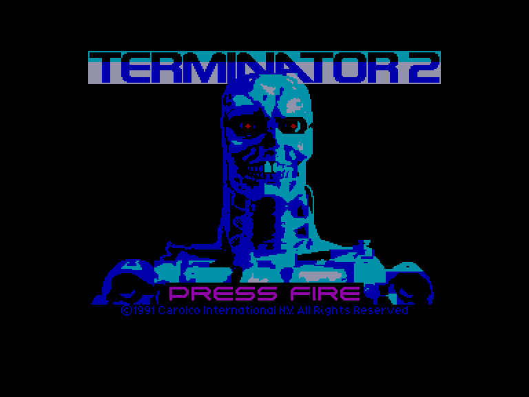
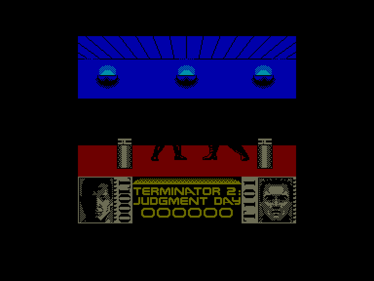
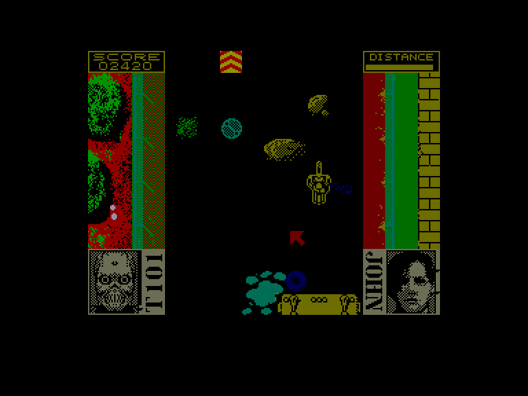
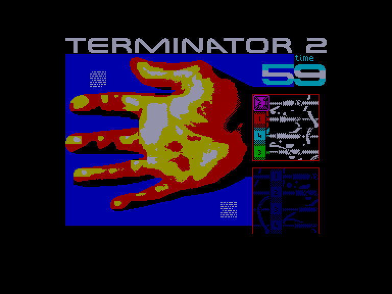

[0-9](../0/games-0.md) - [A](../a/games-a.md) - [B](../b/games-b.md) - [C](../c/games-c.md) - [D](../d/games-d.md) - [E](../e/games-e.md) - [F](../f/games-f.md) - [G](../g/games-g.md) - [H](../h/games-h.md) - [I](../i/games-i.md) - [J](../j/games-j.md) - [K](../k/games-k.md) - [L](../l/games-l.md) - [M](../m/games-m.md) - [N](../n/games-n.md) - [O](../o/games-o.md) - [P](../p/games-p.md) - [Q](../q/games-q.md) - [R](../r/games-r.md) - [S](../s/games-s.md) - [T](../t/games-t.md) - [U](../u/games-u.md) - [V](../v/games-v.md) - [W](../w/games-w.md) - [X](../x/games-x.md) - [Y](../y/games-y.md) - [Z](../z/games-z.md)

Ігри для [Enterprise 64k](../games-ep64.md) - [Enterprise 128k+RAMexp](../games-epramexp.md) - [2dfx](games-2dfx.md)

Ігри для систем [IS-DOS](../games-is-dos.md) - [SymbOS](../games-symbos.md) - [EDC Windows](../games-edcw.md)

Ігри для емуляторів [ZX Spectrum 48k/128k](../zxemu/games-zxemu.md) - [Amstrad CPC](../cpcemu/games-cpc.md) - [Sinclair ZX81](../zx81emu/games-zx81.md) - [Videoton TVC](../tvcemu/games-tvc.md) - [Commodore VIC-20](../vic20emu/games-vic20.md)

----------

# Terminator 2: Judgment Day

**ID:** terminator2-zx

## Скріншоти

## Опис

(temporary description generated by AI [ChatGPT])

**Опис гри:**
"Terminator 2: Judgment Day" — це відеогра, що складається з кількох динамічних сцен дії, пов'язаних між собою. Кожен рівень має свій унікальний стиль, зокрема, перший рівень нагадує бійку в бічному вигляді. Між рівнями гравці можуть насолоджуватися короткими відео з фільму.

**Правила гри:**
1. Гравець керує Т-800 (Арнольд Шварценеггер) у його місії з порятунку Джона Коннора від Т-1000.
2. Гра складається з різних етапів, включаючи бійки один на один та гонки з елементами стрільби.
3. Гравець повинен стежити за енергією персонажів і уникати атак супротивника під час гонок.
4. Виконуючи завдання, гравець може отримувати додаткові бали та здоров'я, вирішуючи головоломки.
5. Гра закінчується, коли гравець виконує всі рівні або втрачає всі життя.

Гра пропонує захоплюючий досвід для фанатів фільму та любителів жанру екшен.

## Основна інформація
- **Оригінальна платформа:** ZX Spectrum

## Посилання
- [Інформація про оригінальну версію](https://spectrumcomputing.co.uk/entry/5187/ZX-Spectrum/Terminator_2_Judgment_Day)

