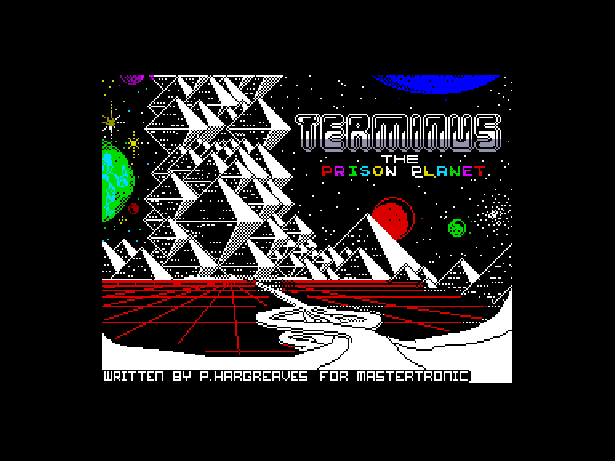
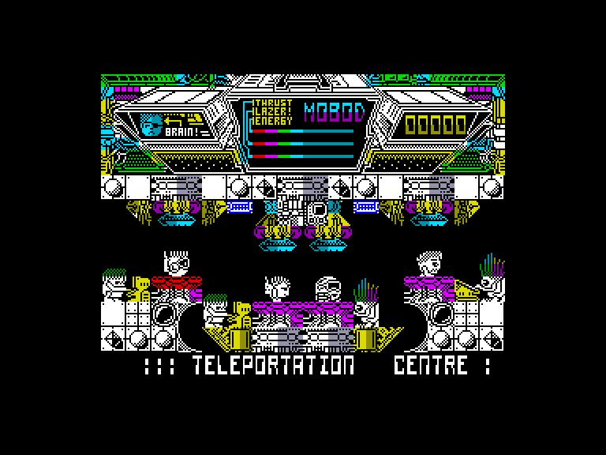
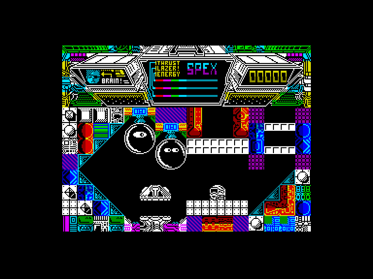
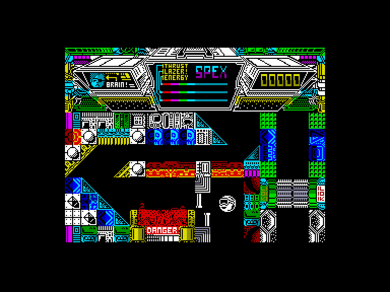

[0-9](../0/games-0.md) - [A](../a/games-a.md) - [B](../b/games-b.md) - [C](../c/games-c.md) - [D](../d/games-d.md) - [E](../e/games-e.md) - [F](../f/games-f.md) - [G](../g/games-g.md) - [H](../h/games-h.md) - [I](../i/games-i.md) - [J](../j/games-j.md) - [K](../k/games-k.md) - [L](../l/games-l.md) - [M](../m/games-m.md) - [N](../n/games-n.md) - [O](../o/games-o.md) - [P](../p/games-p.md) - [Q](../q/games-q.md) - [R](../r/games-r.md) - [S](../s/games-s.md) - [T](../t/games-t.md) - [U](../u/games-u.md) - [V](../v/games-v.md) - [W](../w/games-w.md) - [X](../x/games-x.md) - [Y](../y/games-y.md) - [Z](../z/games-z.md)

Ігри для [Enterprise 64k](../games-ep64.md) - [Enterprise 128k+RAMexp](../games-epramexp.md)

Ігри для систем [IS-DOS](../games-is-dos.md) - [SymbOS](../games-symbos.md) - [EDC Windows](../games-edcw.md)

Ігри для емуляторів [ZX Spectrum 48k/128k](../zxemu/games-zxemu.md) - [Amstrad CPC](../cpcemu/games-cpc.md) - [Sinclair ZX81](../zx81emu/games-zx81.md) - [Videoton TVC](../tvcemu/games-tvc.md) - [Commodore VIC-20](../vic20emu/games-vic20.md)

----------

# Terminus

**Альтернативні назви:**
 - Terminus: The Prison Planet

**ID:** terminus-the-prison-planet-zx

## Скріншоти

## Опис

(temporary description generated by AI Assistant)

**Термінус: Планета в'язниць** - це аркадна гра, випущена у 1986 році для ZX Spectrum. Гравець бере на себе роль команди з чотирьох повстанців, відомих як Ванглери, які намагаються врятувати свого лідера Брейна, ув'язненого в імперській в'язниці. Кожен персонаж має унікальні здібності, такі як літання, лазіння та стрибки, що впливають на ігровий процес.

**Правила гри:**
1. Гравець може перемикатися між чотирма персонажами, використовуючи телепорти на екранах.
2. Кожен персонаж має обмежений запас енергії для спеціальних костюмів, який можна заряджати.
3. Гравець повинен долати охоронців та вирішувати головоломки, щоб просуватися через 512 екранів в'язниці.
4. Мета гри - звільнити лідера та втекти з в'язниці.

Гра пропонує захоплюючий науково-фантастичний світ з динамічним ігровим процесом.

## Основна інформація
- **Оригінальна платформа:** ZX Spectrum

## Посилання
- [Інформація про оригінальну версію](https://spectrumcomputing.co.uk/entry/5189/ZX-Spectrum/Terminus)

**Дата генерації:** 28.07.2026

