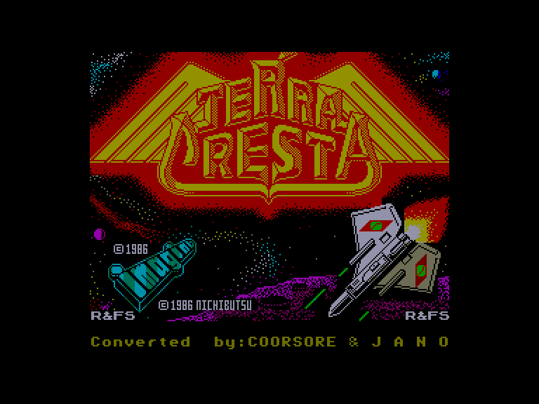
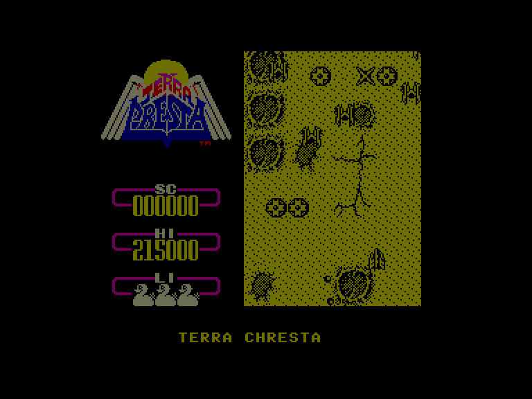
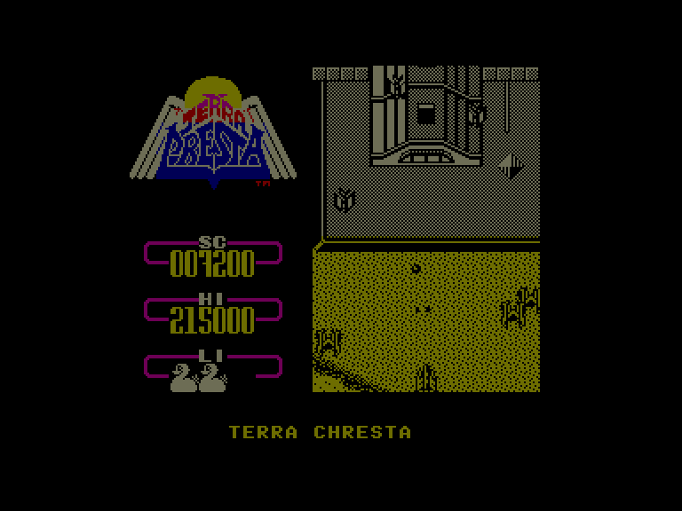
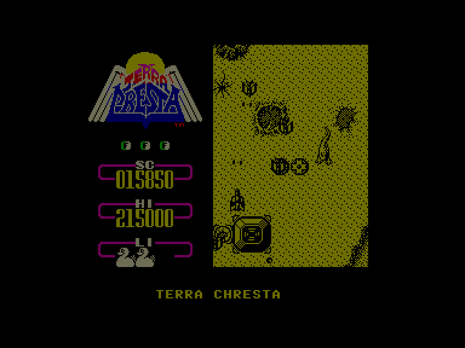

[0-9](../0/games-0.md) - [A](../a/games-a.md) - [B](../b/games-b.md) - [C](../c/games-c.md) - [D](../d/games-d.md) - [E](../e/games-e.md) - [F](../f/games-f.md) - [G](../g/games-g.md) - [H](../h/games-h.md) - [I](../i/games-i.md) - [J](../j/games-j.md) - [K](../k/games-k.md) - [L](../l/games-l.md) - [M](../m/games-m.md) - [N](../n/games-n.md) - [O](../o/games-o.md) - [P](../p/games-p.md) - [Q](../q/games-q.md) - [R](../r/games-r.md) - [S](../s/games-s.md) - [T](../t/games-t.md) - [U](../u/games-u.md) - [V](../v/games-v.md) - [W](../w/games-w.md) - [X](../x/games-x.md) - [Y](../y/games-y.md) - [Z](../z/games-z.md)

Ігри для [Enterprise 64k](../games-ep64.md) - [Enterprise 128k+RAMexp](../games-epramexp.md) - [2dfx](../games-2dfx.md)

Ігри для систем [IS-DOS](../games-is-dos.md) - [SymbOS](../games-symbos.md) - [EDC Windows](../games-edcw.md)

Ігри для емуляторів [ZX Spectrum 48k/128k](../zxemu/games-zxemu.md) - [Amstrad CPC](../cpcemu/games-cpc.md) - [Sinclair ZX81](../zx81emu/games-zx81.md) - [Videoton TVC](../tvcemu/games-tvc.md) - [Commodore VIC-20](../vic20emu/games-vic20.md)

----------

# Terra Cresta

**ID:** terra-cresta-zx

## Скріншоти

## Опис

(temporary description generated by AI [ChatGPT])

**Terra Cresta** - це аркадна гра, яка почала свій шлях на ігрових автоматах і є продовженням Moon Cresta. У цій грі вам потрібно боротися з ворогами, які нападають на людство, літаючи над планетою, що належить інопланетянам. Гравець керує літаком, піднімаючись вгору та стріляючи у всі літаючі об'єкти та гармати. Лазерна зброя ефективна як проти наземних цілей, так і проти літаків.

### Правила гри:
1. **Стрільба**: Використовуйте лазерну зброю для знищення ворогів.
2. **Збір деталей**: Знищуючи численні силоси, ви можете отримати деталі для покращення вашого літака.
3. **Формування**: Коли ви зберете кілька деталей, натисніть ENTER, щоб активувати форму, що підвищить вашу вогневу потужність.
4. **Ворожі атаки**: Будьте обережні, вороги можуть стріляти назад, і деякі з них мають здатність завдавати шкоди з високою точністю.
5. **Життя**: Якщо ви втратите життя, починайте з початку рівня. Гра може бути складною, тому що навіть безсмертя не рятує від швидкого закінчення гри.
6. **Нагороди**: Отримайте додаткове життя при досягненні 50,000 очок та кожні 70,000 очок після цього.
7. **Управління**: Гра може керуватися з клавіатури або джойстика. Для власників Enterprise: натискайте '0', щоб стріляти.

Приготуйтеся до захоплюючої битви в Terra Cresta!

## Основна інформація
- **Оригінальна платформа:** ZX Spectrum

## Посилання
- [Опис на ep128.hu (угорською)](http://www.ep128.hu/Games/Terra_Cresta.htm)
- [Інформація про оригінальну версію](https://spectrumcomputing.co.uk/entry/5190/ZX-Spectrum/Terra_Cresta)
- [Завантажити](http://www.ep128.hu/Ep_Games/Prg/Terra_Cresta.rar)

