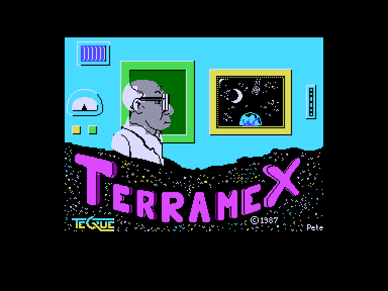
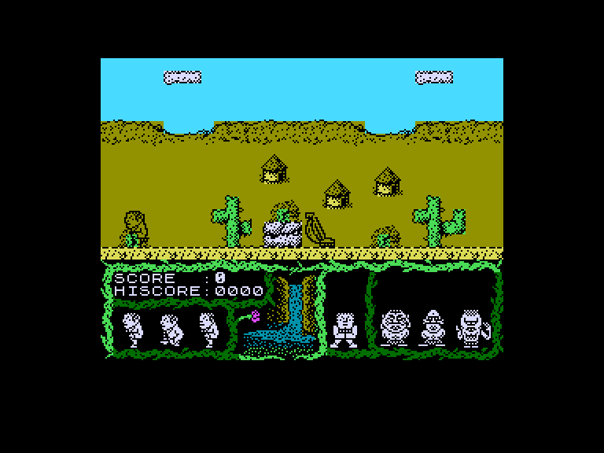
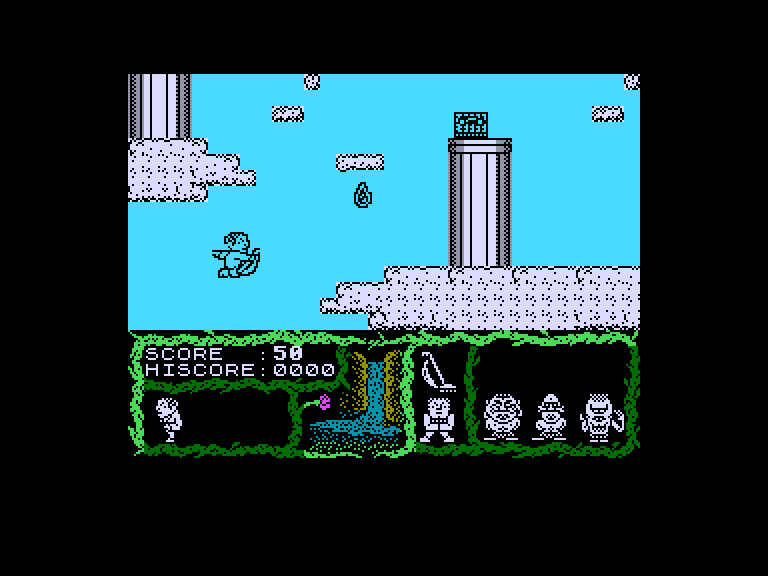

[0-9](../0/games-0.md) - [A](../a/games-a.md) - [B](../b/games-b.md) - [C](../c/games-c.md) - [D](../d/games-d.md) - [E](../e/games-e.md) - [F](../f/games-f.md) - [G](../g/games-g.md) - [H](../h/games-h.md) - [I](../i/games-i.md) - [J](../j/games-j.md) - [K](../k/games-k.md) - [L](../l/games-l.md) - [M](../m/games-m.md) - [N](../n/games-n.md) - [O](../o/games-o.md) - [P](../p/games-p.md) - [Q](../q/games-q.md) - [R](../r/games-r.md) - [S](../s/games-s.md) - [T](../t/games-t.md) - [U](../u/games-u.md) - [V](../v/games-v.md) - [W](../w/games-w.md) - [X](../x/games-x.md) - [Y](../y/games-y.md) - [Z](../z/games-z.md)

Ігри для [Enterprise 64k](../games-ep64.md) - [Enterprise 128k+RAMexp](../games-epramexp.md)

Ігри для систем [IS-DOS](../games-is-dos.md) - [SymbOS](../games-symbos.md) - [EDC Windows](../games-edcw.md)

Ігри для емуляторів [ZX Spectrum 48k/128k](../zxemu/games-zxemu.md) - [Amstrad CPC](../cpcemu/games-cpc.md) - [Sinclair ZX81](../zx81emu/games-zx81.md) - [Videoton TVC](../tvcemu/games-tvc.md) - [Commodore VIC-20](../vic20emu/games-vic20.md)

----------

# Terramex

**ID:** terramex-zx

## Скріншоти

## Опис

(temporary description generated by AI [ChatGPT])

**Опис гри:**
У грі "TERRAMEX" вам потрібно врятувати Землю від великого астероїда, який наближається до планети. Ви обираєте одного з п'яти відважних дослідників з різних країн, щоб виконати місію. Ваше завдання полягає в зборі шести предметів, необхідних для створення пристрою, який зможе відхилити астероїд. Гра включає в себе дослідження різних локацій, вирішення головоломок і уникнення небезпек.

**Правила гри:**
1. Виберіть одного з п'яти персонажів: Фортіск Сміт (Англія), Герр Круш (Німеччина), Ву Понг (Китай), Біг Джон Кейн (США) або Анрі Бокоп (Франція).
2. Використовуйте клавіші 'Z', 'X', 'O', 'K' для переміщення (ліворуч, праворуч, вгору, вниз) та 'SPACE' для стрибка.
3. Збирайте предмети, які допоможуть у виконанні місії.
4. Уникайте небезпек, таких як падіння з висоти або зіткнення з ворогами, і слідкуйте за кількістю життів.
5. Використовуйте предмети для вирішення головоломок і проходження рівнів.
6. Завершіть гру, передавши професору Eyestrain усі необхідні предмети для створення пристрою.

Ваша мета – врятувати Землю, перш ніж астероїд досягне її!

## Основна інформація
- **Оригінальна платформа:** ZX Spectrum

## Посилання
- [Опис гри на ep128.hu (угорською)](http://www.ep128.hu/Games/Terramex.htm)
- [Інформація про оригінальну версію](https://spectrumcomputing.co.uk/entry/5195/ZX-Spectrum/Terramex)
- [Завантажити гру](http://www.ep128.hu/Ep_Games/Prg/Terramex.rar)

