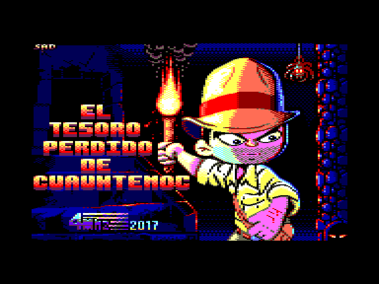
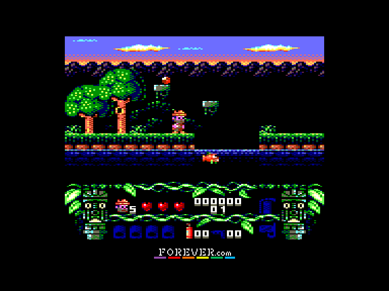
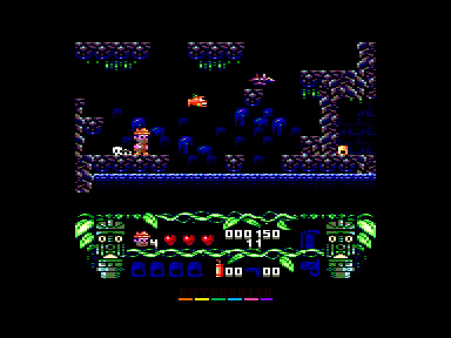
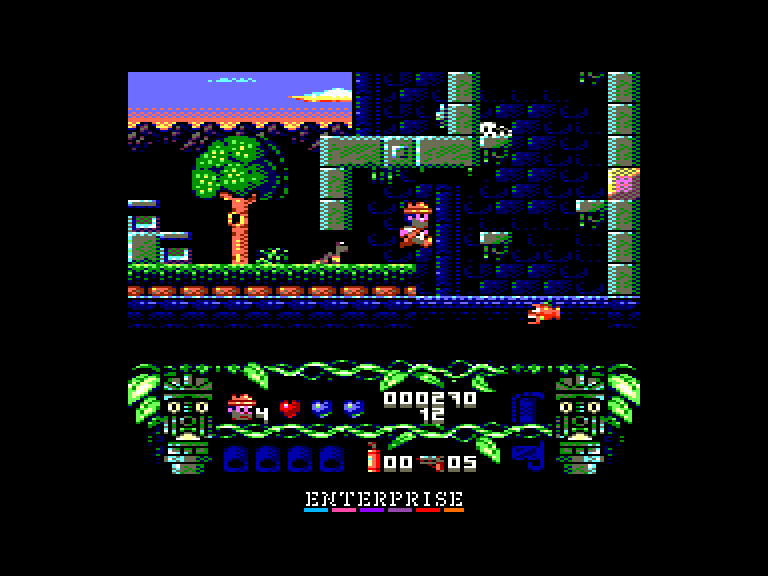

[0-9](../0/games-0.md) - [A](../a/games-a.md) - [B](../b/games-b.md) - [C](../c/games-c.md) - [D](../d/games-d.md) - [E](../e/games-e.md) - [F](../f/games-f.md) - [G](../g/games-g.md) - [H](../h/games-h.md) - [I](../i/games-i.md) - [J](../j/games-j.md) - [K](../k/games-k.md) - [L](../l/games-l.md) - [M](../m/games-m.md) - [N](../n/games-n.md) - [O](../o/games-o.md) - [P](../p/games-p.md) - [Q](../q/games-q.md) - [R](../r/games-r.md) - [S](../s/games-s.md) - [T](../t/games-t.md) - [U](../u/games-u.md) - [V](../v/games-v.md) - [W](../w/games-w.md) - [X](../x/games-x.md) - [Y](../y/games-y.md) - [Z](../z/games-z.md)

Ігри для [Enterprise 64k](../games-ep64.md) - [Enterprise 128k+RAMexp](../games-epramexp.md)

Ігри для систем [IS-DOS](../games-is-dos.md) - [SymbOS](../games-symbos.md) - [EDC Windows](../games-edcw.md)

Ігри для емуляторів [ZX Spectrum 48k/128k](../zxemu/games-zxemu.md) - [Amstrad CPC](../cpcemu/games-cpc.md) - [Sinclair ZX81](../zx81emu/games-zx81.md) - [Videoton TVC](../tvcemu/games-tvc.md) - [Commodore VIC-20](../vic20emu/games-vic20.md)

----------

# El Tesoro Perdido de Cuauhtemoc

**ID:** tesoro-perdido-de-cuauhtemoc-cpc

## Скріншоти

## Опис

(temporary description generated by AI [ChatGPT])

**Опис гри:**
"El Tesoro Perdido De Cuauhtemoc" - це захоплююча гра, де ви стаєте героєм, який шукає легендарний скарб останнього ацтекського правителя Куатемока. Гравець повинен подолати численні перешкоди, ворогів та розгадати загадки, щоб потрапити до таємної кімнати зі скарбами. Гра пропонує динамічний і нелінійний геймплей, в якому необхідно збирати ресурси, використовувати динаміт та інші інструменти для досягнення мети.

**Правила гри:**
1. Гравець починає без спорядження і повинен знайти динаміт та револьвер для виживання.
2. Використовуйте автоматичні інструменти, щоб подолати перешкоди, наприклад, гасити вогонь або очищати шлях від каменів.
3. Гравець може взаємодіяти з кнопками для відкриття нових проходів.
4. Збирайте зелені та червоні дорогоцінні камені для підвищення свого рахунку.
5. Уникайте ворогів і пасток, таких як стріли та вогняні кулі.
6. Гравець має три серця, які показують кількість енергії; втрата енергії не означає негайної загибелі.
7. Гра закінчується не одразу після входу до кімнати зі скарбами; потрібно самостійно вийти з гри.
8. Використовуйте клавіші для управління персонажем, стрільби та використання динаміту.

Гра обіцяє бути веселою та захоплюючою, з красивою графікою та приємною музикою!

## Основна інформація
- **Оригінальна платформа:** Amstrad CPC

## Посилання
- [Домашня сторінка гри](https://www.4mhz.es/el-tesoro-perdido-de-cuauhtemoc/)
- [Опис гри на ep128.hu (угорською)](http://www.ep128.hu/Ep_Games/Leiras/El_Tesoro_Perdido_De_Cuauhtemoc.htm)
- [Інформація про оригінальну версію](https://www.cpc-power.com/index.php?page=detail&num=14207)
- [Завантажити гру](http://www.ep128.hu/Ep_Games/Prg/El_Tesoro_Perdido_De_Cuauhtemoc.rar)
- [Easy Load&Play](https://t.me/EP128k_Load_n_Play/281) *(Telegram-канал Vibrant Waves)*

## Відео

<iframe src="https://www.youtube.com/embed/3KOkTQU0qhY"  
style="width:75%; aspect-ratio:16/9;" allowfullscreen></iframe>
