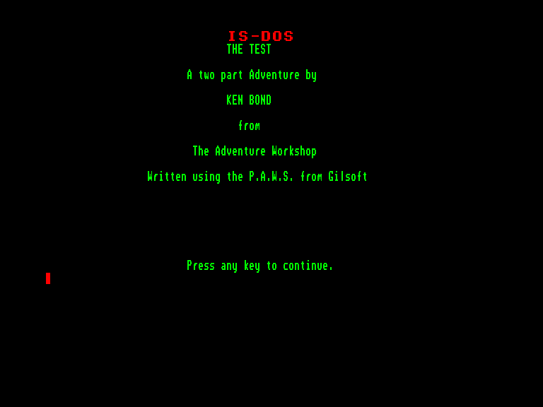
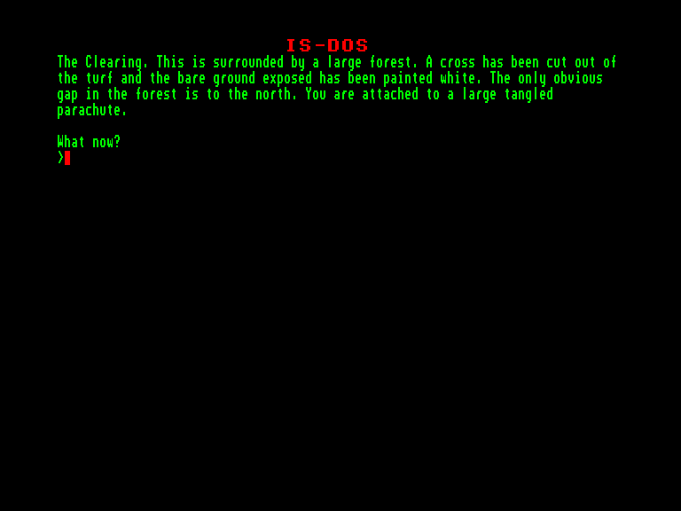

[0-9](../0/games-0.md) - [A](../a/games-a.md) - [B](../b/games-b.md) - [C](../c/games-c.md) - [D](../d/games-d.md) - [E](../e/games-e.md) - [F](../f/games-f.md) - [G](../g/games-g.md) - [H](../h/games-h.md) - [I](../i/games-i.md) - [J](../j/games-j.md) - [K](../k/games-k.md) - [L](../l/games-l.md) - [M](../m/games-m.md) - [N](../n/games-n.md) - [O](../o/games-o.md) - [P](../p/games-p.md) - [Q](../q/games-q.md) - [R](../r/games-r.md) - [S](../s/games-s.md) - [T](../t/games-t.md) - [U](../u/games-u.md) - [V](../v/games-v.md) - [W](../w/games-w.md) - [X](../x/games-x.md) - [Y](../y/games-y.md) - [Z](../z/games-z.md)

Ігри для [Enterprise 64k](../games-ep64.md) - [Enterprise 128k+RAMexp](../games-epramexp.md)

Ігри для систем [IS-DOS](../games-is-dos.md) - [SymbOS](../games-symbos.md) - [EDC Windows](../games-edcw.md)

Ігри для емуляторів [ZX Spectrum 48k/128k](../zxemu/games-zxemu.md) - [Amstrad CPC](../cpcemu/games-cpc.md) - [Sinclair ZX81](../zx81emu/games-zx81.md) - [Videoton TVC](../tvcemu/games-tvc.md) - [Commodore VIC-20](../vic20emu/games-vic20.md)

----------

# The Test

**ID:** test-isdos

**Жанри:** Текстова пригода

## Скріншоти

## Опис

(temporary description generated by AI [ChatGPT])

**Опис гри: "Тест"**

"Тест" - це пригодницька гра, розроблена Amster Productions та Guild Adventure Software у 1990 році. Гравці мають можливість досліджувати різноманітні світи на різних платформах, таких як Amiga, Atari ST, PC та Spectrum. Гра пропонує захоплюючий сюжет та численні завдання, які вимагають логічного мислення та кмітливості.

**Правила гри:**
1. Гравець управляє персонажем, досліджуючи ігровий світ.
2. Необхідно взаємодіяти з об'єктами та персонажами для розв'язання головоломок.
3. Використовуйте підказки та ресурси, доступні в грі, для досягнення цілей.
4. Гра може містити різні рівні складності, які впливають на ігровий процес.
5. Рекомендується зберігати прогрес, щоб уникнути втрат у разі невдачі.

Гра доступна на різних системах, тому ви можете вибрати платформу, яка вам найбільше підходить. Насолоджуйтеся пригодою!

## Основна інформація
- **Мови:** Англійська
- **Оригінальна платформа:** Amstrad CPC
### Системні вимоги
- **Апаратні:** EXDOS
- **Програмні:** IS-DOS
### Геймплей
- **Керування:** Keyboard
- **Кількість гравців:** 1 player
- **Додаткові теги:** Text80 mode, PAW
### Розробка
- **Рік випуску:** 1990
- **Автор:** Ken Bond

## Посилання
- [Інформація про оригінальну версію](https://www.cpc-power.com/index.php?page=detail&num=3281)
- [Інформація про гру (SolutionArchive.com)](https://solutionarchive.com/game/id%2C3517/Test%2C+The.html)

**Дата генерації:** 28.07.2026

