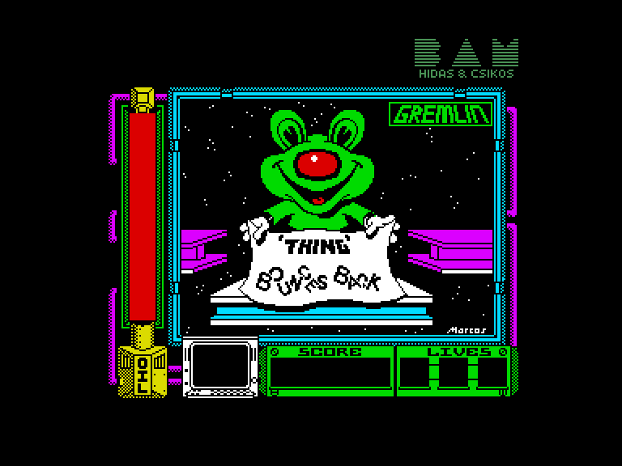
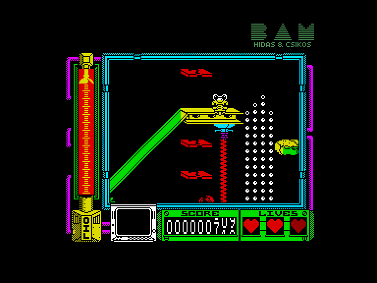
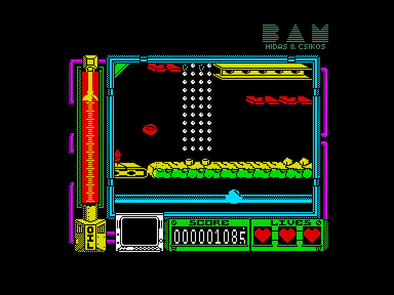
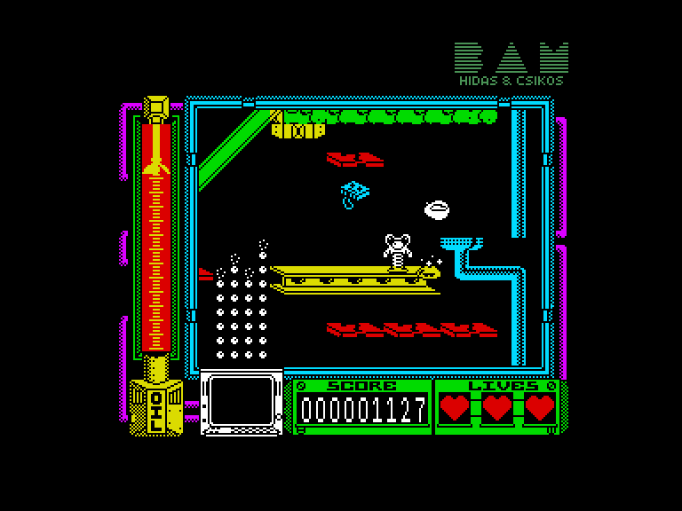

[0-9](../0/games-0.md) - [A](../a/games-a.md) - [B](../b/games-b.md) - [C](../c/games-c.md) - [D](../d/games-d.md) - [E](../e/games-e.md) - [F](../f/games-f.md) - [G](../g/games-g.md) - [H](../h/games-h.md) - [I](../i/games-i.md) - [J](../j/games-j.md) - [K](../k/games-k.md) - [L](../l/games-l.md) - [M](../m/games-m.md) - [N](../n/games-n.md) - [O](../o/games-o.md) - [P](../p/games-p.md) - [Q](../q/games-q.md) - [R](../r/games-r.md) - [S](../s/games-s.md) - [T](../t/games-t.md) - [U](../u/games-u.md) - [V](../v/games-v.md) - [W](../w/games-w.md) - [X](../x/games-x.md) - [Y](../y/games-y.md) - [Z](../z/games-z.md)

Ігри для [Enterprise 64k](../games-ep64.md) - [Enterprise 128k+RAMexp](../games-epramexp.md) - [2dfx](games-2dfx.md)

Ігри для систем [IS-DOS](../games-is-dos.md) - [SymbOS](../games-symbos.md) - [EDC Windows](../games-edcw.md)

Ігри для емуляторів [ZX Spectrum 48k/128k](../zxemu/games-zxemu.md) - [Amstrad CPC](../cpcemu/games-cpc.md) - [Sinclair ZX81](../zx81emu/games-zx81.md) - [Videoton TVC](../tvcemu/games-tvc.md) - [Commodore VIC-20](../vic20emu/games-vic20.md)

----------

# Thing Bounces Back

**Альтернативні назви:**
 - Thing 2: Thing Bounces Back

**ID:** thing-bounces-back-zx

## Скріншоти

## Опис

(temporary description generated by AI [ChatGPT])

**Опис гри:**
"Coil Cop" — це платформер, де гравець керує персонажем на ім'я Thing, який повинен подолати 11 рівнів, щоб зупинити злісного іграшкового гобліна. У грі потрібно збирати різні предмети, уникати ворогів і використовувати труби для переходу між рівнями. Гравець повинен стежити за рівнем масла, оскільки його втрата призводить до завершення гри.

**Правила гри:**
1. Керуй персонажем Thing, щоб уникати ворогів та перешкод.
2. Збирай предмети, такі як стрічки, дискети та чіпи, розкидані по рівнях.
3. Використовуй труби для переходу між рівнями.
4. Уникай важких предметів, які можуть зменшити рівень масла.
5. Якщо рівень масла досягне нуля, гра закінчується.

## Основна інформація
- **Оригінальна платформа:** ZX Spectrum

## Посилання
- [Інформація про оригінальну версію](https://spectrumcomputing.co.uk/entry/5232/ZX-Spectrum/Thing_Bounces_Back)

