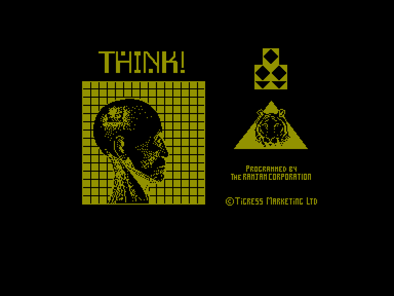
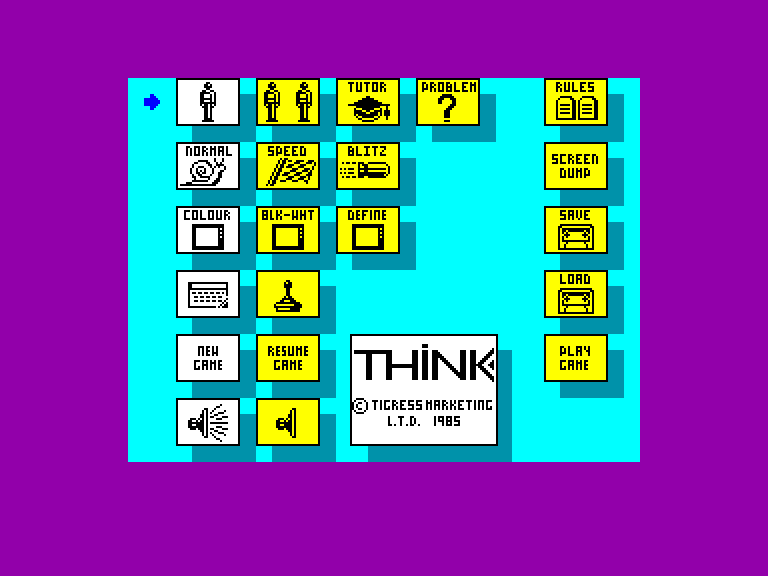
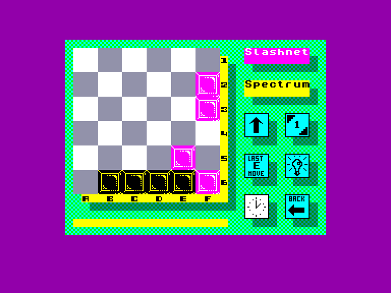

[0-9](../0/games-0.md) - [A](../a/games-a.md) - [B](../b/games-b.md) - [C](../c/games-c.md) - [D](../d/games-d.md) - [E](../e/games-e.md) - [F](../f/games-f.md) - [G](../g/games-g.md) - [H](../h/games-h.md) - [I](../i/games-i.md) - [J](../j/games-j.md) - [K](../k/games-k.md) - [L](../l/games-l.md) - [M](../m/games-m.md) - [N](../n/games-n.md) - [O](../o/games-o.md) - [P](../p/games-p.md) - [Q](../q/games-q.md) - [R](../r/games-r.md) - [S](../s/games-s.md) - [T](../t/games-t.md) - [U](../u/games-u.md) - [V](../v/games-v.md) - [W](../w/games-w.md) - [X](../x/games-x.md) - [Y](../y/games-y.md) - [Z](../z/games-z.md)

Ігри для [Enterprise 64k](../games-ep64.md) - [Enterprise 128k+RAMexp](../games-epramexp.md)

Ігри для систем [IS-DOS](../games-is-dos.md) - [SymbOS](../games-symbos.md) - [EDC Windows](../games-edcw.md)

Ігри для емуляторів [ZX Spectrum 48k/128k](../zxemu/games-zxemu.md) - [Amstrad CPC](../cpcemu/games-cpc.md) - [Sinclair ZX81](../zx81emu/games-zx81.md) - [Videoton TVC](../tvcemu/games-tvc.md) - [Commodore VIC-20](../vic20emu/games-vic20.md)

----------

# Think!

**ID:** think-zx

## Скріншоти

## Опис

(temporary description generated by AI [ChatGPT])

**Опис гри:**

Think! – це стратегічна головоломка, схожа на настільну гру Connect 4. Грається двома гравцями (гравець проти гравця або гравець проти комп'ютера) на полі 6x6. Гравці по черзі ставлять фішки на поле, мета – зібрати чотири в ряд. Фішки не можна ставити будь-де, їх потрібно виштовхувати на поле знизу або з правого краю. Коли фішка додається, все в цьому рядку або стовпчику пересувається. Фішки, які досягають протилежних країв поля, можуть бути скинуті і втрачені. Виграшні лінії можуть бути горизонтальними, вертикальними або діагональними.

Крім звичайного режиму, є кілька додаткових варіацій. Це Speed Think!, де кожен гравець має обмежений час для кожного ходу, і Blitz Think!, де гравець має загальний ліміт часу для всіх ходів. Є режим навчання, де комп'ютер надає зворотний зв'язок щодо якості кожного ходу. Наприкінці гравець отримує процентний бал. Також є шість заздалегідь визначених задач з кількома фішками на полі, а гравець може створити свої власні задачі.

**Правила гри:**

1. Грається на полі 6x6.
2. Гравці по черзі ставлять фішки, намагаючись зібрати чотири в ряд.
3. Фішки можна ставити лише знизу або з правого краю поля.
4. Якщо фішка досягає протилежного краю, вона скидається.
5. Виграшні лінії можуть бути горизонтальними, вертикальними або діагональними.
6. Доступні різні режими гри: звичайний, Speed Think!, Blitz Think! та режим навчання.
7. Гравці можуть створювати свої власні задачі.

Грайте, думайте та вигравайте!

## Основна інформація
- **Оригінальна платформа:** ZX Spectrum

## Посилання
- [Інформація про оригінальну версію](https://spectrumcomputing.co.uk/entry/5235/ZX-Spectrum/Think)

**Дата генерації:** 29.07.2026

